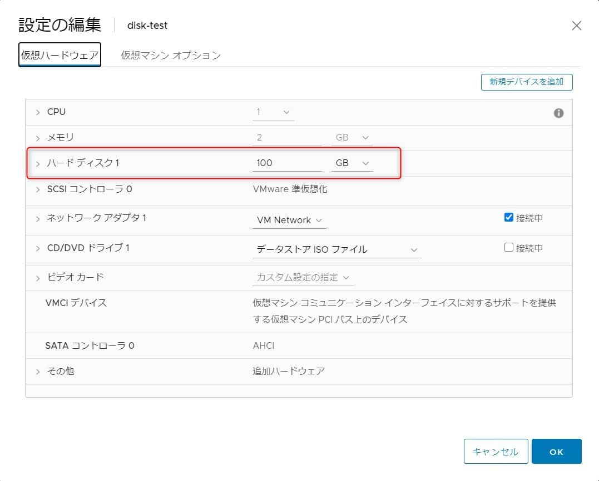

こんにちは。

今回は、**標準パーティションで作成した CentOS7 の仮想マシンのディスクサイズを拡張する方法** を紹介します。

## 環境・事前確認

- 仮想基盤：VMware ESXi, 6.7.0, 15160138
- OS：CentOS 7.9.2009 ( ファイルシステムは **xfs** )

以下のようなパーティションを作成しました。


拡張前のCentOSのディスク情報はこのようになっています。

**df の結果**
```
[root@localhost ~]# df -h
ファイルシス   サイズ  使用  残り 使用% マウント位置
devtmpfs         909M     0  909M    0% /dev
tmpfs            920M     0  920M    0% /dev/shm
tmpfs            920M  8.8M  911M    1% /run
tmpfs            920M     0  920M    0% /sys/fs/cgroup
/dev/sda3         97G  1.4G   96G    2% /
/dev/sda1       1014M  176M  839M   18% /boot
tmpfs            184M     0  184M    0% /run/user/0
```

**fdisk の結果**
```
[root@localhost ~]# fdisk /dev/sda
Welcome to fdisk (util-linux 2.23.2).

Changes will remain in memory only, until you decide to write them.
Be careful before using the write command.


コマンド (m でヘルプ): p

Disk /dev/sda: 107.4 GB, 107374182400 bytes, 209715200 sectors
Units = sectors of 1 * 512 = 512 bytes
Sector size (logical/physical): 512 bytes / 512 bytes
I/O サイズ (最小 / 推奨): 512 バイト / 512 バイト
Disk label type: dos
ディスク識別子: 0x000a8dfe

デバイス ブート      始点        終点     ブロック   Id  システム
/dev/sda1   *        2048     2099199     1048576   83  Linux
/dev/sda2         2099200     6295551     2098176   82  Linux swap / Solaris
/dev/sda3         6295552   209715199   101709824   83  Linux
```

## ディスク拡張作業 (VMware側)
操作は、**VMware ESXi** から行います。

作成した **仮想マシンの設定から、ディスクサイズを変更** します。
**評価では OS を停止せず** 行いました。

- 変更前


- 変更後


変更後は **サイズを増やすと減らすことができなくなるので注意** です。


変更後に **OSを再起動** します。
**再起動後、再度ディスクの状態を確認** してみます。

df の結果は変わっていませんが  **fdisk で認識している容量が増えている** ことが確認できます。

**df の結果**
```
[root@localhost ~]# df -h
ファイルシス   サイズ  使用  残り 使用% マウント位置
devtmpfs         909M     0  909M    0% /dev
tmpfs            920M     0  920M    0% /dev/shm
tmpfs            920M  8.8M  911M    1% /run
tmpfs            920M     0  920M    0% /sys/fs/cgroup
/dev/sda3         97G  1.4G   96G    2% /
/dev/sda1       1014M  176M  839M   18% /boot
tmpfs            184M     0  184M    0% /run/user/0
```

**fdisk の結果**
```
[root@localhost ~]# fdisk /dev/sda
Welcome to fdisk (util-linux 2.23.2).

Changes will remain in memory only, until you decide to write them.
Be careful before using the write command.


コマンド (m でヘルプ): p

Disk /dev/sda: 214.7 GB, 214748364800 bytes, 419430400 sectors
Units = sectors of 1 * 512 = 512 bytes
Sector size (logical/physical): 512 bytes / 512 bytes
I/O サイズ (最小 / 推奨): 512 バイト / 512 バイト
Disk label type: dos
ディスク識別子: 0x000a8dfe

デバイス ブート      始点        終点     ブロック   Id  システム
/dev/sda1   *        2048     2099199     1048576   83  Linux
/dev/sda2         2099200     6295551     2098176   82  Linux swap / Solaris
/dev/sda3         6295552   209715199   101709824   83  Linux
```

**fdisk の結果抜粋 ( 拡張前 )**
`Disk /dev/sda: 107.4 GB, 107374182400 bytes, 209715200 sectors`

**fdisk の結果抜粋 ( 拡張後 )**
`Disk /dev/sda: 214.7 GB, 214748364800 bytes, 419430400 sectors`

認識している **容量が、107374182400 bytes → 214748364800 bytes に増えている** のが分かります。


## ディスク拡張作業 (OS側)

とても **デリケートな作業** です。
**操作を誤れば再起不能になりますのでご注意** ください。

作業の概要は、 **容量を拡張するため、/dev/sda3 の 終点 ( End ) を後ろに拡張** します。
一度 **/dev/sda3 を削除 ( d )し、終点 ( End ) を変更した /dev/sda3 を作成 ( n )** します。

それではいきましょう。
★＝ 入力ポイント＋コメント です。

**fdisk /dev/sda を実行**
```
[root@localhost ~]# fdisk /dev/sda
Welcome to fdisk (util-linux 2.23.2).

Changes will remain in memory only, until you decide to write them.
Be careful before using the write command.


コマンド (m でヘルプ): d　★ d ( 削除 ) を入力する
パーティション番号 (1-3, default 3): 3 ★ 3 ( /dev/sda3 ) を削除する
Partition 3 is deleted

コマンド (m でヘルプ): p　★ p を入力し状況を確認, /dev/sda3 が消えていることが確認できる

Disk /dev/sda: 214.7 GB, 214748364800 bytes, 419430400 sectors
Units = sectors of 1 * 512 = 512 bytes
Sector size (logical/physical): 512 bytes / 512 bytes
I/O サイズ (最小 / 推奨): 512 バイト / 512 バイト
Disk label type: dos
ディスク識別子: 0x000a8dfe

デバイス ブート      始点        終点     ブロック   Id  システム
/dev/sda1   *        2048     2099199     1048576   83  Linux
/dev/sda2         2099200     6295551     2098176   82  Linux swap / Solaris

コマンド (m でヘルプ): n　★ n で /dev/sda3 の再作成に進む
Partition type:
   p   primary (2 primary, 0 extended, 2 free)
   e   extended
Select (default p): p　★ p で primry を指定する
パーティション番号 (3,4, default 3): 3　★ 3 を入力し /dev/sda3 を作成する
最初 sector (6295552-419430399, 初期値 6295552):　★ Enter を押す ( 初期値の自動判別 )
初期値 6295552 を使います
Last sector, +sectors or +size{K,M,G} (6295552-419430399, 初期値 419430399):　★ Enter を押す ( 初期値の自動判別 )
初期値 419430399 を使います
Partition 3 of type Linux and of size 197 GiB is set

コマンド (m でヘルプ): p　★ p を入力する ( p で状況を確認, /dev/sda3 が最大値で再作成できていることが確認できる )

Disk /dev/sda: 214.7 GB, 214748364800 bytes, 419430400 sectors
Units = sectors of 1 * 512 = 512 bytes
Sector size (logical/physical): 512 bytes / 512 bytes
I/O サイズ (最小 / 推奨): 512 バイト / 512 バイト
Disk label type: dos
ディスク識別子: 0x000a8dfe

デバイス ブート      始点        終点     ブロック   Id  システム
/dev/sda1   *        2048     2099199     1048576   83  Linux
/dev/sda2         2099200     6295551     2098176   82  Linux swap / Solaris
/dev/sda3         6295552   419430399   206567424   83  Linux

コマンド (m でヘルプ): w　★ w を入力し、変更を確定する (この時点で書き込まれます。誤った場合は q で fdisk を抜ける )
パーティションテーブルは変更されました！

ioctl() を呼び出してパーティションテーブルを再読込みします。

WARNING: Re-reading the partition table failed with error 16: デバイスもしくはリソースがビジー状態です.
The kernel still uses the old table. The new table will be used at
the next reboot or after you run partprobe(8) or kpartx(8)
ディスクを同期しています。
```

**OS を再起動** します。
SSHでつながりました。ひと安心。


**df** してみます。

**df の結果**
```
[root@localhost ~]# df -h
ファイルシス   サイズ  使用  残り 使用% マウント位置
devtmpfs         909M     0  909M    0% /dev
tmpfs            920M     0  920M    0% /dev/shm
tmpfs            920M  8.8M  911M    1% /run
tmpfs            920M     0  920M    0% /sys/fs/cgroup
/dev/sda3         97G  1.4G   96G    2% /
/dev/sda1       1014M  176M  839M   18% /boot
tmpfs            184M     0  184M    0% /run/user/0
```

**まだ変わってません** ね。

最後に、**マウント中の XFS ファイルシステムを拡大するため** のコマンド `xfs_growfs` で `/dev/sda3` の容量を変更します。
[3.4. XFS ファイルシステムのサイズの拡大 Red Hat Enterprise Linux 7 | Red Hat Customer Portal](https://access.redhat.com/documentation/ja-jp/red_hat_enterprise_linux/7/html/storage_administration_guide/xfsgrow)

**xfs_growfs /dev/sda3 を実行**
```
[root@localhost ~]# xfs_growfs /dev/sda3
meta-data=/dev/sda3              isize=512    agcount=4, agsize=6356864 blks
         =                       sectsz=512   attr=2, projid32bit=1
         =                       crc=1        finobt=0 spinodes=0
data     =                       bsize=4096   blocks=25427456, imaxpct=25
         =                       sunit=0      swidth=0 blks
naming   =version 2              bsize=4096   ascii-ci=0 ftype=1
log      =internal               bsize=4096   blocks=12415, version=2
         =                       sectsz=512   sunit=0 blks, lazy-count=1
realtime =none                   extsz=4096   blocks=0, rtextents=0
data blocks changed from 25427456 to 51641856
```

**再度 df** します。
おー、**無事拡張** されました。

**df の結果**
```
[root@localhost ~]# df -h
ファイルシス   サイズ  使用  残り 使用% マウント位置
devtmpfs         909M     0  909M    0% /dev
tmpfs            920M     0  920M    0% /dev/shm
tmpfs            920M  8.8M  911M    1% /run
tmpfs            920M     0  920M    0% /sys/fs/cgroup
/dev/sda3        197G  1.4G  196G    1% /　★ 200GB になった
/dev/sda1       1014M  176M  839M   18% /boot
tmpfs            184M     0  184M    0% /run/user/0
```

## あとがき
実際にお客様の環境で実施した手順ですが、構築時点からLVMにしていたらよかったと後悔しました。。

それでは次回の記事でお会いしましょう。