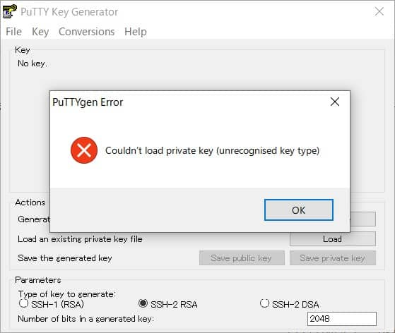

こんにちは。

本記事は、[過去記事](/convert-ssh-secret-key-from-rsa-to-putty/) の続編です。

**WinSCPでサーバーに接続しよう** と、過去記事の方法で **WindowsからPuttyツールを利用して変換を試みた** のですが、以下のような **エラーに** 見舞われました。


原因追及まではしていないのですが、 CentOS 8 を利用してコマンドで変換してみましたのでメモを兼ねて記事にしました。

## 事前準備

1. 適当なCentOS 8を準備 ( CentOS 7 でも問題ないと思います )
1. putty をインストール
```
yum -y install epel-release
yum -y install putty
```
1. 変換対象の SSH 形式の秘密鍵をサーバーに配置

## 変換手順

とても簡単です。
ファイル名は、変換前の名称を `ssh.key` 変換後の名称を `ssh.ppk` とします。

1. root 権限で `puttygen ssh.key -o ssh.ppk -O private` を実行します
1. 設定しているパスフレーズを入力して完了です

```
Enter passphrase to load key: 
```

以下のように変換後の `ssh.ppk` 鍵が出来上がります。

```
# ls | grep ssh.
ssh.key
ssh.ppk
```

変化後の秘密鍵を指定して、 **無事WinSCPでサーバーに入ることが出来ました** 。


以上、小ネタでしたが次回の記事でお会いしましょう。