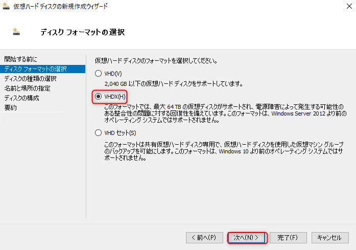
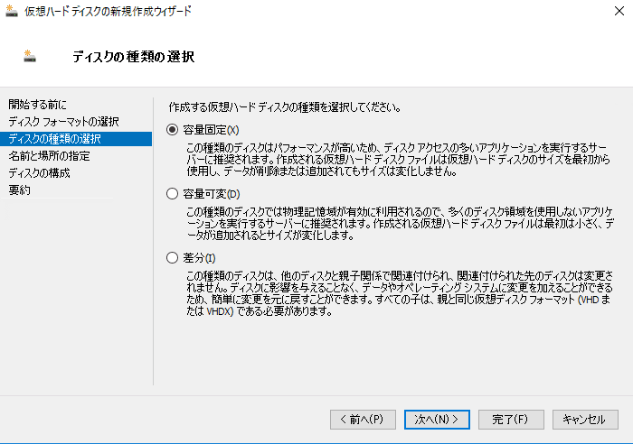
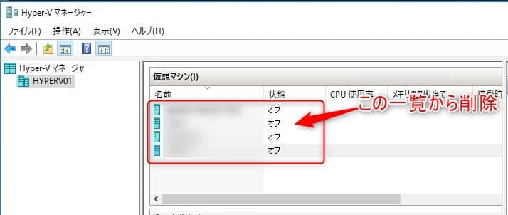

こんにちは。

今回はある案件で、**500GB程度のHyper-Vの仮想マシンをエクスポートして、その後再度インポートする** という内容のものがあり、その際に評価した結果を記事にしました。

簡単な図ですが、以下の **①の時間** と **②の時間** を計測します。

計測方法は、開始時刻と終了時刻をメモして行いました。

## 計測結果

1. エクスポートは、**約6時間50分**
1. インポートは、**約2時間20分** かかりました。

## 評価環境
- ホストOS　Windows Server 2016 Standard
- 仮想OS　Windows Server 2012 R2
- 仮想OSのCドライブ　500GB
インストール直後のCドライブの空き容量　489GB

**外付けHDDは、Dドライブ** として認識していることを前提とします。

## テスト用の仮想マシンを作成する

以下の流れでに **仮想ディスク ( VHDX )を作成** します。

仮想ディスクが作成できていることを確認します。

**作成したVHDX を指定して仮想マシンを作成** し、OSのインストール等の準備を済ませます。
※仮想マシンの作成手順は割愛します。

## エクスポート時間の計測
### エクスポートの流れ
前項で作成した仮想マシンを起動(実行)し、外付けHDD (Dドライブ) エクスポートします。
以下の流れでエクスポートします。

### エクスポートに要した時間
**約6時間50分** かかりました。

今回は案件の状況を再現するために起動状態で実施しましたが、**エクスポート中はやはり動作が重く** なりました。

エクスポートした仮想マシンはをシャットダウンし、仮想ディスク (C:\Hyper-V\test.vhdx) を削除します。

**Hyper-Vマネージャーから一覧も削除** します。(これをしないとインポート時にエラーが発生します)

## インポート時間の計測
### インポートの流れ
以下の流れでインポートします。

エクスポート場所は、元あった場所 (C:\Hyper-V\test.vhdx) を指定します。

### インポートに要した時間
**約2時間20分** かかりました。

インポートした仮想マシンが無事起動することを確認し、評価は完了です。

## あとがき

あとがきに、**ダミーファイル作成** に関しての情報を記載します。

ダミーファイルを作成する場合には以下の記事・ツールが便利です。
[ダミーファイル作成ソフト – GFileCreator | ぽーたぶるっ！](https://triton.casey.jp/portable/gfilecreator/)

別の方法として 標準コマンドである `fsutil` を利用して、Windows上で大容量のファイルを作成できます。
しかし、ゼロデータのみで作成されるため仮想ディスク(VHDXファイル)の容量が大きくなりません。
[Windows 10対応：巨大サイズのファイルを簡単に作る（fsutilコマンド編）：Tech TIPS - ＠IT](https://www.atmarkit.co.jp/ait/articles/0209/28/news002.html)

たとえば、100GBのファイルを作成して以下のように仮想マシン内に格納しても、

仮想ディスク(VHDXファイル)の容量が変わりません。

時間計測の参考になれば幸いです。

それでは次回の記事でお会いしましょう。