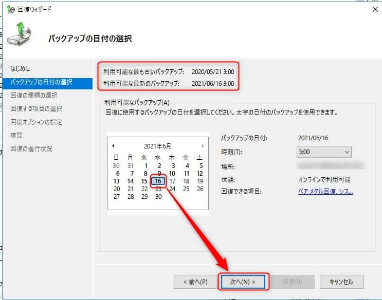

こんにちは。

お客様から「バックアップデータから過去のファイルを取り出せますか？」と問合せがあり、いざ実施しようと思ったらすぐに分からなかったので **Windows Server バックアップデータ からファイルを復元する方法** をメモ代わりに記事にしました。

## やりたいこと
- Windows Server バックアップで取得しているバックアップデータからファイルを復元したい
    - すでに Windows Server バックアップで日々バックアップが取得できていることが前提です

## 手順
1. サーバーマネージャーから **ツール→Windows Server バックアップ** を開きます。

タスクバーにピン留めしておくと便利ですね。

1. 右ペインから回復 を選択します

1. ウィザードを進めます。バックアップの場所は環境に応じて選択してください

1. **復元したいファイルが含まれている日付を選択し、次へをクリック** します。上部に **最も古いバックアップ** と **最新のバックアップ** の **日時が表示** されます

1. **ファイルおよびフォルダーを選択し、次へをクリック** します。

1. 復元元の **ファイルおよびフォルダーを選択** します。

1. 回復先のフォルダを指定します。今回は、デスクトップ上に保存します。

1. 内容を確認し、**回復をクリック** します

1. 完了しました

回復先に指定した場所にファイルが復元されました。

操作記録はログに残ります。

## 注意点
回復オプションの指定で、**回復するファイルまたはフォルダに対し、アクセス制御リスト(ACL)のアクセス許可を復元する** にチェックをいれていると、復元後にファイルが開けない場合があります。

その場合は必要に応じてプロパティから権限を付与してください。

## あとがき
その他 [Windows Server バックアップ](/tag/windows-server-%e3%83%90%e3%83%83%e3%82%af%e3%82%a2%e3%83%83%e3%83%97/) に関連した記事も是非ご覧下さい。

それでは次回の記事でお会いしましょう。

