こんにちは。

**Windows 11 が 2021年10月5日に初回リリース** されました。

Windows 10 がリリースされたときは、Windows として最後のOSと言われていたのに、バージョンアップだけでは難しい事情でも出たのでしょうか。

リリースされたら使ってみるしかないと、プライベートPCをWindows 10 から Windows 11 にアップデートしてみました。

## PCスペック

- プロセッサ Intel(R) Celeron(R) N4500 @ 1.10GHz
- メモリー 8GB
- OS Windows 10 (20H2)

## Microsoft Windows 11 とは

>Windows 11は、マイクロソフトが開発するWindows NT系のオペレーティングシステムである。Windows 10の後継バージョンにあたる。日本では2021年10月5日に公開された。開発コードネームは「Sun Valley」であり、正式発表前はWindows 10のバージョンの一つともみられていた。
[Wikipedia 抜粋](https://ja.wikipedia.org/wiki/Microsoft_Windows_11)

## アップデートの流れ

大きな流れは、 **アップデート対象として問題ないかチェック** → **アップデート** という形です。

1. PC正常性チェックアプリ の実行

    [ここから](https://aka.ms/GetPCHealthCheckApp) アプリをダウンロードします。
    
    ダウンロードした `WindowsPCHealthCheckSetup.msi` を実行し、以下の流れで進めます。 
    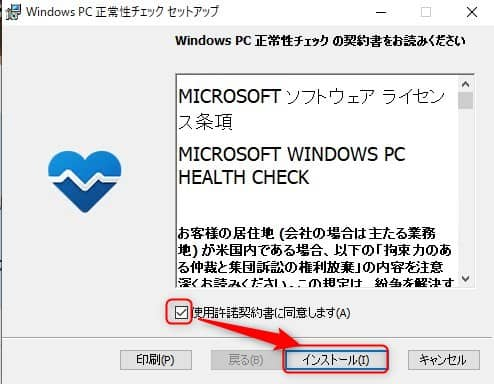
    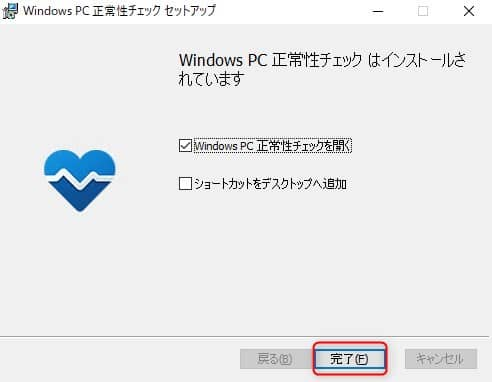
    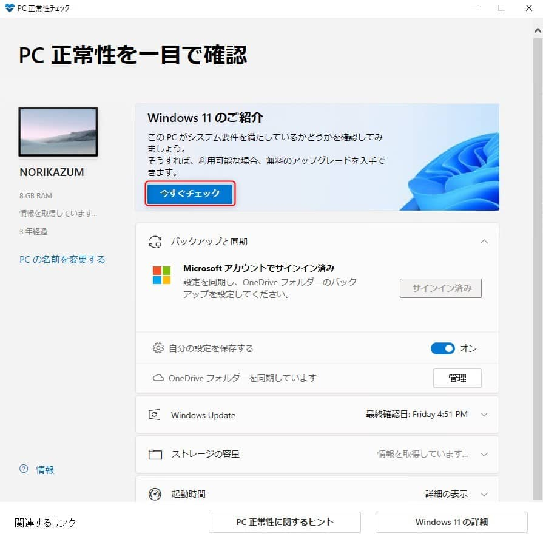
    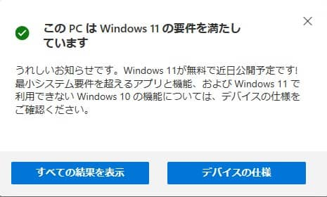
    
    結果から、以下の要件を満たす必要があるようです。
    - プロセッサの **クロック速度が 1GHz 以上** かつ **2コア以上** であることを
    - メモリーが **4GB以上** 搭載されていること
    - システムディスクが **64GB以上** であること
    - **UEFI、セキュアブートに対応** していること
    - **TPM2.0が有効** になっていること

1. Windows 11 にアップデート
    
    Windows 11 を [ここからダウンロード](https://www.microsoft.com/ja-jp/software-download/) します。
    
    ダウンロードされた `Windows11InstallationAssistant.exe` を実行し、以下の流れでアップデートを進めます。

    
    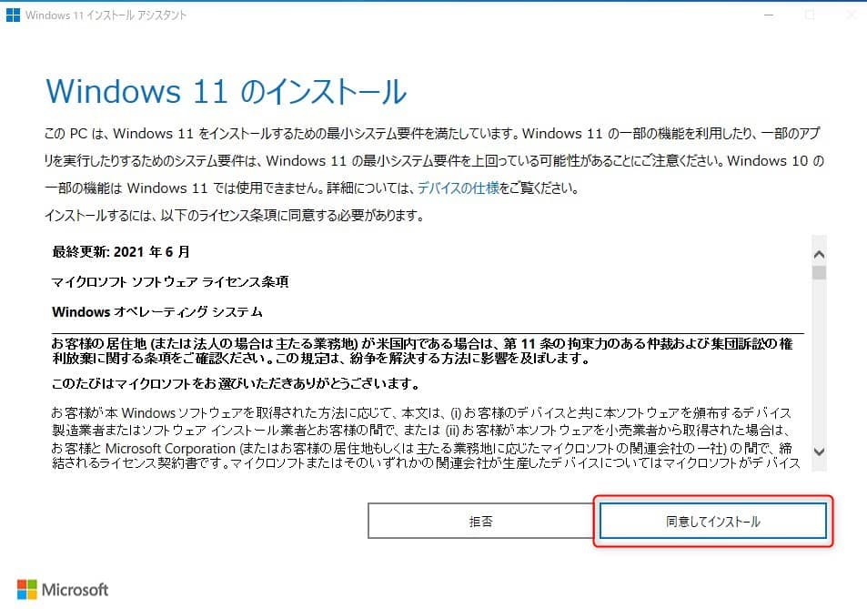
    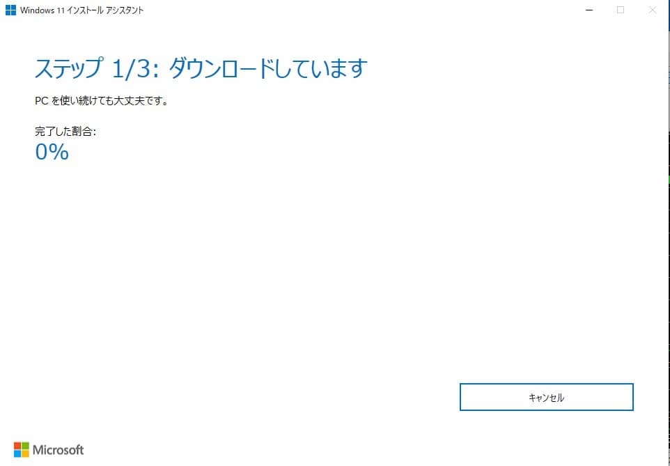
    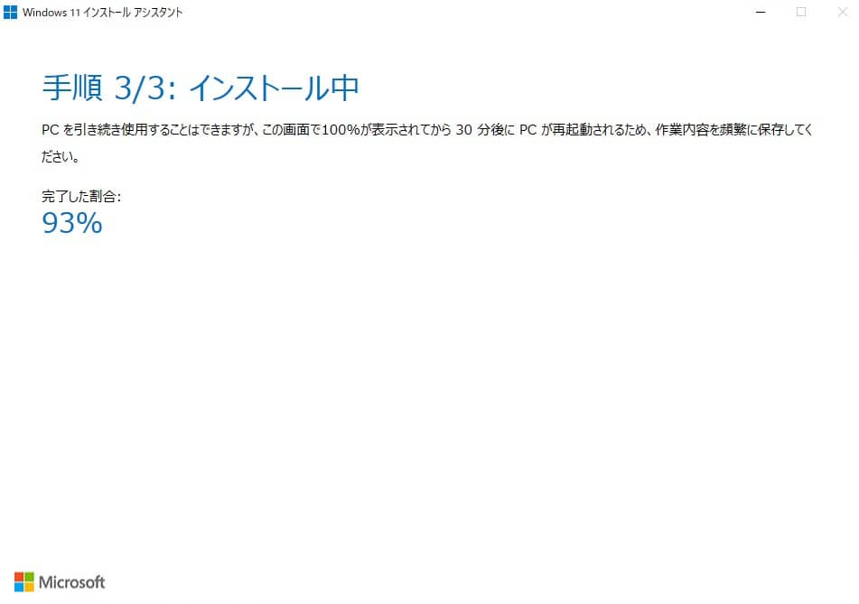

    22:42から実施し0:30 ( **2時間経過** )の時点で **93％** でした。
    ちょっと眠気に負けてここまで見届けて寝てしまいました。

1. Windows 11 アップデート完了

    起きて端末を確認すると **自動で再起動されアップデートが完了** していました。
    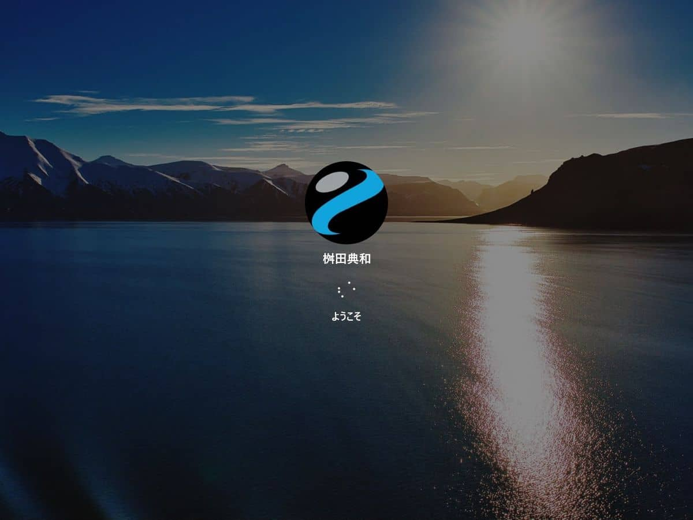
    
    ログインすると、このような状況になりました。壁紙は Windows 11 用に変更されていましたがタスクバーなどは引き継がれていました。
    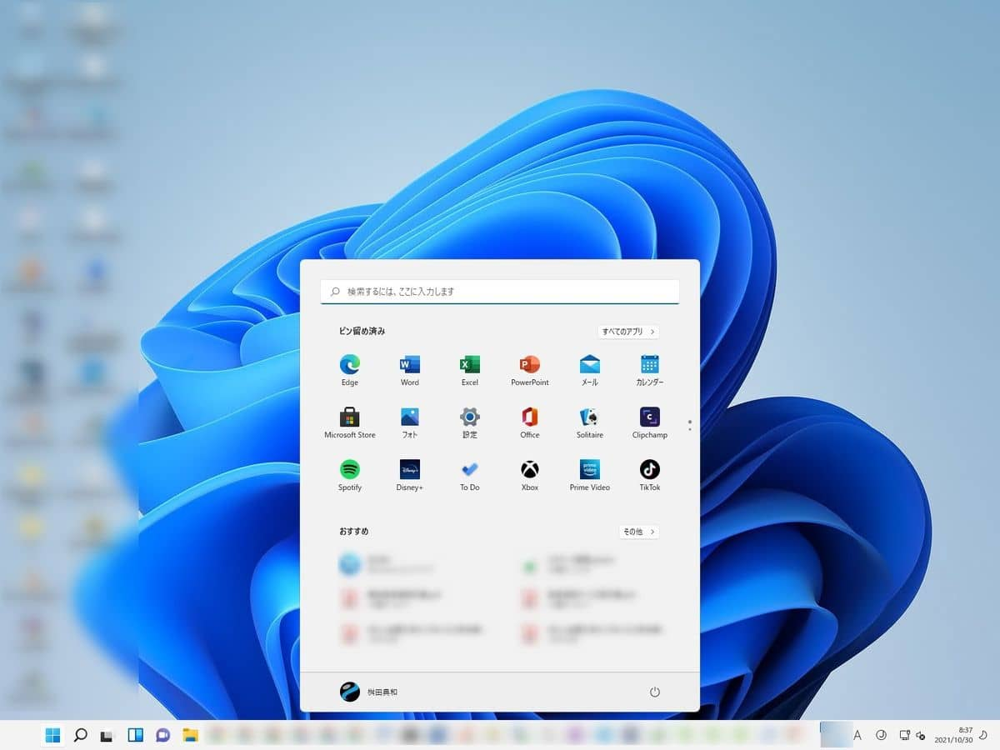

    Windows 11 にアップデート直後ですが、すぐに Windows Updata が出ていたのでアップデートを実施しました。
    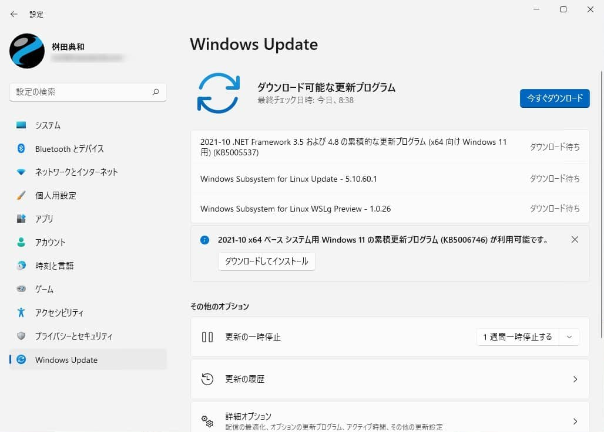

    ではざっと触ってみたいと思います。

## アップデート後のレビュー

- ESET Internet Security をインストールしていますが ESET からファイアウォールが無効だと警告が出たので有効にしました。
    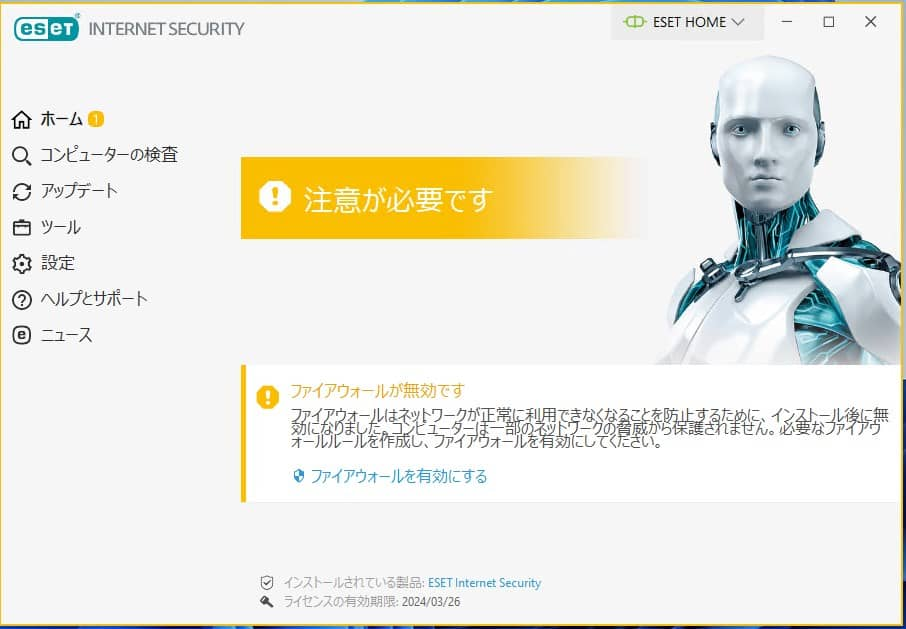

- 左下のWindowsマークをクリックするとこんな感じ。
    
    設定画面もWindows 10 より個人的にはすっきりして見やすく感じました。
    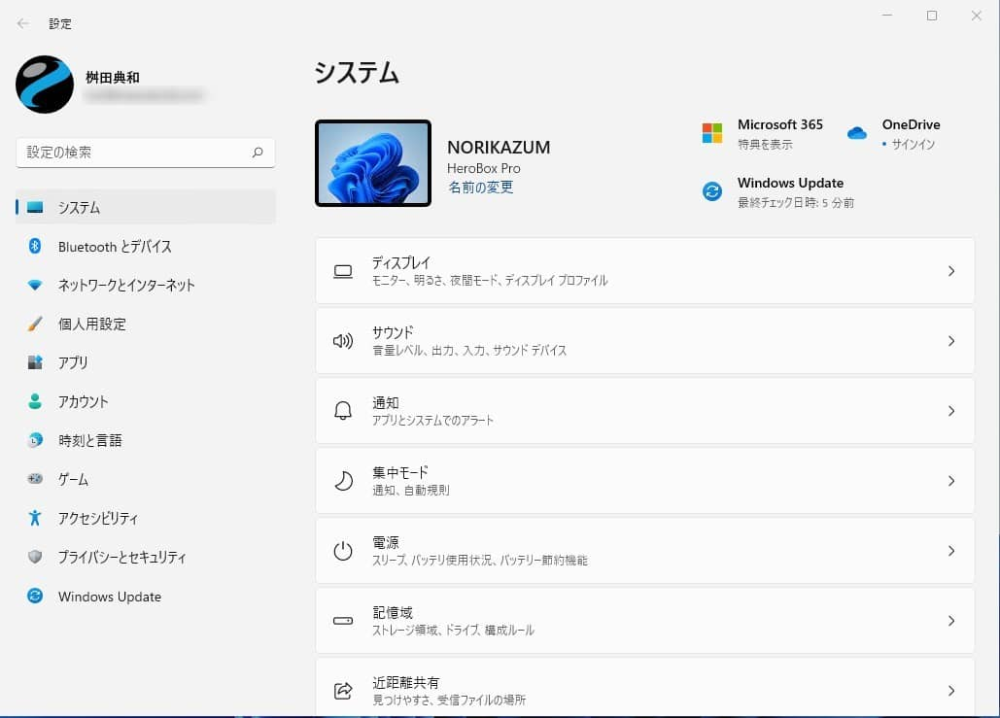

- タスクマネージャーが右下の時刻を右クリックと場所が変わっていました。
    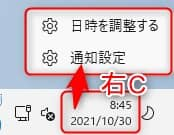
    Windows マークを右クリックにありました。
    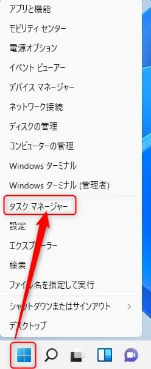

- ネットワークの設定は旧来のイメージから脱却していました。
    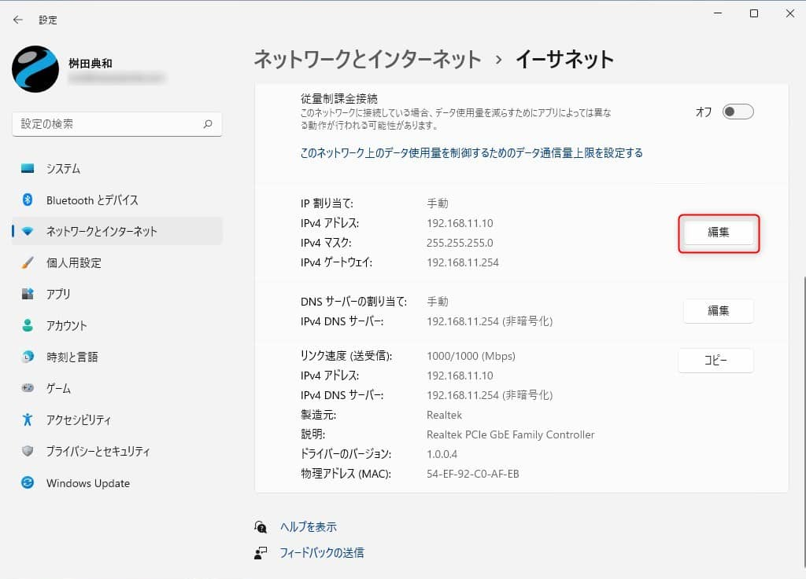
    ↓
    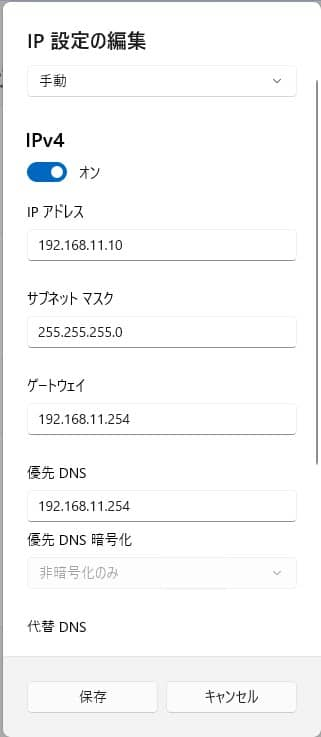
    旧来のイメージ。
    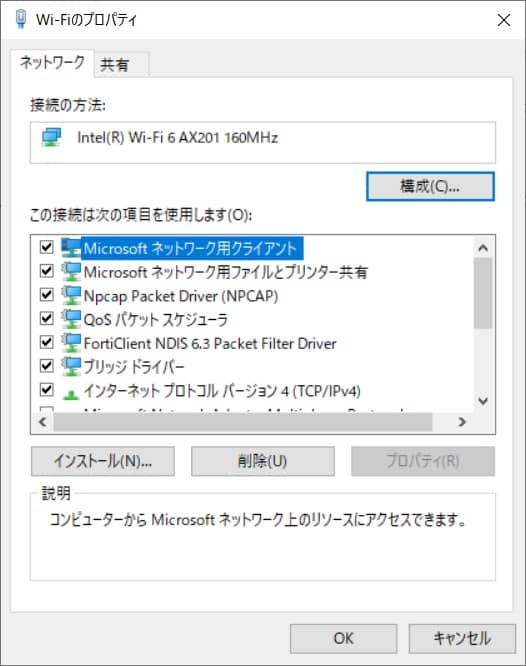

- マルチデスクトップにも対応しているようです。
    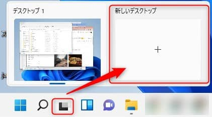
    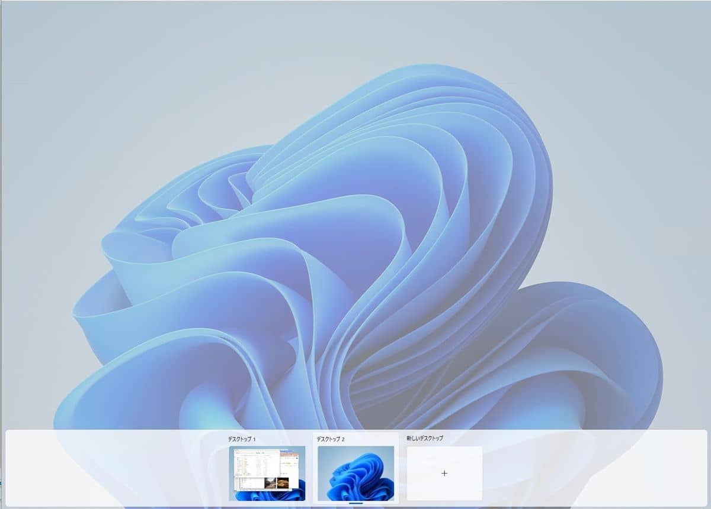

- 右クリックメニューはこんな感じになっていました。
    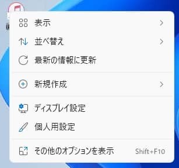

## これからも使える便利なファイル名を指定して実行

新しくなったとはいえ、**ファイル名を指定して実行** は健在です。
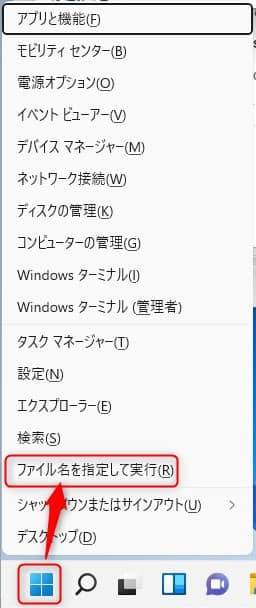

Windowsキー + R でも起動できます。
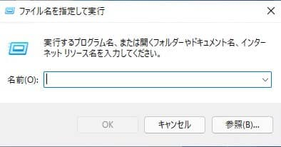

これからも現役であろうショートカットを紹介します。
※Windows 11 で動作することを確認しました。

プログラム | コマンド
-- | --
アドレス帳 | wab
アドレス帳インポートツール | wabmig
イベントビューアー | eventvwr
インターネットのプロパティー | inetcpl.cpl
エクスプローラ | explorer
外字エディター | eudcedit
拡大鏡 | magnify
ディスプレイ設定 | desk.cpl
共有フォルダ | fsmgmt.msc
クリップブック | clipbrd
グループポリシー | gpedit.msc
ゲームコントローラー | joy.cpl
コマンドプロンプト | cmd
コンソール | mmc
コントロールパネル | control
コンピューターの管理 | compmgmt.msc
コンポーネントサービス | dcomcnfg
サウンドとオーディオ デバイスのプロパティー | mmsys.cpl
サービス | services.msc
システム構成ユーティリティー | msconfig
システムのプロパティー | sysdm.cpl
証明書 | certmgr.msc
スクリーンキーボード | osk
セキュリティが強化された Windows ファイアウォール | wf.msc
ダイヤラ | dialer
タスクスケジューラ | taskschd.msc
タスクマネージャ | taskmgr
地域と言語のオプション | intl.cpl
ディスク クリーンアップ | cleanmgr
送付状エディター | fxscover
ディスクの管理 | diskmgmt.msc
デバイスマネージャ | devmgmt.msc
電源オプションのプロパティー | powercfg.cpl
電卓 | calc
ネットワーク接続 | rasphone
電話とモデムのオプション | telephon.cpl
同期センター | mobsync
ドライバーの検証ツールマネージャー | verifier
ナレータ | narrator
ネットワーク接続 | ncpa.cpl
パフォーマンスモニター | perfmon
日付と時刻のプロパティー | timedate.cpl
ファイアウォール | firewall.cpl
ファイル署名の確認 | sigverif
フォント | fonts
プログラムと機能 | appwiz.cpl
ペイント | mspaint
ポリシーの結果セット | rsop.msc
音声ミキサー | sndvol
マウスのプロパティー | main.cpl
メモ帳 | notepad
文字コード表 | charmap
アクセシビリティ | utilman
リモートデスクトップ接続 | mstsc
レジストリー エディター | regedit
ローカルセキュリティポリシー | secpol.msc
ローカルユーザーとグループ | lusrmgr.msc
ログオフ | logoff
ワードパット | write
Bluetooth ファイル転送ウィザード | fsquirt
DirectX診断ツール | dxdiag
ディスク Partition Manager | diskpart
Iexpress Wizard(自己解凍書庫) | iexpress
Internet Explorer | iexplore
nslookup | nslookup
SQLクライアント設定ユーティリティー | cliconfg
Windows 悪意のあるソフトウェアの削除ツール | mrt
Windows セキュリティとメンテナンス | wscui.cpl
Windows バージョン情報 | winver
Windows Management Infrastructure | wmimgmt.msc
Windows Media Player | wmplayer
Windows Script Hostの設定 | wscript
Microsoft Excel | excel
Microsoft PowerPoint | powerpnt
Microsoft Word | winword

## あとがき

プライベートPCにはあまりソフトを多くインストールしていませんが、ざっと以下の動作(起動)に問題ないことを確認しました。

- Chrome 95.0.4638.69
- Google Drive
- FortiClient 7.0.1.0083
- ATOK Passport
- ESET 15.0.16.0
- Word / Excel / PowerPoint (ともにバージョン2019)
- CyberLink PowerDirector 14 14.0.1931.0
- PlayMemories Home 6.0.00.12211

まだ少しだけしか触っていませんが、操作性はそれほど Windows 10 と変わらないような感じです。
気になる点があればまた記事にしたいと思います。

それでは次回の記事でお会いしましょう。
