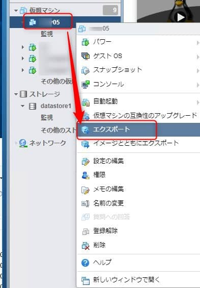
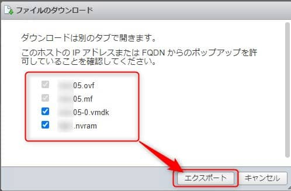
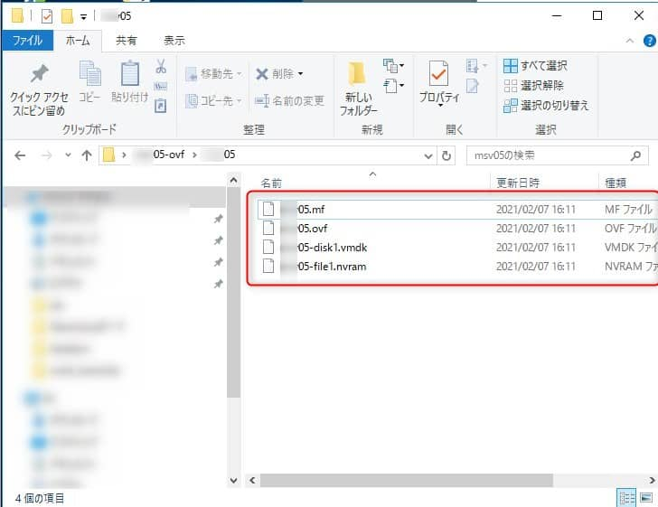
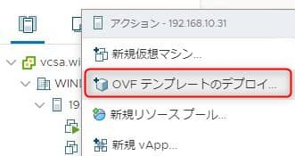

こんにちは。

評価環境で **VMware Host Client から 仮想マシン を エクスポートを実施すると 何度やっても途中で停止して完了しない現象が発生** しました。

**VMware OVF Tool を利用することで解決** しましたので紹介します。

## 環境
* サーバー
    * VMWare ESXi 6.7.0 Update 3 (Build 15160138)
* クライアント
    * Chrome 87.0.4280.141（Official Build） 

## 失敗する現象
- **VMware Host Client から エクスポートを実行** します

↓


- **進捗が50％で止まり完了しません** 。一晩実行し続けても何度かやりなおしても同じでした。 **出力済みのファイルをみると nvram ファイルだけが出力されていないような状態** でした。


以下の記事を参考に、 OVF Tool を使ってやってみると解決しました。
[技術メモメモ: OVF Toolを使って仮想マシンをエクスポート・インポートする](https://tech-mmmm.blogspot.com/2020/09/ovf-tool.html)

## VMware OVF Tool のインストール

以下よりダウンロードし、インストールします。 ( ログインが必要です )
[VMware Open Virtualization Format Tool 4.3.0](https://my.vmware.com/jp/web/vmware/downloads/details?downloadGroup=OVFTOOL430&productId=742)

インストールが完了すると、`C:\Program Files\VMware\VMware OVF Tool\ovftool.exe` が利用できるようになります。

GUI はなく、**コマンドプロンプトで利用** します。 

## VMware OVF Tool を利用して仮想マシンをエクスポート
**エクスポートする仮想マシンは電源オフ** にする必要があります。

利用方法は簡単です。
コマンドプロンプトを開き、コマンドが配置するフォルダまで移動します
```
cd "c:\Program Files\VMware\VMware OVF Tool"
```

以下の形式のコマンドを作成します。
```
ovftool.exe vi://ユーザー名:パスワード@ESXiのホスト名 or IPアドレス/登録されているインベントリ名 "保存先"
```

実際には以下のようになります。
```
ovftool.exe vi://root:password@192.168.1.1/srv05 "C:\srv05-ovf"
```

実行結果は、以下のようになります。
```
>ovftool.exe vi://root:password@192.168.1.1/srv05 "C:\srv05-ovf"
Opening VI source: vi://root@192.168.1.1/srv05
Opening OVF target: C:\srv05-ovf
Writing OVF package: C:\srv05-ovf\srv05\srv05.ovf
Transfer Completed
Completed successfully
```

C:\srv05-ovf フォルダの下に、 srv05 フォルダが作成され、その下にエクスポートされます。



## 別環境の ESXi にインポート成功
エクスポートした OVF テンプレート一式を別環境の vCenter にインポートテストを行いました。



無事成功しました。


動作も問題ありませんでした。


## あとがき
今回の対応では バージョン 4.3.0 を利用したのですが、当初 **誤って 3.5.0 の古いバージョンをインストール** していました。

3.5.0 で同じコマンドを実行すると以下のエラーになりました。
```
Error: cURL error: SSL connect error
Completed with errors
```

[この記事](https://communities.vmware.com/t5/Open-Virtualization-Format-Tool/ESXI-6-7-OVFTools-Curl-perform-error-code-35-SSL-connect-error/td-p/1421267) をみると、**TLS1.2をサポートしていない** という内容が確認できたので 再確認すると誤って古いバージョンをインストールしてしまっていたことに気づきました。

**3.5 をアンインストールし、 4.3.0 をインストールして解決**しました。

それでは次回の記事でお会いしましょう。