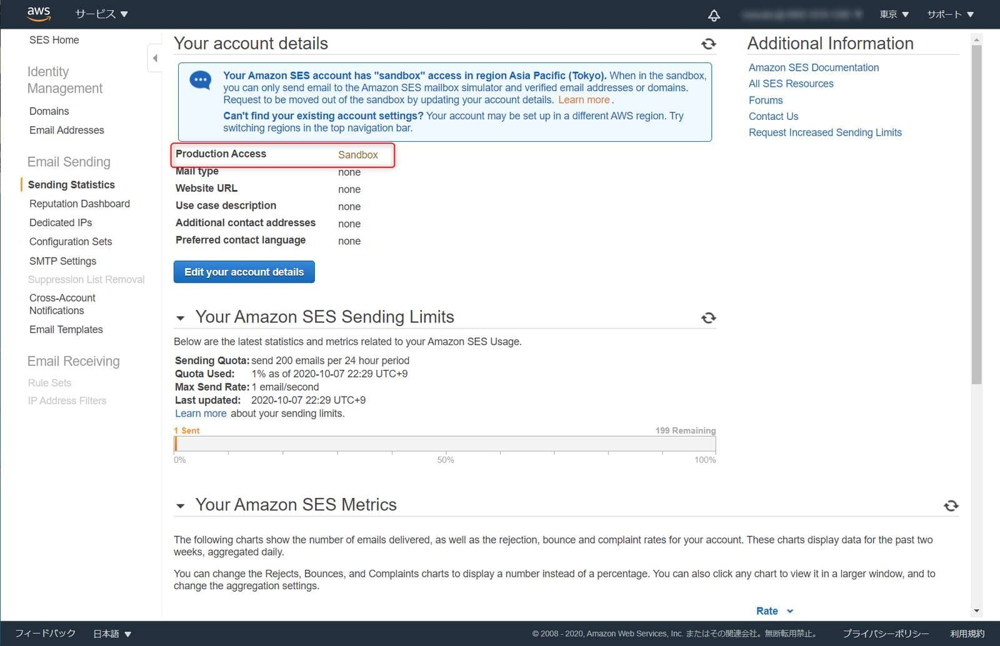
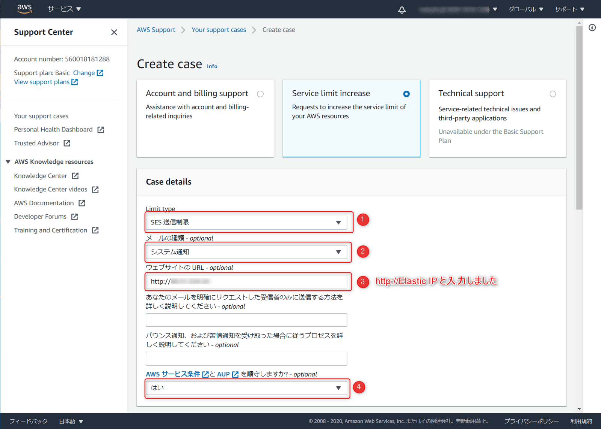
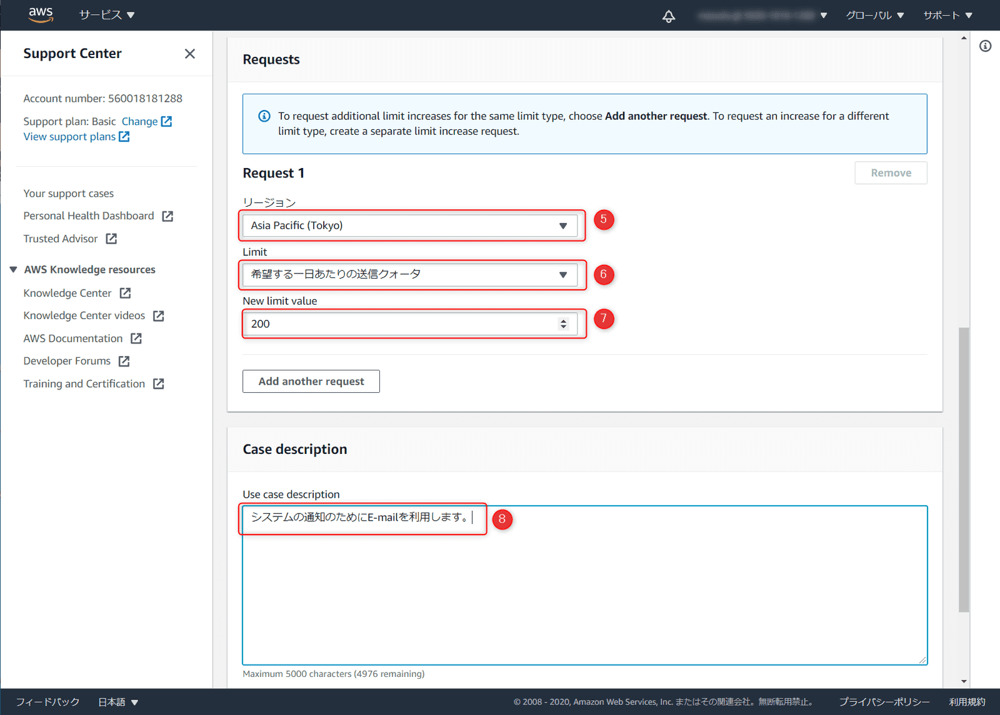
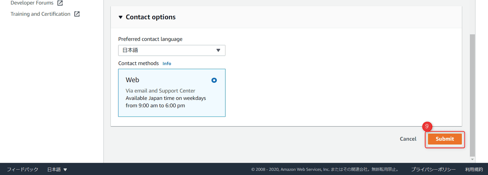
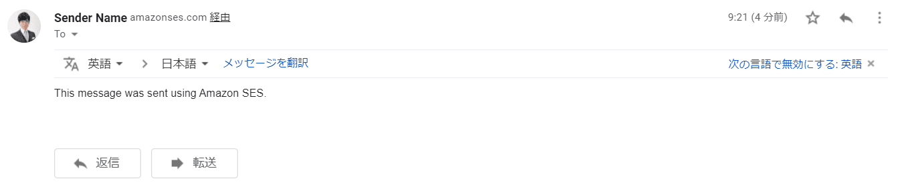

こんにちは。

今回は、AWS のサービスのひとつである [SES (Amazon Simple Email Service) ](https://aws.amazon.com/jp/ses/)と EC2で動作しているAmazon Linux2上のPostfixと連携させ、メール配送ができる仕組みを作ります。

このようなイメージです。
<a href="images/send-emails-by-linking-amazon-ses-and-postfix-1.png"></a>

今回の記事では **送信することを目的** としています。

気になる料金情報は以下に掲載があります。
[料金 - Amazon SES | AWS](https://aws.amazon.com/jp/ses/pricing/)

## 前提
- EC2 上にAmazon Linux2のインスタンスが1つあり、SSHログインできる
    - **Elastic IPが必要** です
- Amazon Linux2上でPostfixが未設定で稼働している
- 受信できるメールアドレスを準備する
- メールアドレスのドメインを管理するDNSサーバー(サービス)を操作できる

## SES設定
1. AWSの管理コンソールにログインし、 **SESと検索しSES Homeに遷移** します
<a href="images/send-emails-by-linking-amazon-ses-and-postfix-2.png"></a>

1. 左メニューから **Email Addresses** をクリックします
<a href="images/send-emails-by-linking-amazon-ses-and-postfix-3.png"></a>

1. **Verify a Email Address** をクリックし、別ウィンドウにメールアドレスを入力し、**Verify This Email Address** をクリックします
<a href="images/send-emails-by-linking-amazon-ses-and-postfix-4.png"></a>

1. メールを送った旨のメッセージが出たあと、以下のように **pending verification** で追加されます
<a href="images/send-emails-by-linking-amazon-ses-and-postfix-5.png"></a>

1. 指定したメールアドレスに **Amazon Web Services – Email Address Verification Request in region リージョン名** というタイトルのメールが到着するので、 **verification URL をクリック** します。
<a href="images/send-emails-by-linking-amazon-ses-and-postfix-6.png"></a>

1. **verified** になりました
<a href="images/send-emails-by-linking-amazon-ses-and-postfix-7.png"></a>

## SES 設定の取得

Postfixの設定に必要な情報を取得します。

1. **SES Homeの左メニューから SMTP Settings** をクリックします
<a href="images/send-emails-by-linking-amazon-ses-and-postfix-8.png"></a>

1. **赤枠の情報をメモ** します `email-smtp.ap-northeast-1.amazonaws.com`
続けて、 **Create My SMTP Credentials** をクリックします
<a href="images/send-emails-by-linking-amazon-ses-and-postfix-9.png"></a>

1. SES を利用するユーザーを作成します
**IAM User Name に任意の名称を入力** し、 **作成** をクリックします
<a href="images/send-emails-by-linking-amazon-ses-and-postfix-10.png"></a>

1. 表示された **SMTPユーザー名** と **SMTPパスワードをメモ** します。もしくは右下の **認証情報のダウンロードをクリック** しCSVをダウンロードします。 この **画面を閉じると2度とこの情報は取得出来ません** ので注意してください。万が一閉じてしまった場合は、再度ユーザー作成する必要があります
<a href="images/send-emails-by-linking-amazon-ses-and-postfix-11.png"></a>

## Amazon Linux2の準備

以下のコマンドで **SASL 認証パッケージをインストール** します
```
yum -y install cyrus-sasl 
```

## Postfix の設定

続けて、EC2の仮想マシンにログインしPostfixの設定を行います
root ユーザーでの実行を想定しています

1. Postfixの設定をバックアップします
`cp /etc/postfix/main.cf{,.org}`

1. 以下のコマンドを実行して設定を追加します
  ```
  postconf -e "relayhost = [email-smtp.ap-northeast-1.amazonaws.com]:587" \
  "smtp_sasl_auth_enable = yes" \
  "smtp_sasl_security_options = noanonymous" \
  "smtp_sasl_password_maps = hash:/etc/postfix/sasl_passwd" \
  "smtp_use_tls = yes" \
  "smtp_tls_security_level = encrypt" \
  "smtp_tls_note_starttls_offer = yes"
  ```
  **email-smtp.ap-northeast-1.amazonaws.com** の部分は、**前項の手順2で取得した情報** です

1. `/etc/postfix/sasl_passwd` を作成します
  ```
  vi /etc/postfix/sasl_passwd
  ```
  ファイルの中身は以下のとおりです
  ```
  [email-smtp.ap-northeast-1.amazonaws.com]:587 SMTPUSERNAME:SMTPPASSWORD
  ```
  **SMTPUSERNAME** と **SMTPPASSWORD** は **前項手順4で取得した情報** を入力します

1. 以下のコマンドを実行し  **SMTP 認証情報を含む hashmap データベースファイルを作成** します
 ```
  postmap hash:/etc/postfix/sasl_passwd
 ```

1. 1つ前の手順で作成したファイルは認証情報が含まれおり **暗号化されていないため以下のコマンドでアクセスを制限** します
  ```
  chown root:root /etc/postfix/sasl_passwd /etc/postfix/sasl_passwd.db
  chmod 0600 /etc/postfix/sasl_passwd /etc/postfix/sasl_passwd.db
  ```

1. **Postfix が CA 証明書の場所を認識できるように** します
  ```
 postconf -e 'smtp_tls_CAfile = /etc/ssl/certs/ca-bundle.crt'
  ```
  ※UbuntuやmacOSはコマンドが異なるため、[参考情報](https://docs.aws.amazon.com/ja_jp/ses/latest/DeveloperGuide/postfix.html)をご確認ください

1. Postfix を再起動します
  ```
 postfix start; postfix reload
  ```

## テスト

SSHセッションを2つ張り、1つは `maillog` を流しておきましょう
```
tail -f /var/log/maillog 
```

以下のコマンドでメールを送付します
```
sendmail -f sender@example.com recipient@example.com
From: Sender Name <sender@example.com>
Subject: Amazon SES Test                
This message was sent using Amazon SES.                
.
```

**デフォルの状態では、verified されたメールにしか送信できない状態** となっていますので上記の **sender@example.com** と **recipient@example.com は verified されたメールアドレスを入力** してください。(ということは、両方同じアドレスになります)

いざ、**実行！**

そして、**ログを確認** 、
```
Oct  7 13:24:03 ip-172-16-1-230 postfix/pickup[3568]: 5A30310C3D8: uid=0 from=<sender@example.com>
Oct  7 13:24:03 ip-172-16-1-230 postfix/cleanup[6820]: 5A30310C3D8: message-id=<20201007132403.5A30310C3D8@ip-172-16-1-230.ap-northeast-1.compute.internal>
Oct  7 13:24:03 ip-172-16-1-230 postfix/qmgr[3569]: 5A30310C3D8: from=<sender@example.com>, size=415, nrcpt=1 (queue active)
Oct  7 13:24:03 ip-172-16-1-230 postfix/smtp[6827]: 5A30310C3D8: to=<sender@example.com>, relay=email-smtp.ap-northeast-1.amazonaws.com[54.238.197.81]:587, delay=4.6, delays=4.3/0.02/0.12/0.16, dsn=2.0.0, status=sent (250 Ok 01060175033bab4a-ce5c2b2b-3ec8-4c20-9685-8ae50f1a2d35-000000)
Oct  7 13:24:03 ip-172-16-1-230 postfix/qmgr[3569]: 5A30310C3D8: removed
```

**status=sent** 送れてますね！

思いっきり迷惑メール扱いされていますが、**受信トレイでも確認** できました。

<a href="images/send-emails-by-linking-amazon-ses-and-postfix-12.png"></a>

## 送信制限を解除する

SES はデフォルトでは一切外にでれないサンドボックス設定になっています。

**SES Home から SendingStatistics を確認**すると **Production Access が Sandbox になっている** ことが確認できます
<a href="images/send-emails-by-linking-amazon-ses-and-postfix-13.png"></a>

**解除申請** をしていきます

**SendingStatistics 画面右側の Request Increased Sending Limits をクリック** します
画面の **Edit your account details をクリック** します

以下ように入力して送信しました

<a href="images/send-emails-by-linking-amazon-ses-and-postfix-14.png"></a>
<a href="images/send-emails-by-linking-amazon-ses-and-postfix-15.png"></a>
<a href="images/send-emails-by-linking-amazon-ses-and-postfix-16.png"></a>

サポートケースが作成されました
<a href="images/send-emails-by-linking-amazon-ses-and-postfix-17.png"></a>

## 送信制限解除

今回の場合、**6時間ほど** で以下の **メールがAmazonから送られて無事解除** されました。
**1日当たり、50,000メッセージ** まで送れるようです。
<a href="images/send-emails-by-linking-amazon-ses-and-postfix-18.png"></a>

それでは、解除後のテストを実施してみましょう。

送信制限が解除がされたので、**verifiedされているメールアドレス以外に送信** してみます。。
**送信元(From)はverifiedされているメールアドレスを指定する必要がある** ので注意です。


テストコマンドは前回と同じく以下をベースにします。
```
sendmail -f sender@example.com recipient@example.com
From: Sender Name <sender@example.com>
Subject: Amazon SES Test                
This message was sent using Amazon SES.                
.
```

メールログは、
```
Oct  8 00:21:04 ip-172-16-1-230 postfix/pickup[2983]: 9C60D10C3DC: uid=0 from=<sender@example.com>
Oct  8 00:21:04 ip-172-16-1-230 postfix/cleanup[3369]: 9C60D10C3DC: message-id=<20201008002104.9C60D10C3DC@ip-172-16-1-230.ap-northeast-1.compute.internal>
Oct  8 00:21:04 ip-172-16-1-230 postfix/qmgr[3569]: 9C60D10C3DC: from=<sender@example.com>, size=415, nrcpt=1 (queue active)
Oct  8 00:21:04 ip-172-16-1-230 postfix/smtp[3371]: 9C60D10C3DC: to=<recipient@example.com>, relay=email-smtp.ap-northeast-1.amazonaws.com[18.178.38.129]:587, delay=4, delays=3.7/0/0.08/0.17, dsn=2.0.0, status=sent (250 Ok 0106017505953060-f7aed5e2-8be0-4c69-9698-51dcee960281-000000)
Oct  8 00:21:04 ip-172-16-1-230 postfix/qmgr[3569]: 9C60D10C3DC: removed
```

**status=sent** となっています。

前回のテストと異なるメールアドレスの **受信トレイでも確認** できました。
<a href="images/send-emails-by-linking-amazon-ses-and-postfix-19.png"></a>

## ドメインの認証

**最後の手順** です。

**この状態では、SES経由のメールがメーラーによっては迷惑メールとして取り扱われる** ため、 **Domainの認証** を行います。
**操作には送信するドメインを管理するDNSサーバーを操作する必要** がありますので事前にご確認ください。

1. **SES Home から、Domains をクリック** し、**Verify a New Domain をクリック** します
<a href="images/send-emails-by-linking-amazon-ses-and-postfix-20.png"></a>

1. **verifiedされているメールアドレスのドメイン部** を入力し、**Verify This Domain をクリック** します
<a href="images/send-emails-by-linking-amazon-ses-and-postfix-21.png"></a>

1. **認証用のTXTレコードを自信のドメインを管理するDNSサーバーに登録** します
<a href="images/send-emails-by-linking-amazon-ses-and-postfix-22.png"></a>

1. 登録してすぐに **verified** になりました
<a href="images/send-emails-by-linking-amazon-ses-and-postfix-23.png"></a>

認証されていない場合は以下のようになります。
<a href="images/send-emails-by-linking-amazon-ses-and-postfix-24.png"></a>

認証されたことを通知する **Domain Verification SUCCESS for msen.jp in region Asia Pacific (Tokyo)
** というタイトルのメールも届いていました
<a href="images/send-emails-by-linking-amazon-ses-and-postfix-25.png"></a>

ドメインが **verified となった後、 **TXTレコードは削除してOKの模様** です。
**評価時に削除して1週間ほど状況を確認しましたが、verified** のままでした。
AWSサポートに問合せもしてみたのですが、有料プランではないと回答できないと言われてしまいました。。

## あとがき
別途メールサーバーを構築することなくシステムからメール送信が行えるので色々と応用が利くのではないでしょうか。

それでは次回の記事でお会いしましょう。

## 参考情報
- [Amazon SES と Postfix の連携 - Amazon Simple Email Service](https://docs.aws.amazon.com/ja_jp/ses/latest/DeveloperGuide/postfix.html)
- [Amazon SES SMTP 認証情報の取得 - Amazon Simple Email Service](https://docs.aws.amazon.com/ja_jp/ses/latest/DeveloperGuide/smtp-credentials.html)
- [Amazon SES サンドボックス外への移動 - Amazon Simple Email Service](https://docs.aws.amazon.com/ja_jp/ses/latest/DeveloperGuide/request-production-access.html)
- [Amazon SESドメイン検証 TXT レコード - Amazon Simple Email Service](https://docs.aws.amazon.com/ja_jp/ses/latest/DeveloperGuide/dns-txt-records.html)