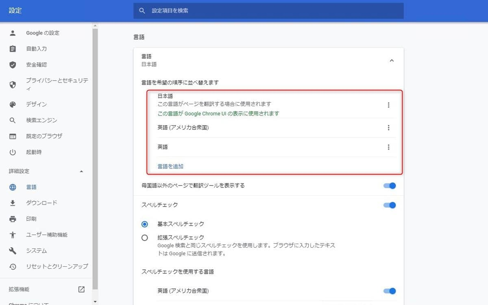

こんにちは。

**Chrome を利用** して [Nextcloud](https://ja.wikipedia.org/wiki/Nextcloud) の評価を行っていて、 **ログイン後の表記が中国語になってしまう現象** に悩まされていました。

私が悲鳴を上げていたところ、[kenzauros](https://github.com/kenzauros) も同じ環境にログインして確認してくれた結果、「**なってないよ**」との連絡が・・・。

切り分けを行ったところ、 **会社PC・自宅PCのどちらも同じ状態** だったため、**ブラウザーの言語設定が原因ではないか？** とアドバイスをもらい早速確認してみました。
[Chrome の言語の変更とウェブページの翻訳 - パソコン - Google Chrome ヘルプ](https://support.google.com/chrome/answer/173424?co=GENIE.Platform%3DDesktop&hl=ja)

結果・・・ **ビンゴ！** でした。

**中国語がふたつ** 上位に来ている。。

なんでこんなことに、と思いながら **早速削除** しました。

**Nextcloudに戻り F5** ぽち。

**おおおー Good Morning ! 直りました！**

では、なぜ私だけが起きたのか。

**原因は定かではない** ですが、**会社・自宅の環境でChromeにログイン** してるので何らかの原因で設定が同期されたものと推測しています。

ともあれ解決しました。
**同じような現象** に悩まされている方は、是非 **ブラウザーの言語設定をご確認** ください。

それでは次回の記事でお会いしましょう。