こんにちは。

Windows 11 が 2021年10月5日に初回リリースされました。

Windows 10 がリリースされたときは、Windows として最後のOSと言われていたのに、バージョンアップだけでは難しい事情でも出たのでしょうか。

リリースされたら使ってみるしかないと、プライベートPCをWindows 10 から Windows 11 にアップデートしてみました。

## PCスペック
- プロセッサ Intel(R) Celeron(R) N4500 @ 1.10GHz
- メモリー 8GB
- OS Windows 10 (20H2)

## Microsoft Windows 11 とは

>Windows 11は、マイクロソフトが開発するWindows NT系のオペレーティングシステムである。Windows 10の後継バージョンにあたる。日本では2021年10月5日に公開された。開発コードネームは「Sun Valley」であり、正式発表前はWindows 10のバージョンの一つともみられていた。
[Wikipedia 抜粋](https://ja.wikipedia.org/wiki/Microsoft_Windows_11)

## アップデートの流れ

大きな流れは、 **アップデート対象として問題ないかチェック** → **アップデート** という形です。

1. PC正常性チェックアプリ の実行
    [ここから](https://aka.ms/GetPCHealthCheckApp) アプリをダウンロードします。
    
    ダウンロードした `WindowsPCHealthCheckSetup.msi` を実行し、以下の流れで進めます。 
    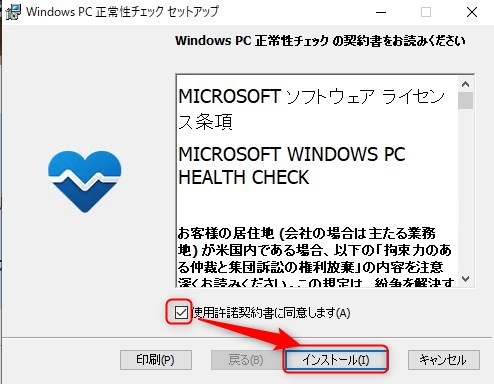
    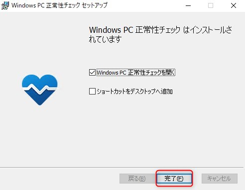
    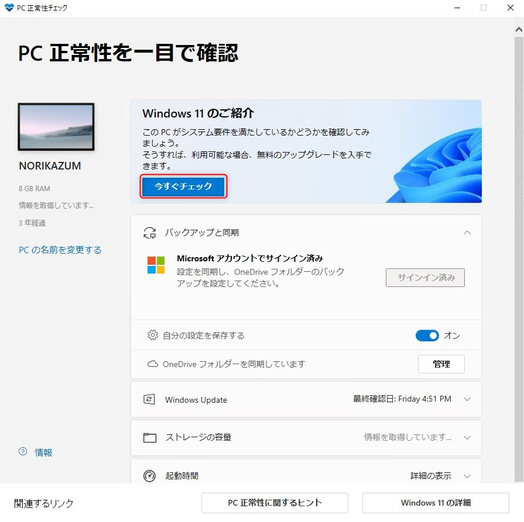
    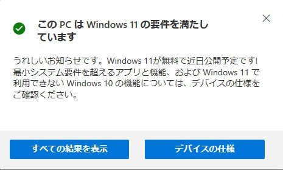
    
    結果から、以下の要件を満たす必要があるようです。
    - プロセッサの **クロック速度が 1GHz 以上** かつ **2コア以上** であることを
    - メモリーが **4GB以上** 搭載されていること
    - システムディスクが **64GB以上** であること
    - **UEFI、セキュアブートに対応** していること
    - **TPM2.0が有効** になっていること

1. Windows 11 にアップデート
    
    Windows 11 を [ここからダウンロード](https://www.microsoft.com/ja-jp/software-download/) します。
    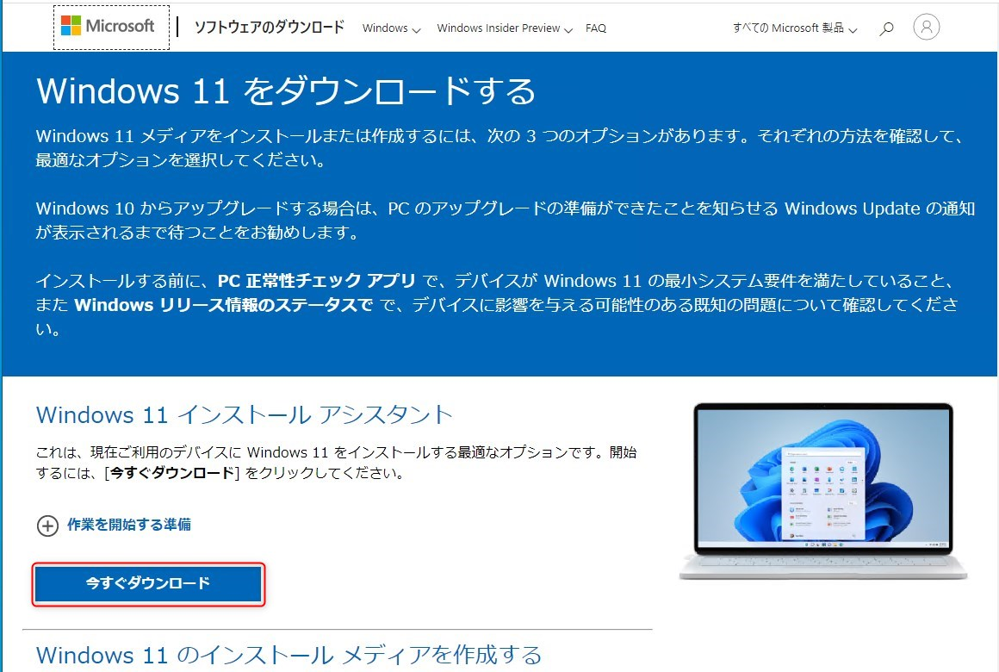
    ダウンロードされた `Windows11InstallationAssistant.exe` を実行し、以下の流れでアップデートを進めます。

    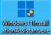
    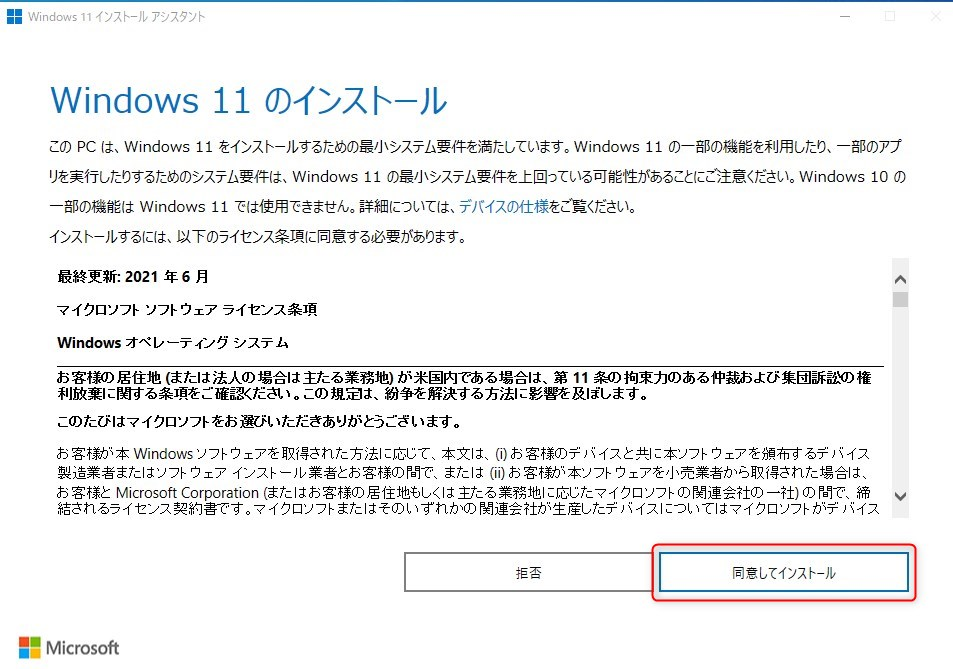
    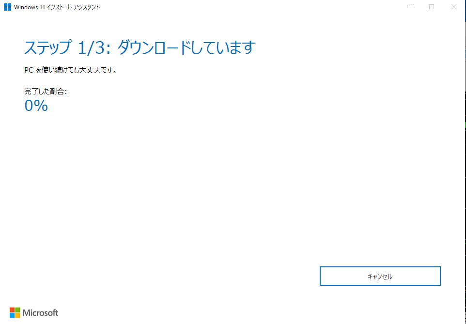
    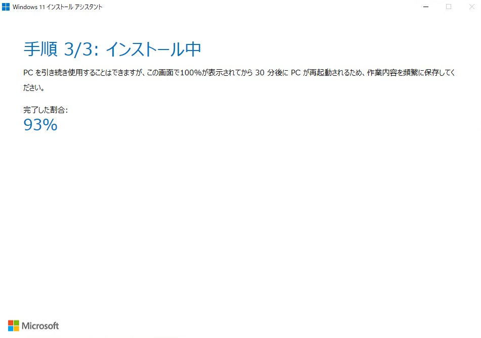

    22:42から実施し0:30 ( **2時間経過** )の時点で **93％** でした。
    ちょっと眠気に負けてここまで見届けて寝てしまいました。

1. Windows 11 アップデート完了
    起きるて端末を確認すると **自動で再起動されアップデートが完了** していました。
    
    
    ログインすると、このような状況になりました。壁紙は Windows 11 用に変更されていましたがタスクバーなどは引き継がれていました。
    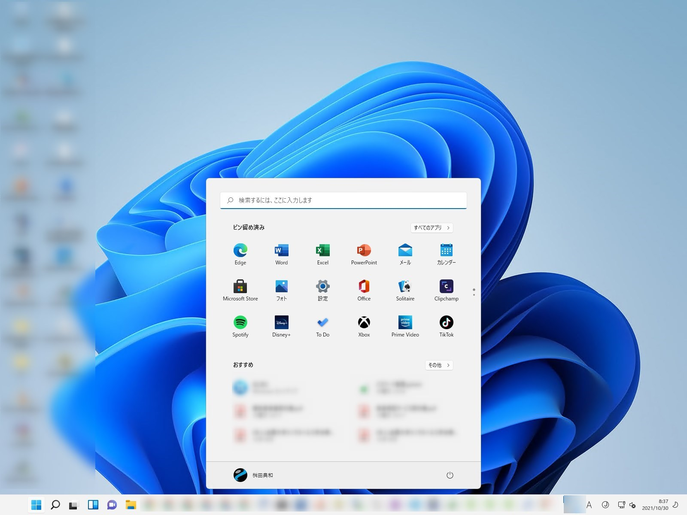
    ではざっと触ってみたいと思います。

    Windows 11 にアップデート直後ですが、すぐに Windows Updata が出ていたのでアップデートを実施しました。
    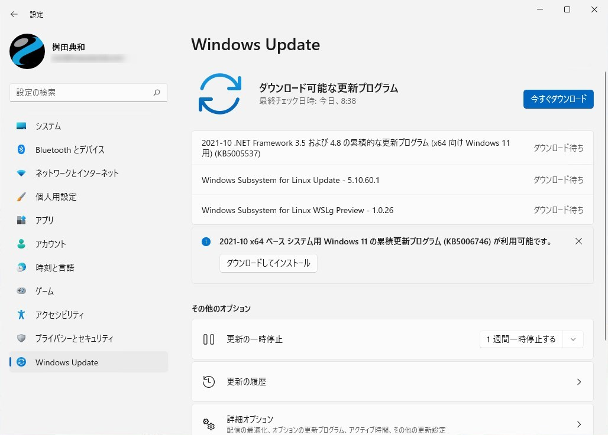

## アップデート後のレビュー
- ESET Internet Security をインストールしていますが ESET からファイアウォールが無効だと警告が出たので有効にしました。
    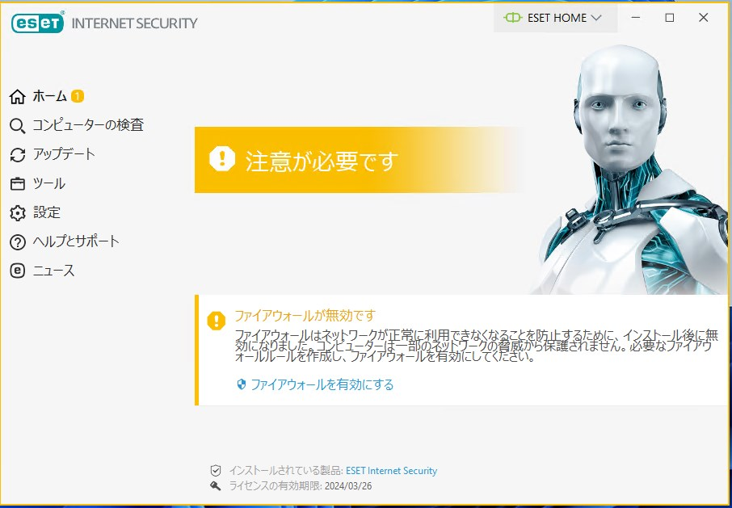

- 左下のWindowsマークをクリックするとこんな感じ。
    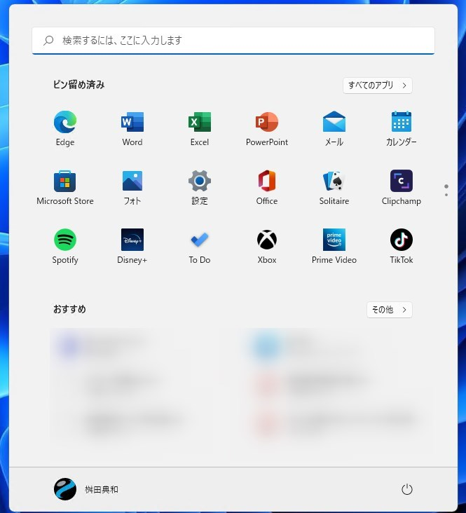
    設定画面もWindows 10 より個人的にはすっきりして見やすく感じました。
    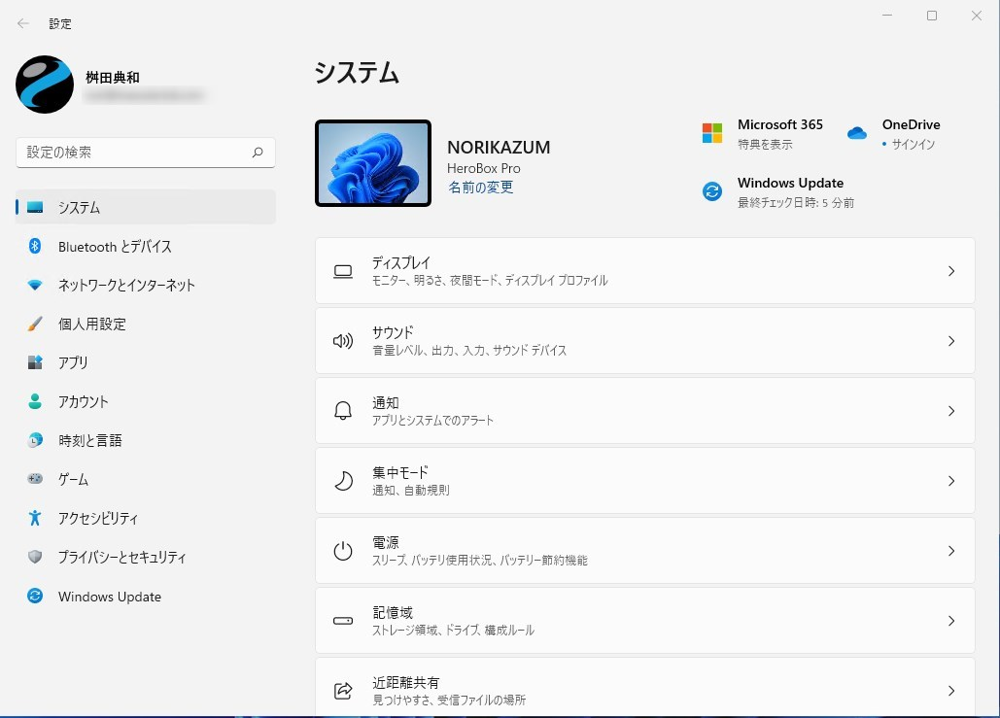

- タスクマネージャーが右下の時刻を右クリックと場所が変わってました。
    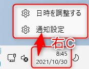
    Windows マークを右クリックにありました。
    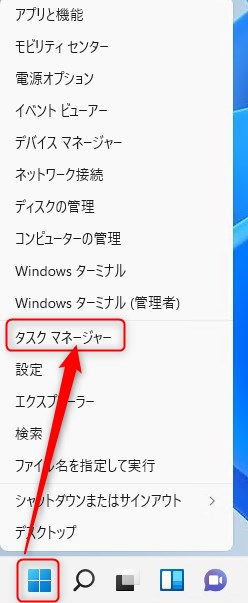

- ネットワークの設定は旧来のイメージから脱却してました。
    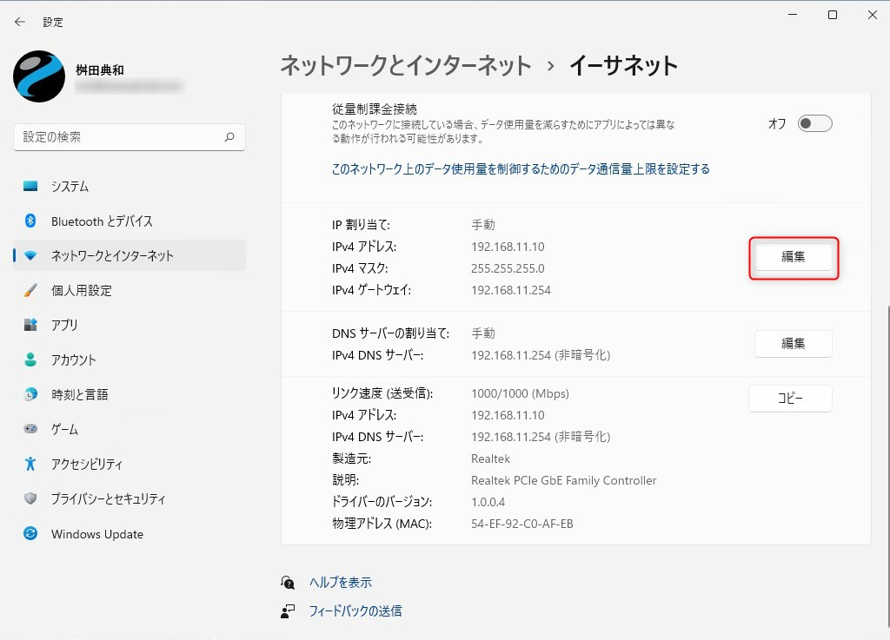
    ↓
    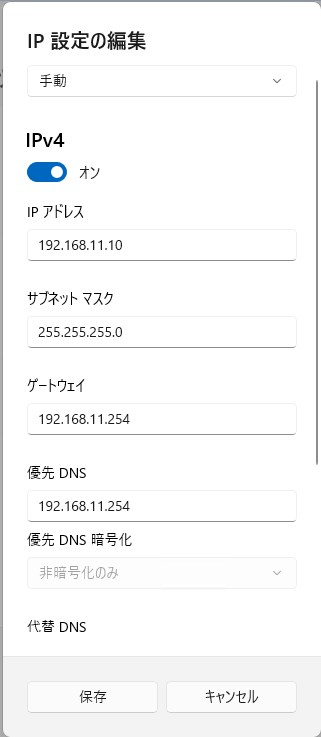
    旧来のイメージ。
    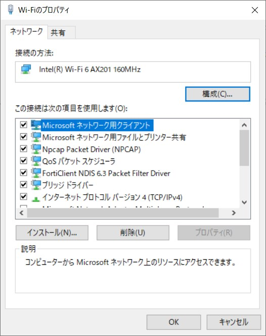

