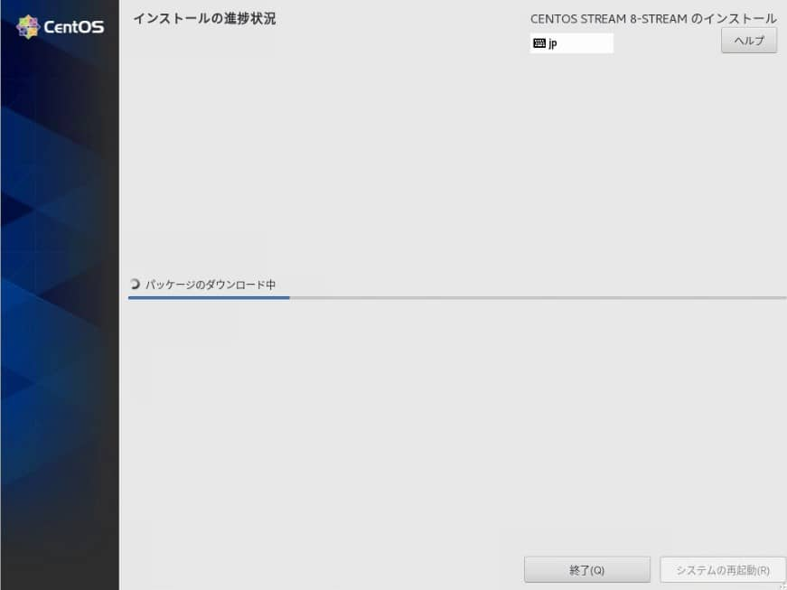
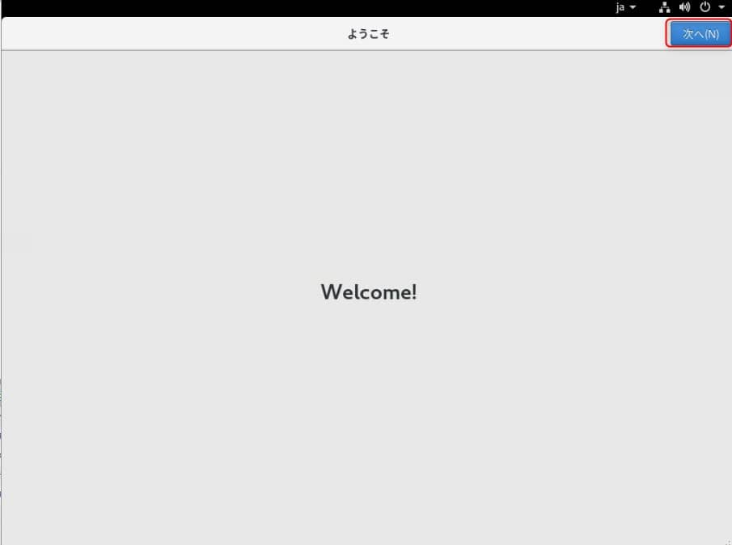

こんにちは。

**2020年12月8日に CentOS Project が Stream 以外の CentOS 8 を 2020 年末に終了 (EoL) するという衝撃のニュース** が出ました。
[CentOS Project shifts focus to CentOS Stream – Blog.CentOS.org](https://blog.centos.org/2020/12/future-is-centos-stream/)

Google 翻訳ですが、記事を読んでみると、

> Red Hat Enterprise Linux（RHEL）の再構築であるCentOS Linuxから、現在のRHELリリースの直前に追跡するCentOSStreamに焦点を移します。CentOS Linux 8は、RHEL 8の再構築として、2021年の終わりに終了します。

続けて、**CentOS 7 は RHEL7 のサイクルとおりに継続する** 、ともありました。

> その間、多くの皆さんがCentOS Linux 7に深く投資していることを理解しており、RHEL7のライフサイクルの残りを通してそのバージョンを作成し続けます。

**RHEL7.7 は 2023 年 8 月 30 日終了予定** となっているので CentOS 7 を利用していればまだ焦ることはありません。
[Red Hat Enterprise Linux のライフサイクル - Red Hat Customer Portal](https://access.redhat.com/ja/support/policy/updates/errata#Life_Cycle_Dates)

まさか  **CentOS 7 を使っていたほうが余命が長くなる** なんて・・・

CentOS 8 を採用しているお客さまも多いことから Stream の移行かもしくはその他か・・・考えていかないといけません、

記事には、**Stream 8 に移行することが最善**、とありました。
> CentOS Linux8からの小さなデルタであるCentOSStream 8に移行するのが最善のオプションであり

と、いうことで (!?) Stream 8 をインストールしてみました。
恥ずかしながら初めてです。

## 環境
- VMware ESXi 6.7
- 仮想マシン (2コア、2GBメモリ)

## インストール
**CentOS-Stream-8-x86_64-20201211-dvd1.iso** を利用しました。
[Index of /centos/8-stream/isos/x86_64](http://mirror.vodien.com/centos/8-stream/isos/x86_64/)

- **ISOからブート** します

↓

- **言語を選択** します

- **インストール概要を決定** します (今回は **全てデフォルト** でインストールしてみます)

↓

↓

- **インストールが進行** し、 **再起動** します

↓

- **ライセンスに同意** します

↓

↓

↓

ここまででインストールは完了です。
**CentOS 8 となんら変わりはなく違和感なし** です。

## 初期セットアップ

- Welcome 画面を **次へ** で進みます

- プライバシー の確認を **次へ** で進みます

- **オンラインアカンとへの接続はスキップ** します

- **ユーザーを作成** します 

↓

- これで **初期セットアップが完了** します

↓

メニューはこんな感じでした。

このあと、パッケージのインストールなども試してみましたが特に違和感を感じることはなく、触ってみた限りでは CentOS 8 と同様に使うことが出来な印象でした。

[この記事](https://www.clara.jp/media/?p=6989) でも、
> Fedoraのような、開発要素の高いディストリビューションではなく、引き続きRHELの互換OSという点ではCentOSと変わらず、RHELのメジャーバージョンにも追従するため、大きな変化はありません。

とまとめられていました。

今後の 提案は CentOS 8 から CentOS Stream となりますね。
それでは次回の記事でお会いしましょう。