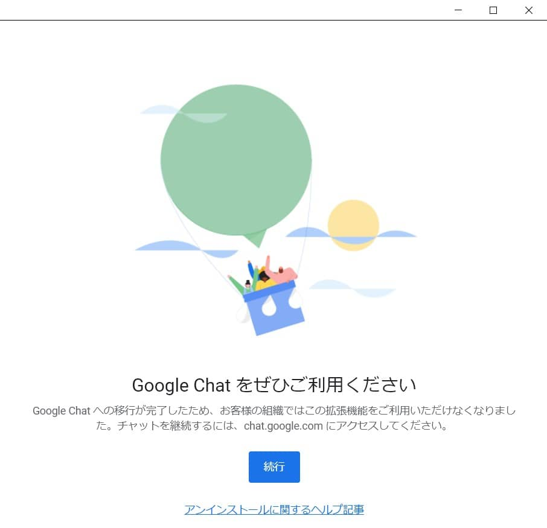

こんにちは。

Google ハングアウトの終了に伴い、ログインすると以下の案内が突然表示されるようになりました。
私は、数ヶ月程前からで出ていたのですが、放置していました。

PC起動時になどで勝手に表示されて嫌になってきたので、短い記事ですがその解消までの流れを記載しました。

## 突然このような画面が
私と同じように突然この画面が表示された方はいませんか？

**続行ボタン** をクリックするとこのエラーになります。

## 原因はアプリの利用終了だった
ヘルプ記事でも十分でしたが、聞いてみたかったのでGoogleサポートに確認したところ、

> ハングアウトのアプリ利用が終了したため、この画面が表示されるようになりました

と、教えてもらいました。

また、原因としては以下のどちらかとのことでした。

1. Google Chrome の拡張機能として利用　→　拡張機能の削除が必要となります。
1. WindosやMacのスタンドアロンアプリとして利用　→　アプリの削除が必要となります。

私の場合は、拡張機能のほうでした。

早速削除しました。

↓

ユーザーを分けて複数のChromeを使いわけている方は全てのユーザーで拡張機能を削除してください。

サポートから最後に、

> 今後、ハングアウトを利用する場合は、ブラウザアクセスを推奨しております。
[Google ハングアウト](https://hangouts.google.com/)

と教えていただきました。

特別な事情がなければ今後は、[Google Chat](https://workspace.google.co.jp/intl/ja/products/chat/) を使うことをお勧めします。
それでは次回の記事でお会いしましょう。