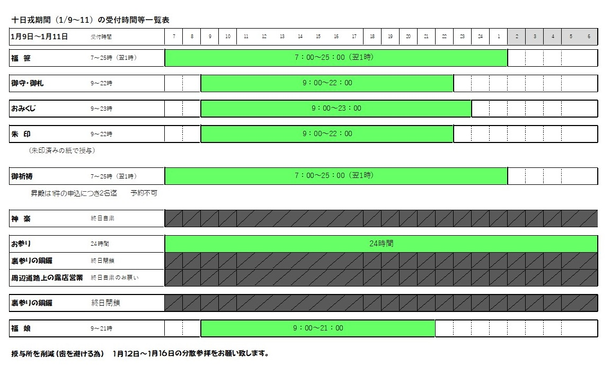
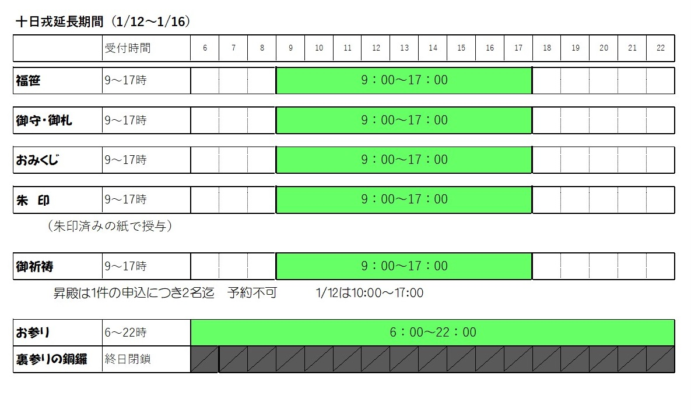
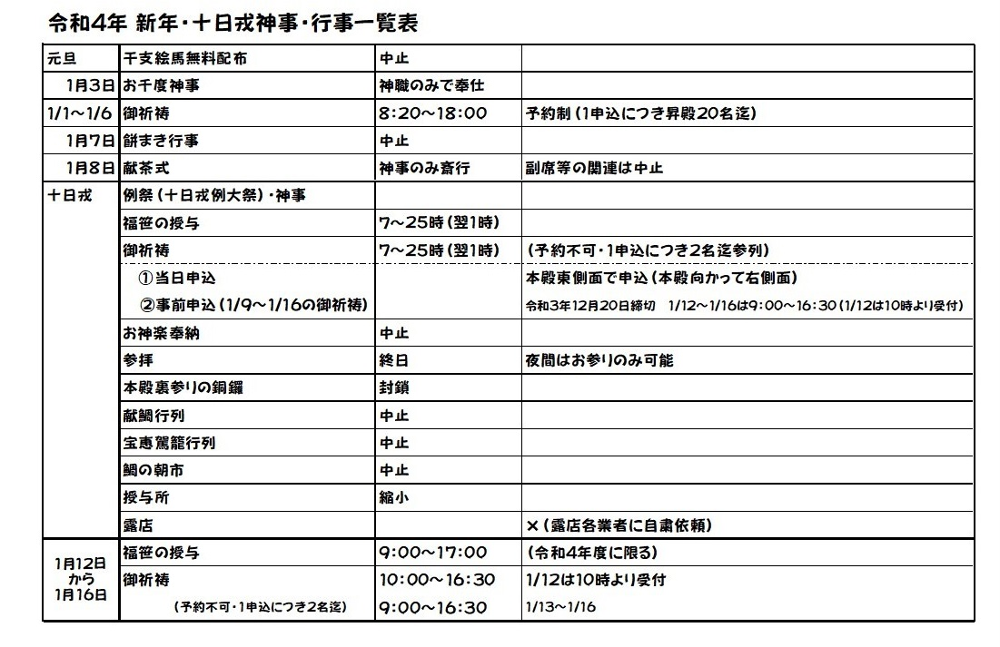
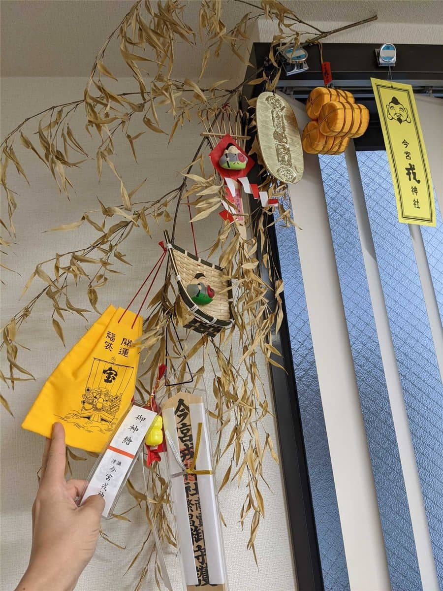

新年あけましておめでとうございます。
本年もよろしくお願いいたします。

[昨年は](https://mseeeen.msen.jp/2021-toka-ebisu/)、コロナ渦で開催が制限されていましたが、今年は分散参拝により **分散参拝 1月12日～16日 9時～17時** で福笹の授与が行われました。

日程は以下のようになっていました。

[今宮戎神社ホームページ抜粋](http://www.imamiya-ebisu.jp/covid-19)

## 昨年の福笹

昨年は **緊急事態宣言後に参拝したため福笹の授与が中止だったので 3点、5点、7点、10点 と決められた飾りが取り付けられた笹** でした。

## 参拝・福笹

混雑もなくとても静かな状態でした。
毎年聞いていた「 **商売繁盛で笹もってこい** 」が再開されていて やっぱりこれだな と思いました。

※写真

返納
※写真

## 今年の福笹

今年は授与が再開されたことで **8期目の8点を選ぶことができました**

※写真

※感想

## あとがき

※以下修正
毎年買っていた、ベビーカステラと、干支の飴は販売がなく購入できませんでした、残念。。

コロナ渦が落ち着くのはまだ先になりそうですが、来年(2022年)は8つの飾りを選べることを祈っています。

2022年もスタッフ一同頑張って参りますのでどうぞよろしくお願いいたします。
※今年は皆での参拝は自粛したため写真はありません。
