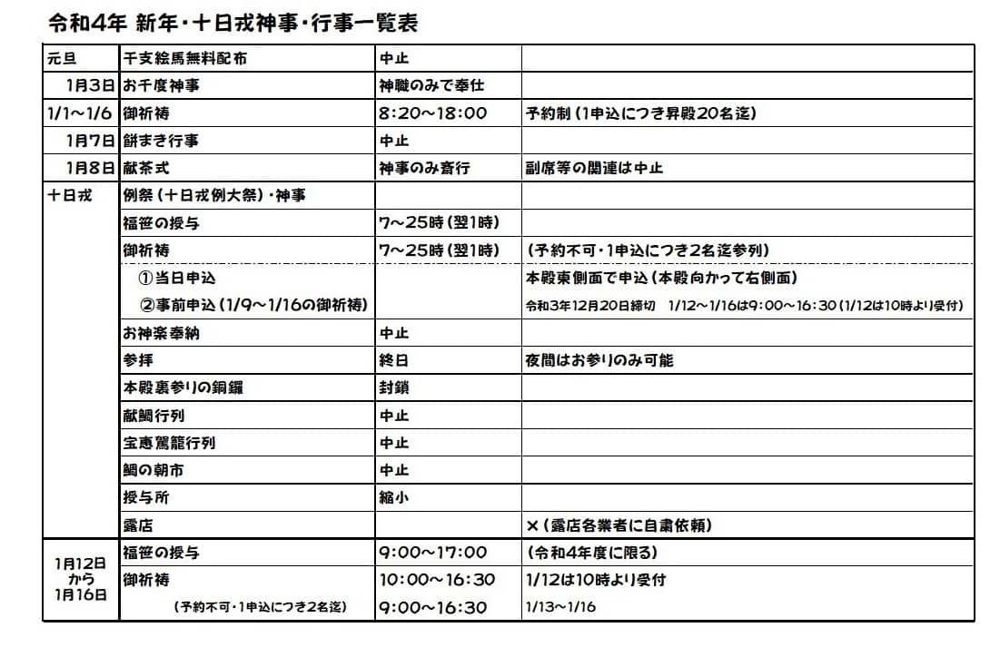
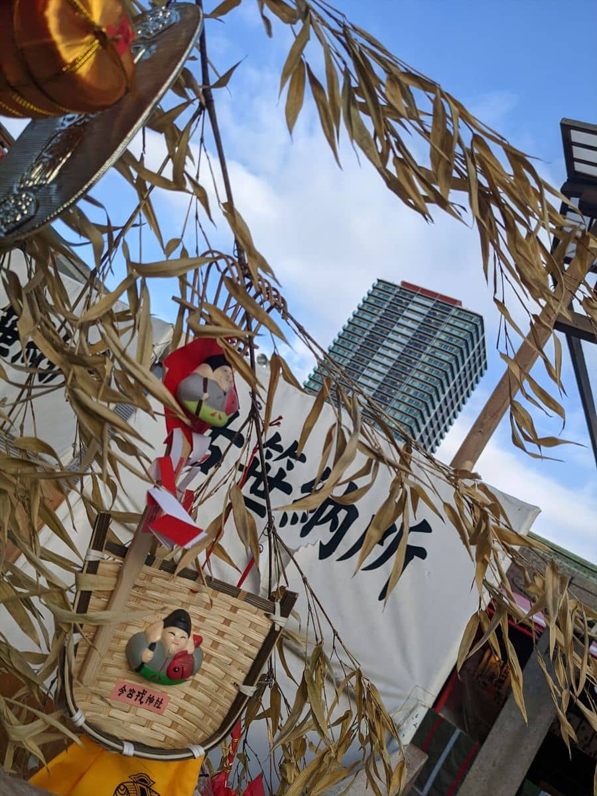

新年あけましておめでとうございます。
本年もよろしくお願いいたします。

2022年は福笹の授与が行われている、1/12(水) に参拝してきました！

## 2022年の日程

[昨年は](https://mseeeen.msen.jp/2021-toka-ebisu/)、コロナ渦で開催が制限されていましたが、今年は分散参拝で **1月9日～16日** で福笹の授与が行われました。

日程は以下のようになっていました。

[今宮戎神社ホームページ抜粋](http://www.imamiya-ebisu.jp/covid-19)

## 昨年の福笹

昨年は **緊急事態宣言の後に参拝したため福笹の授与が中止だったので 3点、5点、7点、10点 と決められた飾りが取り付けられた笹** でした。

## 参拝・福笹

12日ということもあって提灯も外され道中は静かでした。

毎年聞いていた「 **商売繁盛で笹もってこい** 」のアナウンスは今年も聞けず、寂しい！

昨年の福笹を無事返納しました。

## 今年の福笹

笹の受け取り。

福飾りも再開されていたので **8期目の8点を選ぶことができました** ！

※一番上の **9個目いただいたもの** です。

## あとがき

今年も、ベビーカステラと、干支の飴は販売がなく購入できませんでした、残念。

個人的に毎年更新している小判は買えました！

コロナ渦が落ち着いてきたと思ったらまた新たな変異種でざわつく今日このごろですね。
来年(2023年)も9つの福飾りの紹介をお楽しみに！

2022年もスタッフ一同頑張って参りますのでどうぞよろしくお願いいたします。

