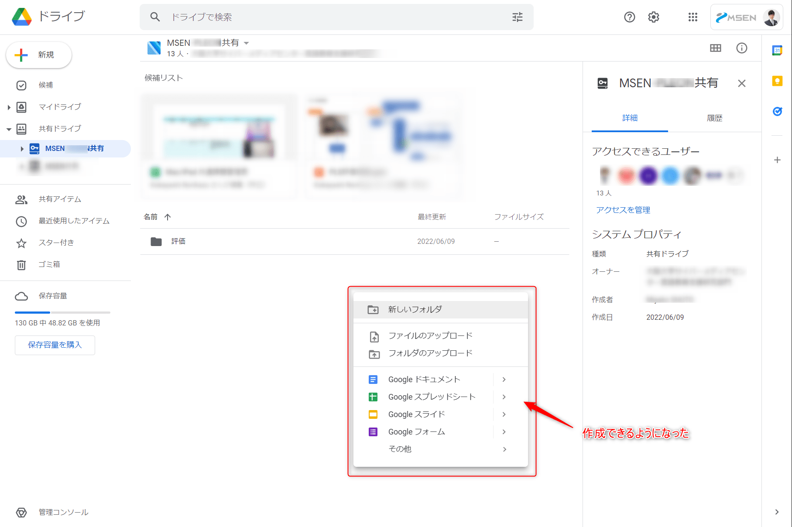

こんにちは。

弊社は Google Workspace を利用していますが、Google Drive を社外共有する設定で少しハマりましたので備忘録を兼ねて記事にします。

## 共有の方向

Google Drive で社外共有したいとケースは、以下の2パターンだと思います。

1. 自社から共有する
1. 他社から共有される

## Google Drive の設定

共有の方向に対する Google Drive の設定は [Google Admin](https://admin.google.com/) から行います。

ログイン後、ドライブとドキュメントをクリックし、共有設定→共有オプションへと進みます。

以下の画像の設定を設定したい共有の方向に合わせて変更します。

1. 自社から共有する場合は、①の設定をオンにする
1. 他社から共有される場合は、②の設定を全員もしくは自社内のユーザーのみに設定する

## ハマったこと

記事を書くにあたりハマったことですが、とある業務で、**他社から共有設定をしていただきましたが、管理権限を与えていただいているのにも関わらず弊社から書き込みができない状態** になりました。

- エクスプローラーからフォルダを作成すると以下のエラーが発生

> 予期しないエラーのため、フォルダーを作成できません。このエラーが再発する場合は、エラーコードを使用して、この問題についてのヘルプを検索してください。
エラー 0x80070522:クライアント要求された特権を保有していません。

- Web ブラウザ上から確認すると、以下のようにグレーアウトされている

前述の画像②の設定を実施した後、正常に書き込めるようになりました。

このように方向ごとに設定が分かれているのでうまくいかないときは確認してみてはいかがでしょうか。

ただし、セキュリティレベルには十分ご注意ください。

それでは次回の記事でお会いしましょう。
