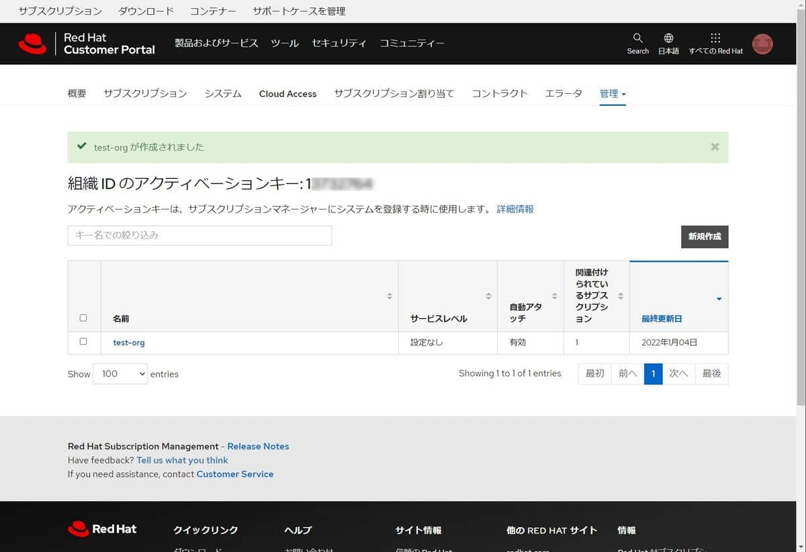

こんにちは。

先日お客様環境にRed Hat Enterprise Linux 8 をアクティベーションしたのですが、**Red Hat アカウント によるものではなく組織IDによるアクティベーションでした** 。

成功するまでに少しはまりましたのでメモとして記事にします。

[以前の記事](https://mseeeen.msen.jp/red-hat-enterprise-linux-8-1-on-vmware-esxi/#%E3%82%A2%E3%82%AF%E3%83%86%E3%82%A3%E3%83%99%E3%83%BC%E3%82%B7%E3%83%A7%E3%83%B3%E3%81%A8%E3%82%B5%E3%83%96%E3%82%B9%E3%82%AF%E3%83%A9%E3%82%A4%E3%83%96) に**Red Hat アカウント によるアクティベーション** を記載しています。

## Red Hat における 組織ID の発行について
今回はお客様から 組織ID と アクティベーションキーを提供いただきました。

それを使用して後述の方法でアクティベーションするのですが、組織IDとアクティベーションキーの発行についても触れておきます。

**この作業は組織の管理者だけが可能** です。
こちらも参考になります。

[Red Hat Subscription Management における組織 ID について理解する - Red Hat Customer Portal](https://access.redhat.com/ja/articles/3296301)

1. [アクティベーションキーページ](https://access.redhat.com/management/activation_keys) にアクセスします。※要ログイン

1. 以下の画面になります。

表現がややこしいですが、**「組織IDのアクティベーションキー」の横の数字が組織ID** です。

1. 同画面から **新規作成(①)をクリック** します。

1. **名前に任意のものを入力(①)し、割り当てるサブスクリプションを選択(②)し作成(③)をクリック** します。

ここでも表現がややこしいですが、**①の名前がアクティベーションキー** になります。**自動アタッチを有効にし、サブスクリプション(③)を割り当てるとアクティベーションと同時にサブスクライブ** されます。

以上で完了です。



## アクティベーションの流れ
1. Red Hat Enterprise Linux 8 を構築 
1. 組織ID と アクティベーションキー の情報を入手する
1. コマンドでアクティベーションする。

## 実行イメージ
ここでは、例として **組織IDを1xxxxxxx** 、**アクティベーションキーをtest-org** とします。

以下のコマンドを実行します。

```bash
subscription-manager register --org=1xxxxxxx --activationkey=test-org
```

結果は以下のとおりです。
```bash
# subscription-manager register --org=1xxxxxxx --activationkey=test-org
このシステムは、次の ID で登録されました: 7d50c8bf-3813-4cf3-b122-7ebcb80438b6
登録したシステム名: test-srv
インストール済み製品の現在の状態:
製品名: Red Hat Ansible Engine
状態:   サブスクライブ済み

製品名: Red Hat Enterprise Linux for x86_64
状態:   サブスクライブ済み
```

画像は合成ですが正常にアクティベートされています。


アクティベーション解除は、通常通り `unregister` することで正常に行えました。

```bash
# subscription-manager unregister
登録の解除中: subscription.rhsm.redhat.com:443/subscription
システムの登録は解除されました。
```


## あとがき

お客様にアクティベーションは組織IDでお願いします、と言われ作業当日を迎え、事前に調べていたコマンドでは通らず、はまりました。

それでは次回の記事でお会いしましょう。
