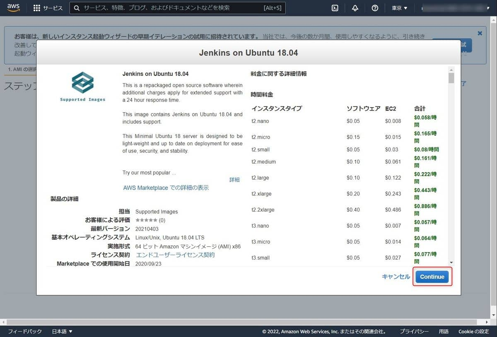
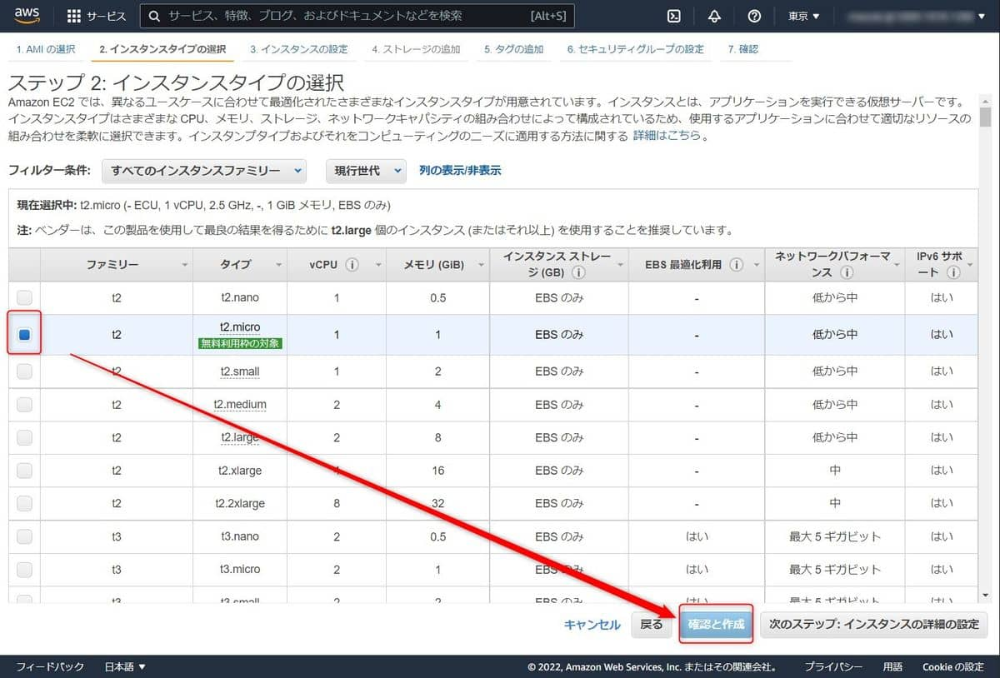
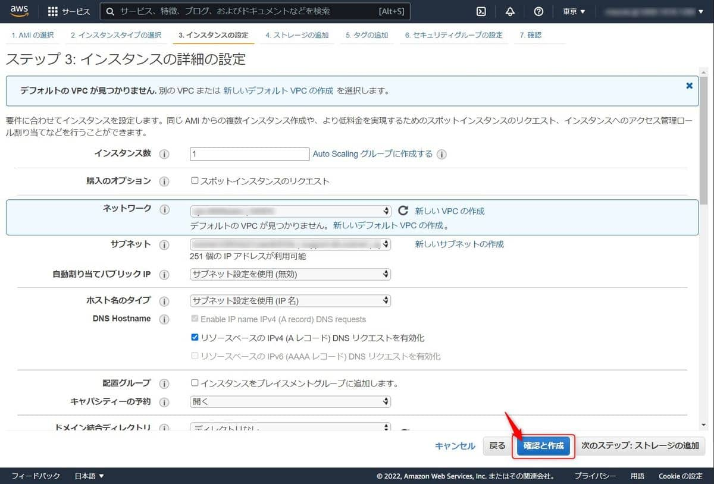
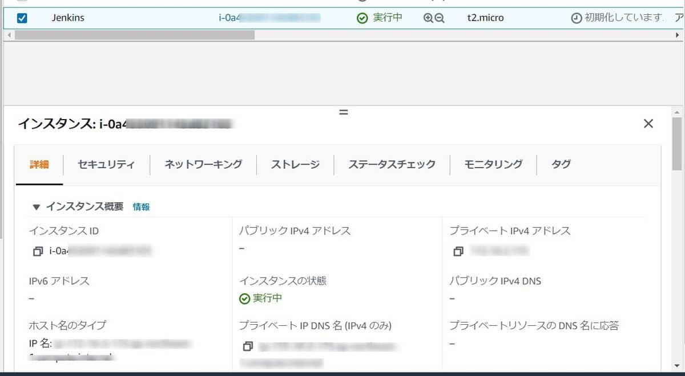
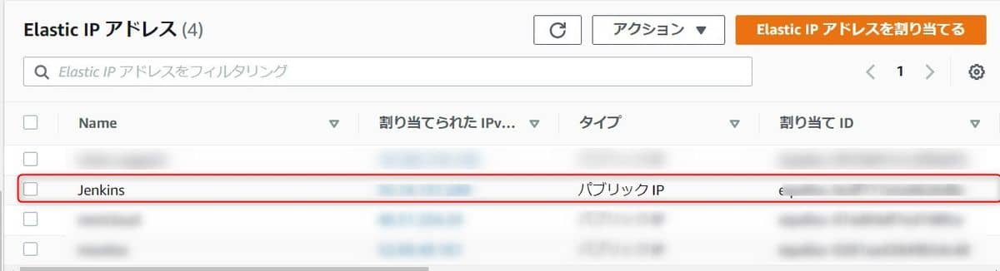
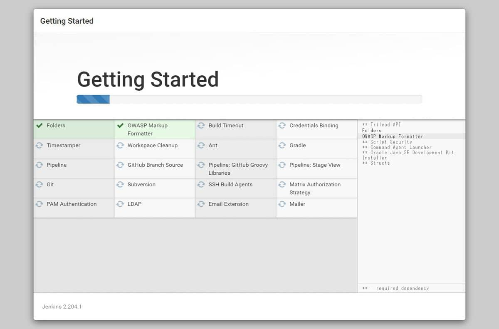
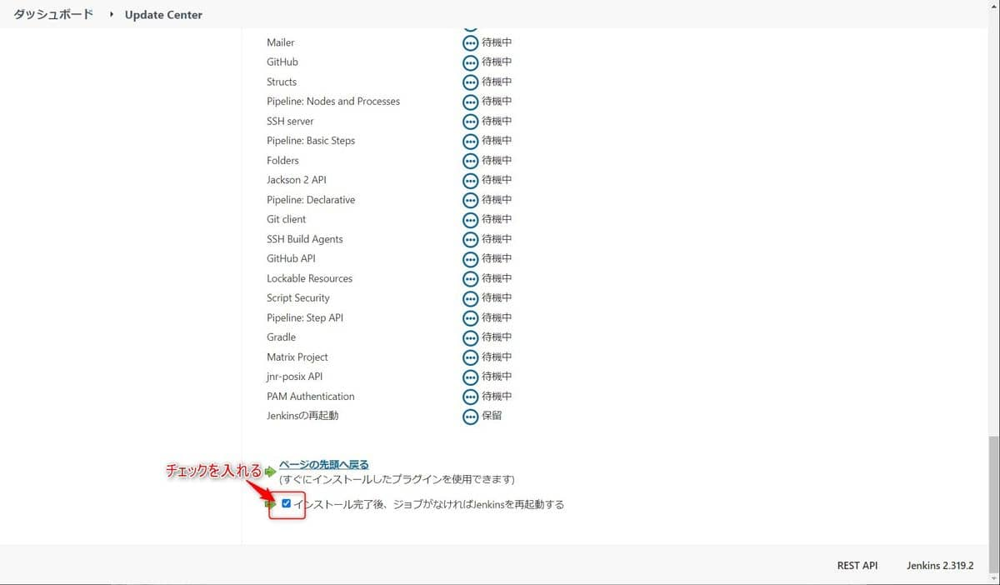

こんにちは。

今回は フリーでオープンソースの **自動化サーバー の Jenkins を Amazon EC2 上に構築** してみたいと思います。

**サクッと構築** するために、 **Supported Images さんから提供されている AMI を利用します** 。

## 手順
1. **AWS コンソールにログイン** します
1. **EC2 ダッシュボード → インスタンス → インスタンスを起動** へ進みます
1. **検索枠に Jenkins を入力**し、**Jenkins on Ubuntu 18.04** を選択します


1. タイプは t2.micro にしました

1. 設定は変更せず作成します。このあたりは適宜調整してください



1. 起動完了です


## EC2 調整
1. 外部からアクセスするため、作成された **インスタンスにElastic IP 割り当て** ます

1. **セキュリティグループは自動で作成・割り当て** され、**8080/tcp と 22/tcp が 公開** されているので必要に応じて調整します


## Jenkins の設定
1. 以下の流れで **SSHアクセス** します。(他の方法でもOK) 
    1. `ssh -i "jenkins.pem" ubuntu@ElasticIP` で接続
    1. `sudo su-` で root に昇格
    1. `cat /var/lib/jenkins/secrets/iniialAdminPassword` で 初期パスワードを出力しメモする
1. http://ElasticIP:8080 にアクセスし、**前項で確認した初期パスワードを入力** します
    
1. 推奨プラグインをインストールしてもらうことにします
    
    
1. 初期ユーザーの情報を入力します
    
1. これで完了です
    
    

## Jenkins のアップデート

バージョンは、`2.204.1` でしたので 執筆時の最新LTSが `2.319.2` でしたのでアップデートします。

[Jenkins download and deployment](https://www.jenkins.io/download/)

1. SSHアクセスし、root になります
1. 以下のコマンドを実行します
    ```bash
    systemctl stop jenkins
    cd /usr/share/jenkins/
    mv jenkins.war{,.bak}
    wget https://get.jenkins.io/war-stable/2.319.2/jenkins.war
    systemctl start jenkins
    ```
1. 再度Jenkinsアクセス→ログインしアップデートされたことを確認します
    
1. 警告が出ているので対応します
- プラグインのアップデート
    
    
    

1つ警告が残りましたが、エージェントの設定はこの記事では割愛しますのでこれでセットアップ完了とします。


**とても簡単** に構築できました。
**AMIご提供者様に感謝** です。

この環境を使った評価はまた別記事にしようと思います。
それでは次回の記事でお会いしましょう。
