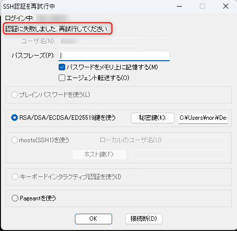

こんにちは。

今回は、 **Red Hat Enterprise Linux 9 ( 以降 RHEL9 と記載 ) の SSH 鍵ペア仕様変更** についての備忘録です。 ※ 執筆時の Red Hat Enterprise Linux の最新は 9.1 

RHEL 9 になって **暗号化を目的とした SHA-1 メッセージダイジェストの使用が非推奨** になったことで標準コマンドで鍵ペアを作成してもログインできず解決までに時間がかかってしまいましたので紹介します。

[RHEL 9.0 における主な変更点](https://access.redhat.com/documentation/ja-jp/red_hat_enterprise_linux/9/html-single/9.0_release_notes/index#overview-major-changes)

## NG パターン
RHEL9 をインストールし、ターミナルを利用し作成したいユーザー ( ここでは user としています ) で `ssh-keygen` (オプションなし) で鍵ペアを作成します。

```bash
$ ssh-keygen
Generating public/private rsa key pair.
Enter file in which to save the key (/home/user/.ssh/id_rsa):
Created directory '/home/user/.ssh'.
Enter passphrase (empty for no passphrase):
Enter same passphrase again:
Your identification has been saved in /home/user/.ssh/id_rsa
Your public key has been saved in /home/user/.ssh/id_rsa.pub
The key fingerprint is:
SHA256:1FNf+u79dEu0jrWXBtGy4+LHB5UHUGw7orPYz4a9E+0 user@test
The key's randomart image is:
+---[RSA 3072]----+
|            o+. .|
|         . . .+o |
|        . o  .+o.|
|       .   ..oo=.|
|        S  . o=oo|
|          o .=o..|
|         o =oo++=|
|        . +o++E**|
|          .+*+o+*|
+----[SHA256]-----+
```

上記が RHEL9 デフォルトの `ssh-keygen` の動作です。
3072ビットが標準になっていますね。

鍵ペアを適切に設定し、秘密鍵をダウンロードしてターミナルから接続すると以下のように接続できません。



`/var/log/secure` を確認すると、 `Dec 19 16:26:58 test sshd[88833]: userauth_pubkey: key type ssh-rsa not in PubkeyAcceptedAlgorithms [preauth]`

と出ていました。

このエラーを追いかけると以下の記事に到達し、**SHA-1 が非推奨になったことが影響している** ことが分かります。
[\[RHEL9\]sshd: userauth_pubkey: key type ssh-rsa not in PubkeyAcceptedAlgorithms \[preauth\] - Red Hat Customer Portal](https://access.redhat.com/solutions/6966079)
※閲覧には Red Hat account でログインが必要です。

## OK パターン
RHEL9 のマニュアルを参考に、暗号アルゴリズムにオプションに ECDSA ( 楕円曲線暗号 ) を指定して `ssh-keygen -t ecdsa` コマンドで鍵ペアを作成します。

[1.4. SSH 鍵ペアの生成 Red Hat Enterprise Linux 9 | Red Hat Customer Portal](https://access.redhat.com/documentation/ja-jp/red_hat_enterprise_linux/9/html/securing_networks/generating-ssh-key-pairs_assembly_using-secure-communications-between-two-systems-with-openssh)

```bash
$ ssh-keygen -t ecdsa
Generating public/private ecdsa key pair.
Enter file in which to save the key (/home/user/.ssh/id_ecdsa):
Enter passphrase (empty for no passphrase):
Enter same passphrase again:
Your identification has been saved in /home/user/.ssh/id_ecdsa
Your public key has been saved in /home/user/.ssh/id_ecdsa.pub
The key fingerprint is:
SHA256:8eZLUKKwX/Fi9ZFIC9vlEW5jGyqAwgqm/sLdhNUW+yw user@test
The key's randomart image is:
+---[ECDSA 256]---+
|        . . +.   |
| .   . . = * o   |
|..o o o B * X    |
|+. . + * O = =   |
|o   + o S = o    |
|.  . o E O       |
|... o . . o      |
| o.. .   . .     |
|  ..      .      |
+----[SHA256]-----+
```

同じく鍵ペアを適切に設定し、秘密鍵をダウンロードしてターミナルから接続すると、無事接続することができました。

`/var/log/secure` にも正常に接続できたことが記録されていました。
```bash
Dec 19 16:53:28 test sshd[88955]: Accepted publickey for test from x.x.x.x port 60741 ssh2: ECDSA SHA256:8eZLUKKwX/Fi9ZFIC9vlEW5jGyqAwgqm/sLdhNUW+yw
Dec 19 16:53:28 test systemd[88958]: pam_unix(systemd-user:session): session opened for user test(uid=1001) by (uid=0)
Dec 19 16:53:28 test sshd[88955]: pam_unix(sshd:session): session opened for user test(uid=1001) by (uid=0)
```

参考になれば幸いです。
それでは次回の記事でお会いしましょう。
