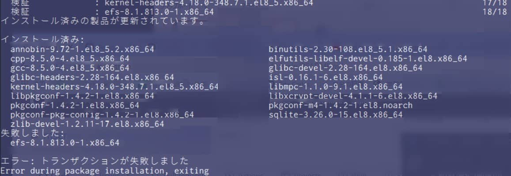

こんにちは。

先日、**Red Hat Enterprise Linux 8.5 を 最小構成でインストール** し、**ESET Server Security 8.1 をインストール** しました。

その際、**USロケールが不足しているとエラー** になったので、その概要と対処について記事にします。

## 環境
- Red Hat Enterprise Linux 8.5
- ESET Server Security 8.1.813.0

## エラー内容

- インストール時に以下のエラーが発生
    ```bash
    ESET Server Security Error: en_US.UTF-8 locale is not present, please install it.
    ```

- 実行コマンド `# sh efs.x86_64.bin`
    


## エラー原因の特定
- インストールされている **langpack の確認**
    ```bash
    # rpm -qa | grep langpack
    glibc-langpack-ja-2.28-164.el8.x86_64
    langpacks-ja-1.0-12.el8.noarch
    ```
    
    ```
    # localectl list-locales
    C.utf8
    ja_JP.eucjp
    ja_JP.utf8
    ```
    `ja` のみがインストールされていることが確認できる。

## 対処
- en langpacks をインストールする
    ```bash
    # dnf install langpacks-en
    サブスクリプション管理リポジトリーを更新しています。
    メタデータの期限切れの最終確認: 3:39:16 時間前の 2021年12月27日 22時57分38秒 に実施しました。
    依存関係が解決しました。
    =======================================================================================================
     パッケージ              Arch         バージョン          リポジトリー                           サイズ
    =======================================================================================================
    インストール:
     langpacks-en            noarch       1.0-12.el8          rhel-8-for-x86_64-appstream-rpms       9.6 k
    弱い依存関係のインストール:
     glibc-langpack-en       x86_64       2.28-164.el8        rhel-8-for-x86_64-baseos-rpms          828 k
    
    トランザクションの概要
    =======================================================================================================
    インストール  2 パッケージ
    
    ダウンロードサイズの合計: 838 k
    インストール後のサイズ: 6.0 M
    これでよろしいですか? [y/N]: y
    パッケージのダウンロード:
    (1/2): langpacks-en-1.0-12.el8.noarch.rpm                               38 kB/s | 9.6 kB     00:00
    (2/2): glibc-langpack-en-2.28-164.el8.x86_64.rpm                       2.4 MB/s | 828 kB     00:00
    -------------------------------------------------------------------------------------------------------
    合計                                                                   2.4 MB/s | 838 kB     00:00
    トランザクションの確認を実行中
    トランザクションの確認に成功しました。
    トランザクションのテストを実行中
    トランザクションのテストに成功しました。
    トランザクションを実行中
      準備             :                                                                               1/1
      インストール中   : glibc-langpack-en-2.28-164.el8.x86_64                                         1/2
      インストール中   : langpacks-en-1.0-12.el8.noarch                                                2/2
      scriptletの実行中: langpacks-en-1.0-12.el8.noarch                                                2/2
      検証             : langpacks-en-1.0-12.el8.noarch                                                1/2
      検証             : glibc-langpack-en-2.28-164.el8.x86_64                                         2/2
    インストール済みの製品が更新されています。
    
    インストール済み:
      glibc-langpack-en-2.28-164.el8.x86_64                 langpacks-en-1.0-12.el8.noarch
    
    完了しました!
    ```

## 確認
- en langpacks がインストールされていることを確認
    ```bash
    # localectl list-locales
    C.utf8
    en_AG
    en_AU
    en_AU.utf8
    en_BW
    en_BW.utf8
    en_CA
    en_CA.utf8
    en_DK
    en_DK.utf8
    en_GB
    en_GB.iso885915
    en_GB.utf8
    en_HK
    en_HK.utf8
    en_IE
    en_IE.utf8
    en_IE@euro
    en_IL
    en_IN
    en_NG
    en_NZ
    en_NZ.utf8
    en_PH
    en_PH.utf8
    en_SC.utf8
    en_SG
    en_SG.utf8
    en_US
    en_US.iso885915
    en_US.utf8
    en_ZA
    en_ZA.utf8
    en_ZM
    en_ZW
    en_ZW.utf8
    ja_JP.eucjp
    ja_JP.utf8
    ```

- 再度 インストールを実施 `# sh efs.x86_64.bin`
    ```
    Do you accept this End User License Agreement and acknowledge Privacy Policy? (y/n) y
    
    Extracting:
    efs-8.1.813.0.x86_64.rpm
    
    サブスクリプション管理リポジトリーを更新しています。
    メタデータの期限切れの最終確認: 3:39:57 時間前の 2021年12月27日 22時57分38秒 に実施しました。
    依存関係が解決しました。
    =======================================================================================================
     パッケージ         アーキテクチャー      バージョン                 リポジトリー                サイズ
    =======================================================================================================
    インストール:
     efs                x86_64                8.1.813.0-1                @commandline                163 M
    
    トランザクションの概要
    =======================================================================================================
    インストール  1 パッケージ
    
    合計サイズ: 163 M
    インストール後のサイズ: 228 M
    これでよろしいですか? [y/N]: y
    パッケージのダウンロード:
    トランザクションの確認を実行中
    トランザクションの確認に成功しました。
    トランザクションのテストを実行中
    トランザクションのテストに成功しました。
    トランザクションを実行中
      準備             :                                                                               1/1
      scriptletの実行中: efs-8.1.813.0-1.x86_64                                                        1/1
      インストール中   : efs-8.1.813.0-1.x86_64                                                        1/1
      scriptletの実行中: efs-8.1.813.0-1.x86_64                                                        1/1
      検証             : efs-8.1.813.0-1.x86_64                                                        1/1
    インストール済みの製品が更新されています。
    
    インストール済み:
      efs-8.1.813.0-1.x86_64
    
    完了しました!
    GUIが有効です。
    URL: https://cmc-hp:9443
    ユーザー名: Administrator
    パスワード: password
    To uninstall ESET Server Security, use:
            dnf remove efs
    ```
en langpacks をインストールすることで無事解決しました。

8.5以前ではそのようなことはなかったような気がするのですが、同じエラーに見舞われた方の参考になれば幸いです。

それでは次回の記事でお会いしましょう。
