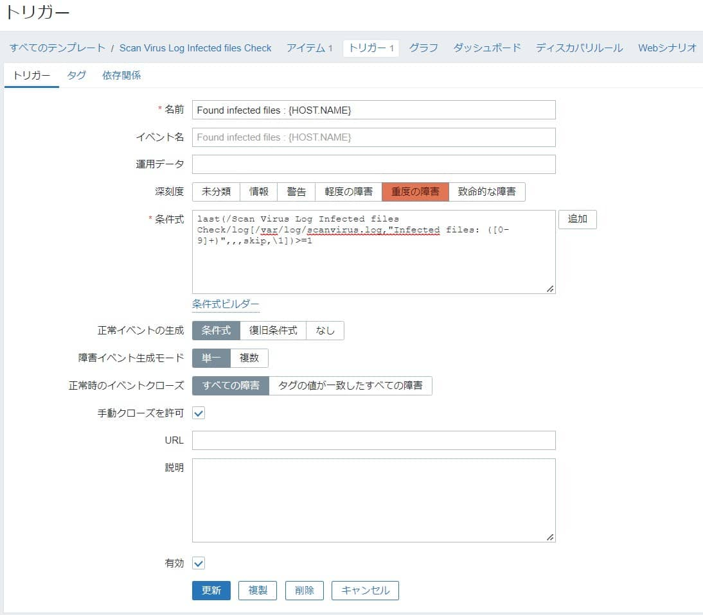

こんにちは。

今回は、Zabbixでログから数値を抽出して監視する方法を紹介します。

[過去の記事](https://mseeeen.msen.jp/install-clam-antivirus-on-amazon-linux-2-to-automate-checks/)で、ClamAVを利用してログファイルを出力する方法を紹介しましたが、これを応用しウィルスが検知されたことをzabbixで検知したいと思います。

## 環境
- Zabbix server 6.0.1


ログファイルが zabbix ユーザーからアクセスできる必要があります。
環境によっては、権限の調整が必要になりますので以下の記事あたりを参考に設定してください。
[技術メモメモ: ZabbixでAllowRoot=1をせずに/var/log/messagesなどを監視する方法](https://tech-mmmm.blogspot.com/2018/03/zabbixallowroot1varlogmessages.html)

## 監視仕様
- `scanvirus.log` から `Infected files: 数字` を検出する。
- 数字の部分を抜き出して、`0以外` のとき通報する。

## zabbix の設定
それでは、zabbixの設定をしていきましょう。

流用できるよう、テンプレートを作成します。
`設定→テンプレート→テンプレートの作成` をクリックします。

`テンプレート名`、`グループ` を任意に入力し`追加`します。
記事中は、`Scan Virus Log Infected files Check` とします。

### アイテム
以下のアイテムを作成します。

```
名前：マルウェアファイル検出監視
タイプ：Zabbixエージェント(アクティブ)
キー：log[/var/log/scanvirus.log,"Infected files: ([0-9]+)",,,skip,\1]
データ型：ログ
監視間隔：1m
```


log 関数のフォーマットは、`log[/path/to/file/file_name,<regexp>,<encoding>,<maxlines>,<mode>,<output>]` となっています。

第2引数の、`regexp` はログの取得対象の文字列を記載します。
本記事では、マルウェアファイルの検出ファイル数を取り出したいので `([0-9]+)` と `1桁以上の連続する数字` を示す正規表現を記載します。

第6引数の、`output` は `\1` を指定します。
これは **第2引数の()で囲んだ箇所をアイテムの値として抽出する** という設定になります。

## トリガー
以下のトリガーを作成します。

```
名前：Found infected files : {HOST.NAME}
深刻度：重度の障害
条件式：`last(/Scan Virus Log Infected files Check/log[/var/log/scanvirus.log,"Infected files: ([0-9]+)",,,skip,\1])>=1`
```



## あとがき
本記事の設定で、マルウェアが1つ以上検出された場合に検出されます。
今回の記事は自動復旧ではなく、手動クローズを想定しています。

さまざまな応用が可能だと思いますのでお試しください。

それでは次回の記事でお会いしましょう。