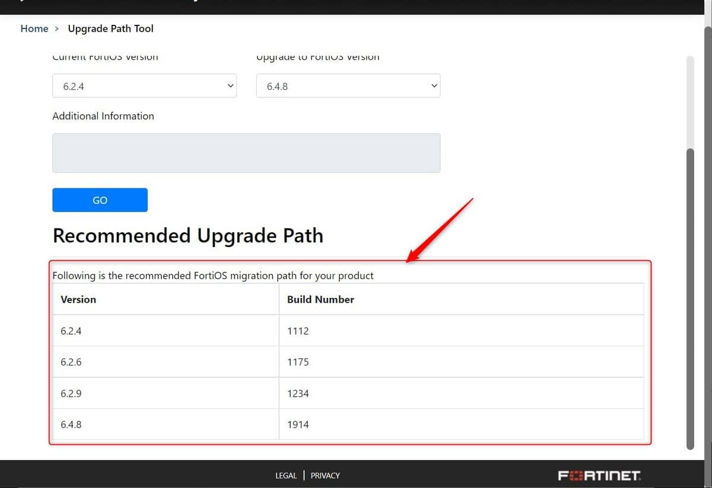

こんにちは。

今回の記事は、FortiGate をアップデートをしようとした際、**このファームウェアバージョンへの有効なアップグレードパスが見つかりませんでした** となる件の解決方法について紹介します。


## 環境
- ForiGate 60E
- アップデート前ファームウェア FortiOS v6.2.4
- アップデート後ファームウェア FortiOS v6.4.8

## 確認方法

1. [Fortinet Documentation Library](https://docs.fortinet.com/upgrade-tool) に接続します
1. Current Product(1), Current FortiOS Version(2), Upgrade to FortiOS Version(3) を選択し、GO をクリックします


すると、下部に目的のバージョンまでに必要なアップデートステップが表示されます。


今回の場合は、`6.2.6(1175) → 6.2.9(1234) → 6.4.8(1914)` と 3回アップデートが必要と分かります。
※build 番号も重要です。

サポートに確認したところ、アップグレードの所要目安時間は1ファームごとに以下となるようです。

```
スタンドアローン環境：約 15 分
HA 環境 ：約 20 分
```

今回であれば 15 分 x 3回 = 45 分 が見込み時間になります。

管理Web画面の `システム→ファームウェア` には最新版のみの掲載されています。

そのため、今回のように旧バージョンを経由してアップデートする場合は、保守契約の手順のとおり事前に旧ファームウェアをダウンロードして準備する必要があります。

## あとがき

今回のアップデートに所要した時間は以下の通りでした。

- FortiOS 6.2.6 へアップデート 約4分
- FortiOS 6.2.9 へアップデート 約3分
- FortiOS 6.4.8 へアップデート 約4分

参考になれば幸いです。
それでは次回の記事でお会いしましょう。
