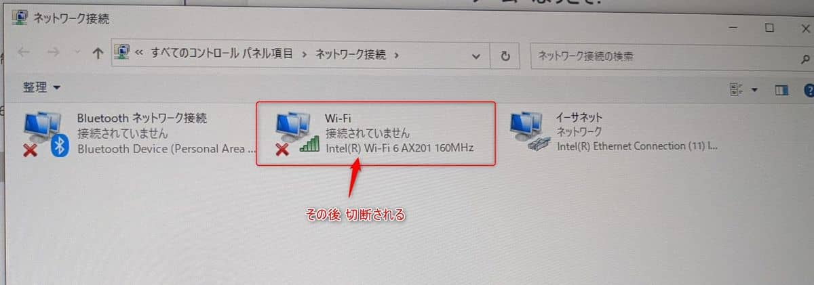

こんにちは。

先日、お客様の端末で **有線と無線の両方で接続している端末** で、ログオン後に **無線接続が切断されてしまう現象** が発生しました。

接続はこのようなイメージです。


## 環境
- Windows 10 ( 2022年1月7日時点で最新 )

## 現象
ログオン直後にネットワーク接続を見ていると、しばらくすると切断されていることがわかりました。

↓


切断された後に手動で接続すると問題なく接続できる状況でした。

## 切り分け
- デバイスマネージャーの詳細設定を変更してみましたが改善せず元に戻しました。


- PC の入れ替え、無線ルーター（図中ルーターA）も入れ替えでも改善しませんでした。

- 端末が接続されているハブポートの変更でも改善しませんでした。

## 対処
残念ながら今回のケースは根本原因を見つけることができませんでした。
対処療法となりますが、以下の方法で接続を維持できました。

1. 対象のSSIDの自動接続をオフにします。


1. 任意の場所に以下のバッチを作成します。今回は例として `D:\wifi_connect.bat` とします。
```bat
netsh wlan connect name="TP-LINK_7***"
```

1. 以下のようなタスクを作成します。


1. タスクのプロパティーを変更します。


この方法でログオン後に手動でWi-Fiを接続する手間な運用をさけることができました。
※ 対処のSSIDの接続情報が保存されていることが前提になります。

## 参考
[WindowsのWi-Fi操作をコマンドプロンプトから行う - Qiita](https://qiita.com/mindwood/items/22e0895473578c4e0c7e)

同じ現象に悩まされている方がおられましたら一度お試しください。
それでは次回の記事でお会いしましょう。
