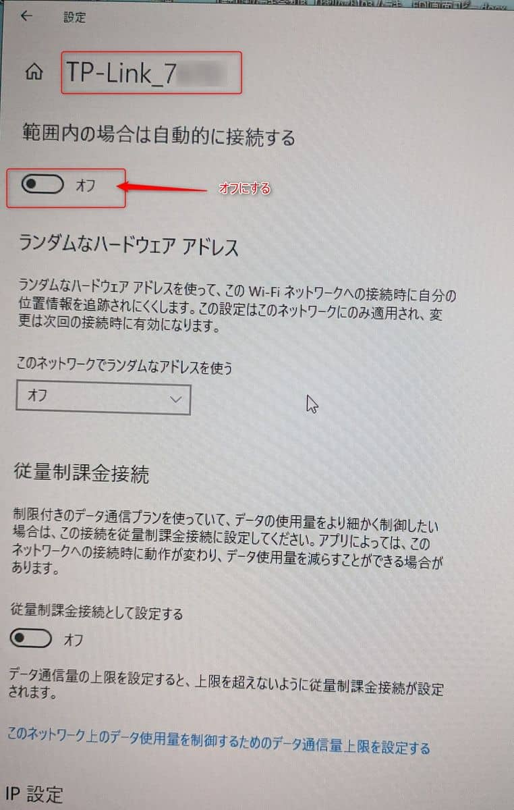

こんにちは。

先日、お客様の端末で **有線と無線の両方で接続している端末** で、ログオン後に **無線接続が切断されてしまう現象** が発生しました。

接続はこのようなイメージです。


## 環境
- Windows 10 ( 2022年1月の確認時点で最新 )

## 現象
ログオン直後にネットワーク接続を見ていると、しばらくすると切断されていることがわかりました。

↓


切断された後に手動で接続すると問題なく接続できる状況でした。

## 切り分け
1. デバイスマネージャーの詳細設定から 802.11n/ac/ax ワイヤレスモードを無効にするなど変更しても改善しませんでした。


2.  端末の交換、無線ルーター（図中ルーターA）も交換しましたが改善しませんでした。

3. 端末が接続されている有線ポートをルーターB側で変更しても改善しませんでした。

レジストリー変更やローカルポリシーを変更すると改善する可能性があると[kenzauros](https://github.com/kenzauros) からアドバイスをもらい確認しましたが、こちらも改善しませんでした。

詳細は以下のとおりです。

4. レジストリー変更
- レジストリーエディター (regedit) を開き、`HKEY_LOCAL_MACHINE\Software\Policies\Microsoft\Windows\WcmSvc\Local` を開く
- `DWORD 値 (32 bit)` を追加し、名前を `fMinimizeConnections` に変更して再起動 ※値は 0 のままで OK


5. ローカルポリシーで以下の4つを無効にする


## 対処
残念ながら今回のケースは根本原因を見つけることができませんでした。
対処療法となりますが、以下の方法で接続を維持できました。

1. 対象のSSIDの自動接続をオフにします。


1. 任意の場所に以下のバッチを作成します。今回は例として `D:\wifi_connect.bat` とします。
```bat
netsh wlan connect name="TP-LINK_7***"
```

1. 以下のようなタスクを作成します。


1. タスクのプロパティーを変更します。


この方法でログオン後に手動でWi-Fiを接続する手間な運用をさけることができました。
※ 対処のSSIDの接続情報が保存されていることが前提になります。

## 参考
[WindowsのWi-Fi操作をコマンドプロンプトから行う - Qiita](https://qiita.com/mindwood/items/22e0895473578c4e0c7e)

同じ現象に悩まされている方がおられましたら一度お試しください。
それでは次回の記事でお会いしましょう。
