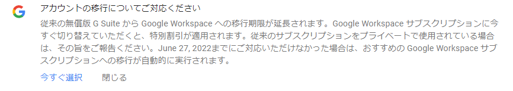
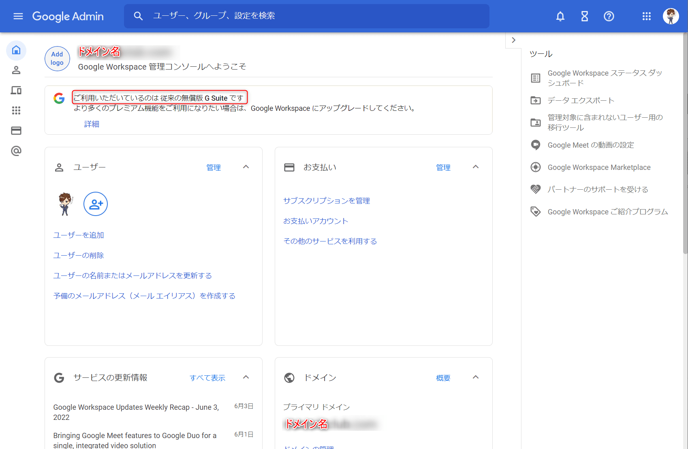

こんにちは。

10年以上前から、無償版 G Suite を個人利用していました。

2022年の5月ごろからでしょうか、Gmail トップ画面に以下の注意が表示されるようになりました。

検索してみると、以下の記事が公開されていました。
[従来の無償版 G Suite からのアップグレード - Google Workspace 管理者 ヘルプ](https://support.google.com/a/answer/60217)

上記の記事を要約してみました。
- **従来の無償版 G Suite は 2022 年 6 月 27 日以降利用できなくなる**
- **2022 年 8 月 1 日まで無料で利用できるよう、今すぐ Google Workspace サブスクリプションにアップグレードすることをすすめる**
- **アップグレードしない場合は、2022 年 6 月 27 日以降に自動的に Google Workspace に移行される**
- **無償版 G Suite を非営利目的で利用中の場合 [管理コンソール](https://admin.google.com/?utm_source=helpcenter) から、手続きができる**

私は非営利で利用していますので、料金のかからない無償版 G Suite を引き続き利用する手続きを実施しました。手続きはとても簡単です。

## 無償版 G Suite を継続利用する手続き

[管理コンソール](https://admin.google.com/?utm_source=helpcenter) に接続すると、以下の画面に遷移するので、**個人での利用 を選択** します。

続く画面で、**個人で使用します を選択** します。

これであっさり完了してしまいました。

管理コンソールに、**従来の無償版 G Suite です という表記が確認** できました。

記事を書きながら手続きをしたのですが、手続きはあっさり完了しました。

非営利で利用されている方がこの手続きを忘れると **勝手に有償版にアップグレードされますので忘れずに** 手続きしましょう。
