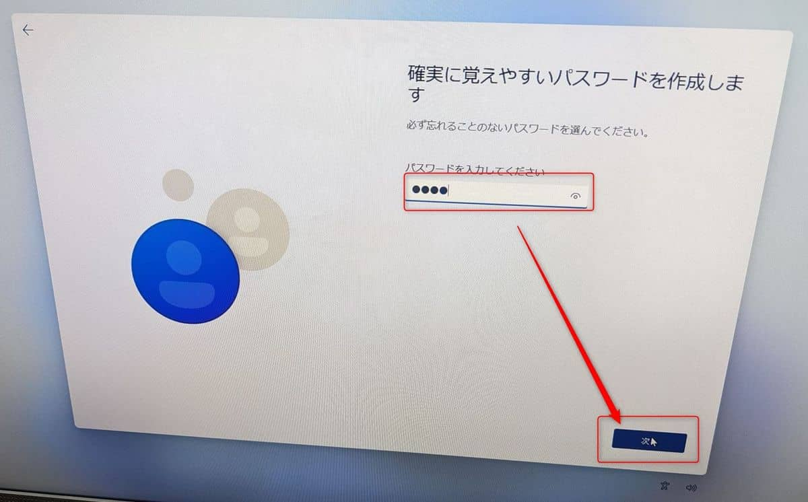
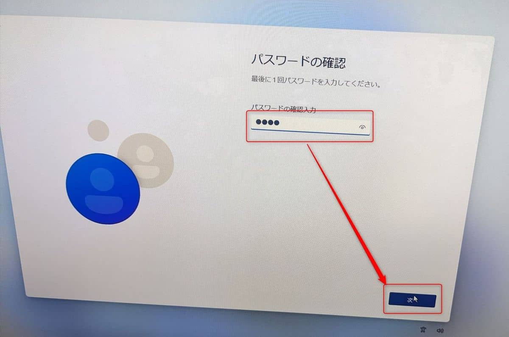

こんにちは。

今回は、Windows 11 Home のセットアップ時にローカルアカウントを作成する方法を紹介します。

**Windows 11 Home は基本的にインターネット接続とMicrosoftアカウントが必須** です。

それでもローカルアカウントを作成したい！という場合もあると思います。
そんなときはこの方法をお試しください。

ポイントは「**ネットワークを使えなくすればローカルアカウントが作れる**」 です。

## ローカルアカウント作成までのながれ
新規購入した Windows 11 Home を参考に記載しています。
1. 国とキーボードを選択します
    
    
    
1. **ネットワークに接続しましょう の画面で Shift + F10 を押します**
    
1. コマンドプロンプトが出るので、 `taskmgr` と入力して `Enter` を押します
    
1. 詳細をクリックして、**ネットワーク接続フローを選択し、タスクの終了をクリック** します
    
    
1. タスクを終了すると、ライセンス契約の同意画面がでてきますので同意して進めます
    
1. **ローカルアカウント名の入力を求められますので任意の名前を入力** します
    
1. パスワードを入力します
    
    
1. セキュリティの質問を3つ設定します
    
    
    
1. Hello を設定します。今回はスキップしています
    
1. デバイスのプライバシー設定の選択 をデフォルトで完了します
    
    

以上でセットアップが完了し、**ローカルアカウントでログイン** できます。

Windows 11 Proでも今後Microsoftアカウントが必須になる可能性がありますので、この方法が役立つかもしれません。

それでは次回の記事でお会いしましょう。
