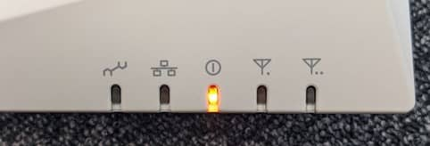

こんにちは。

今回は、**FURUNO SYSTEMS のアクセスポイント ACERA 1110 を初期化する手順** を備忘録を兼ねて記事にします。

他の機種でもおおむね同様の手順だと思います。

手順としては複雑ではないのですが、更新マニュアルをダウンロードするのもメールアドレスを入力したりと少し手間どりました。

## 初期化手順
1. まず、機器の上部から DEFAULT スイッチを確認します。
    

1. アクセスポイントの電源が入った状態で、ボールペンの先などでデフォルトスイッチを3秒程度押し続けます。
    

1. 電源ランプが橙になりますので、青色になるまで待ちます。※色が変わればDEFAULTスイッチを放します。
    
    
    

1. **アクセスポイントの LAN1 と PC を同じネットワークに接続し、PCに 192.168.1.1～192.168.1.254 の IP アドレスを設定**します。ただし、**アクセスポイントの IP アドレスが 192.168.1.10 で設定されているのでそれ以外で設定** します。

1. **PCのブラウザから、 http://192.168.1.10 にアクセス** し、**ユーザー名に user , パスワードも user を入力** します。
    

これで、初期化されたアクセスポイントにログインできました。

参考になれば幸いです。
それでは次回の記事でお会いしましょう。
