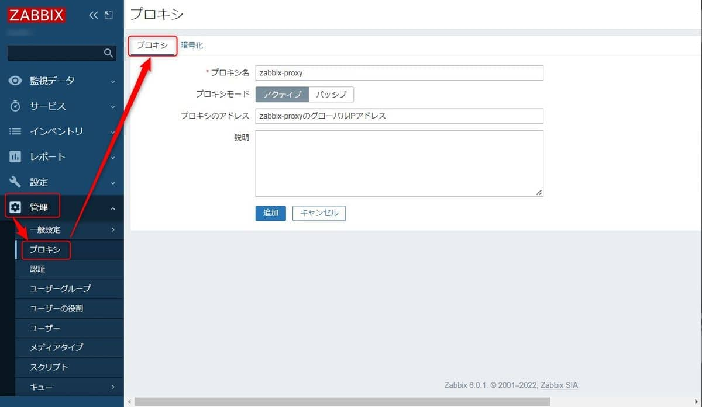
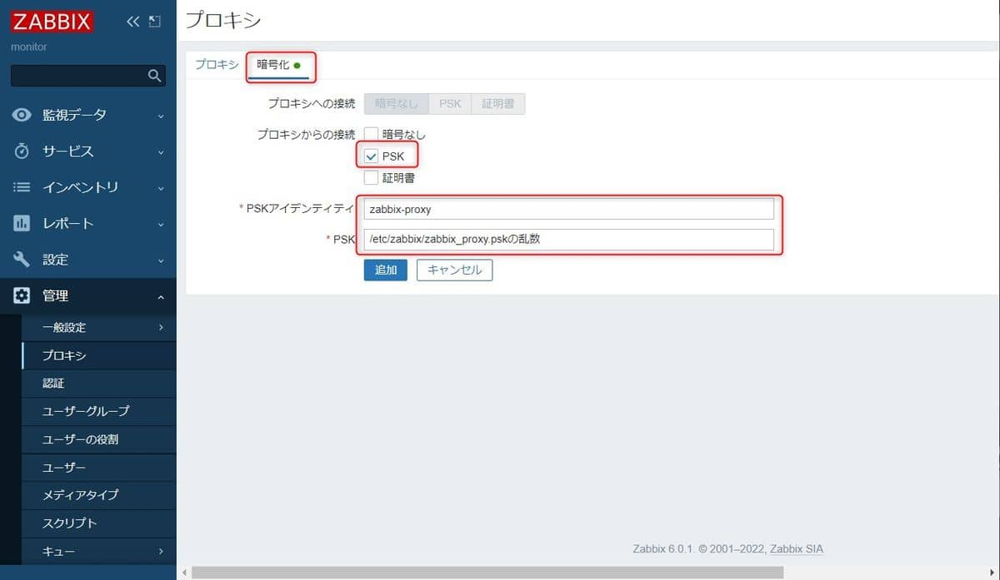

こんにちは。

今回は、**Zabbixプロキシを利用して監視する方法** を紹介します。

以下は、[公式ドキュメント](https://www.zabbix.com/documentation/current/jp/manual/distributed_monitoring/proxies) の抜粋です。

> Zabbixプロキシは、Zabbixサーバーに代わってパフォーマンスと可用性のデータを収集できます。このようにして、プロキシはデータ収集の負荷の一部を引き受け、Zabbixサーバーの負荷を軽減できます。
> 
> また、すべてのエージェントとプロキシが1つのZabbixサーバーにレポートし、すべてのデータが一元的に収集される場合、プロキシを使用するのが集中型および分散型のモニタリングを実装する最も簡単な方法です。

Zabbixプロキシは次の目的で使用できます。

- 遠隔地を監視する
- 通信の信頼性が低い場所を監視する
- 何千ものデバイスを監視する場合は、Zabbixサーバーをオフロードします
- 分散監視の保守を簡素化する


プロキシは、ZabbixサーバーへのTCP接続を1つだけ必要とします。この方法では、ファイアウォールルールを1つだけ構成する必要があるため、ファイアウォールを回避するのが簡単です。

## 環境
- Zabbix サーバー 6.0.1 
- Zabbix プロキシ 6.0.1 (Alma Linux 8)
- Zabbix エージェント 6.0.1
**Zabbix サーバーとZabbix プロキシは同じメジャーバージョンでなければ動作しません** 。

本記事では Zabbix プロキシ に関連した設定を紹介します。

## Zabbix プロキシ監視を利用するメリット
zabbix監視 は サーバー・エージェントで行うことが多いと思います。

しかし、この方法はファイアウォールの設定が柔軟に行えない環境や、NATされているような環境では監視すること自体が難しく、監視系統が複数に分かれてしまうことがあります。

1. ファイウォールの調整が可能な場合、サーバー・エージェント監視は可能です。
    

1. ファイアウォールの調整が不可な場合は、監視自体ができません。
    

1. NAT環境である場合、NAPTを利用したとしても1台しか監視できません。
    

1. 前項のようなケースは監視系統を複数にして凌ぐケースがあります。
    

これらのデメリットをzabbix プロキシ監視を利用すると解消できます。


通信要件は、以下のとおりです。
- プロキシ→エージェント 10050 / tcp
- エージェント→プロキシ 10051 / tcp
- プロキシ→サーバー 10051 / tcp


それでは設定に進みましょう。

## Zabbix プロキシ の構築
### インストール

```
dnf -y install https://repo.zabbix.com/zabbix/6.0/rhel/8/x86_64/zabbix-release-6.0-1.el8.noarch.rpm
dnf -y intall zabbix-proxy-mysql
dnf -y intall mysql-server
dnf -y intall zabbix-sql-scripts
```

### MySQL サーバー の初期設定


`mysql_secure_installation` コマンドを利用して、MySQL サーバーの初期設定を行います。

実行結果は以下のとおりです。
```bash
# mysql_secure_installation

Securing the MySQL server deployment.

Connecting to MySQL using a blank password.

VALIDATE PASSWORD COMPONENT can be used to test passwords
and improve security. It checks the strength of password
and allows the users to set only those passwords which are
secure enough. Would you like to setup VALIDATE PASSWORD component?

Press y|Y for Yes, any other key for No: y

There are three levels of password validation policy:

LOW    Length >= 8
MEDIUM Length >= 8, numeric, mixed case, and special characters
STRONG Length >= 8, numeric, mixed case, special characters and dictionary                  file

Please enter 0 = LOW, 1 = MEDIUM and 2 = STRONG: 2
Please set the password for root here.

New password:

Re-enter new password:

Estimated strength of the password: 100
Do you wish to continue with the password provided?(Press y|Y for Yes, any other key for No) : y
By default, a MySQL installation has an anonymous user,
allowing anyone to log into MySQL without having to have
a user account created for them. This is intended only for
testing, and to make the installation go a bit smoother.
You should remove them before moving into a production
environment.

Remove anonymous users? (Press y|Y for Yes, any other key for No) : y
Success.


Normally, root should only be allowed to connect from
'localhost'. This ensures that someone cannot guess at
the root password from the network.

Disallow root login remotely? (Press y|Y for Yes, any other key for No) : y
Success.

By default, MySQL comes with a database named 'test' that
anyone can access. This is also intended only for testing,
and should be removed before moving into a production
environment.


Remove test database and access to it? (Press y|Y for Yes, any other key for No) : y
 - Dropping test database...
Success.

 - Removing privileges on test database...
Success.

Reloading the privilege tables will ensure that all changes
made so far will take effect immediately.

Reload privilege tables now? (Press y|Y for Yes, any other key for No) : y
Success.

All done!
```

### データベースの作成

以下の流れでデータベースを作成します。
```bash
mysql -uroot -p
create database zabbix_proxy character set utf8mb4 collate utf8mb4_bin;
create user 'zabbix'@'localhost' identified by 'password';
grant all privileges on zabbix_proxy.* to 'zabbix'@'localhost';
quit;
```

### データベースに初期データの投入
準備されているSQLを利用し、初期データを投入します。
※トラブルポイントです。
```bash
cat /usr/share/doc/zabbix-sql-scripts/mysql/proxy.sql | mysql -uzabbix -p zabbix_proxy
Enter password:
ERROR 1050 (42S01) at line 2079: Table 'dbversion' already exists
```

本来、これで初期データが投入できるはずなのですが、エラーが発生しました。

エラー：`ERROR 1050 (42S01) at line 2079: Table 'dbversion' already exists` 

そして、この解決でとても時間がかかりましたが、[kiyoshin](https://github.com/kiyoshin)が **実行順をかえることでエラーが解消する** ことを見つけてくれました。

`diff` の結果は以下のとおりです。
```diff
# diff -u proxy.sql.org proxy.sql
--- proxy.sql.org       2022-03-01 19:15:06.000000000 +0900
+++ proxy.sql   2022-03-10 16:23:06.133334842 +0900
@@ -1,3 +1,10 @@
+CREATE TABLE `dbversion` (
+       `dbversionid`            bigint unsigned                           NOT NULL,
+       `mandatory`              integer         DEFAULT '0'               NOT NULL,
+       `optional`               integer         DEFAULT '0'               NOT NULL,
+       PRIMARY KEY (dbversionid)
+) ENGINE=InnoDB;
+INSERT INTO dbversion VALUES ('1','6000000','6000000');
 CREATE TABLE `role` (
        `roleid`                 bigint unsigned                           NOT NULL,
        `name`                   varchar(255)    DEFAULT ''                NOT NULL,
@@ -2076,13 +2083,6 @@
        PRIMARY KEY (sla_service_tagid)
 ) ENGINE=InnoDB;
 CREATE INDEX `sla_service_tag_1` ON `sla_service_tag` (`slaid`);
-CREATE TABLE `dbversion` (
-       `dbversionid`            bigint unsigned                           NOT NULL,
-       `mandatory`              integer         DEFAULT '0'               NOT NULL,
-       `optional`               integer         DEFAULT '0'               NOT NULL,
-       PRIMARY KEY (dbversionid)
-) ENGINE=InnoDB;
-INSERT INTO dbversion VALUES ('1','6000000','6000000');
 ALTER TABLE `users` ADD CONSTRAINT `c_users_1` FOREIGN KEY (`roleid`) REFERENCES `role` (`roleid`) ON DELETE CASCADE;
 ALTER TABLE `hosts` ADD CONSTRAINT `c_hosts_1` FOREIGN KEY (`proxy_hostid`) REFERENCES `hosts` (`hostid`);
 ALTER TABLE `hosts` ADD CONSTRAINT `c_hosts_2` FOREIGN KEY (`maintenanceid`) REFERENCES `maintenances` (`maintenanceid`);
```

[正常に投入できたファイル](https://gist.github.com/norikazum/8cd4cd0aebd6630b1f5296b25b63d2b3/)を掲載します。


データベースを再作成し、初期データを投入するコマンドを実行することで無事登録できました。

```
cat /usr/share/doc/zabbix-sql-scripts/mysql/proxy.sql | mysql -uzabbix -p zabbix_proxy
```

### Zabbix プロキシ の設定

`/etc/zabbix/zabbix_proxy.conf` の以下の項目を修正します。

```ini:title=/etc/zabbix/zabbix_proxy.conf
Server=x.x.x.x
Hostname=zabbix-proxy
DBHost=localhost
DBPassword=password
ConfigFrequency=60
TLSConnect=psk
TLSAccept=psk
TLSPSKIdentity=zabbix-proxy
TLSPSKFile=/etc/zabbix/zabbix_proxy.psk
```

それぞれの設定値について説明します。

- Server
    - IPアドレスを入力します。本記事ではグローバルIPアドレスの想定です。

- Hostname
    - 任意のホスト名を入力します。後述の**zabbix サーバー に設定するプロキシ名と同名にする必要があります**。

- DBHost
    - データベースサーバーを入力します。今回の記事では `localhost` になります。

- DBPassword
    - 設定したデータベースパスワードを平文で入力します。

- ConfigFrequency
    - zabbixサーバーから設定データを取得する頻度を秒単位で入力します。

- TLSConnect
    - zabbixサーバーとzabbixプロキシ間の通信を暗号化するため、`psk`と入力します。

- TLSAccept
    - zabbixサーバーとzabbixプロキシ間の通信を暗号化するため、`psk`と入力します。

- TLSPSKIdentity
    - zabbixサーバーに入力する`Identity`を入力します。わかりやすく`Hostname`と同名にしています。

- TLSPSKFile
    - pskファイルのパスを入力します。
    - 次のコマンドで生成します。`openssl rand -hex 32 > /etc/zabbix/zabbix_proxy.psk`

パラメーターは[公式ページ](https://www.zabbix.com/documentation/current/jp/manual/appendix/config/zabbix_proxy)も参考にしてください。

### サービス起動

以下のコマンドを実行し、`zabbix-proxy` を起動します。
```bash
systemctl enable zabbix-proxy
systemctl start zabbix-proxy
```

## Zabbix Server の設定

### プロキシの追加
Zabbix サーバーにログインし、`管理→プロキシ→プロキシの作成`へ進みます。
`プロキシ` と `暗号化` の設定を以下の画像を参考に実施します。



最新データの受信が直近になっていればOKです。


Zabbix監視にプロキシ監視の手法を加えることで柔軟で広範囲の監視が検討できます。

それでは次回の記事でお会いしましょう。

## 参考サイト
- [オープンソースソフトウェアへの取り組み： 技術コラム・特集： ZABBIX大解説： 第5回 応用編 （2/3） ｜ SCSK株式会社](https://www.scsk.jp/product/oss/tec_guide/zabbix/1_zabbix5_2.html)