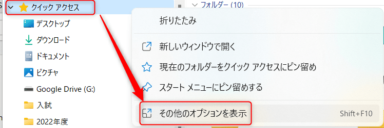

こんにちは。

今回は、**エクスプローラーにあるクイックアクセスに、アイテムが自動的に追加されないようにする方法を紹介** します。

## クイックアクセスとは

クイックアクセスは下の画像の、①と②の2種類があります。
①はアクセス履歴で、②は自身の操作でピン留めしたものです。

②は自身の操作でピン留めするのでいいのですが、①はフォルダが存在しなくなっても表示されてしまい、ピン留めを解除してもまた出てきてしまいます。

ピン留めを解除しても・・・

また出てきてしまう。

## クイックアクセスに自動でアイテムを追加しないようにする

1. クイックアクセスを右クリックしオプションに進みます。
    
    

1. フォルダーオプションからプライバシーの消去をクリックし(①)、2つのチェック(②)を外してOKをクリックします。
    

これでピン留め以外のクイックアクセスが消去され、今後はピン留めしたものだけが表示されます。

ピン留めするにはピン留めしたいフォルダなどを右クリックして「クイックアクセスにピン留めする」をクリックすればOKです。

参考になれば幸いです。
それでは次回の記事でお会いしましょう。
