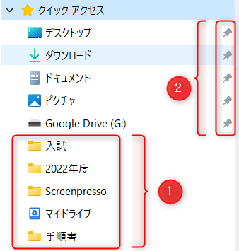
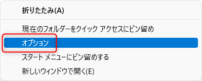

こんにちは。

今回は、エクスプローラーにあるクイックアクセスを自動的に追加させない方法を紹介します。

クイックアクセスは下の画像の、①と②の2種類があります。
①はアクセス履歴で、②は自身の操作でピン留めしたものです。

**エクスプローラーのクイックアクセス**

②は自身の操作でピン留めするのでいいのですが、②はフォルダが存在しなくなっても表示されてしまい、ピン留めを解除してもまた出てきてしまいます。

**ピン留めを解除してもまた出てきてしまう**

以下の手順でクイックアクセスに履歴を自動追加させないように設定します。

1. クイックアクセスを右クリックしオプションに進みます。

1. フォルダーオプションからプライバシーの消去をクリックし(①)、2つのチェック(②)を外してOKをクリックします。

これでピン留め以外のクイックアクセスが消去され、今後はピン留めしたものだけが表示されます。

ピン留めするにはピン留めしたいフォルダなどを右クリックして「クイックアクセスにピン留めする」をクリックすればOKです。

参考になれば幸いです。
それでは次回の記事でお会いしましょう。
