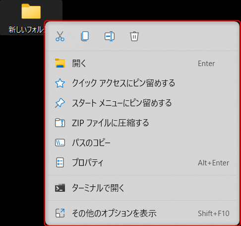
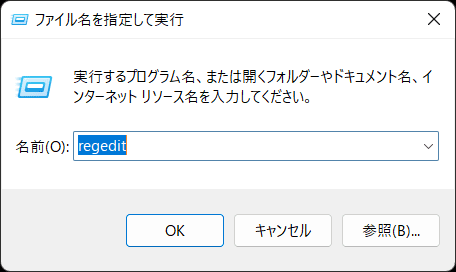
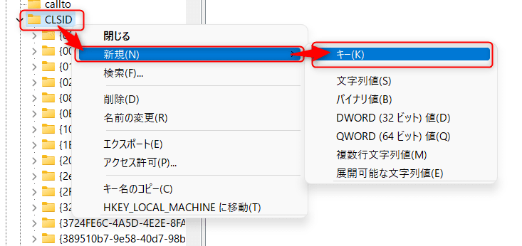
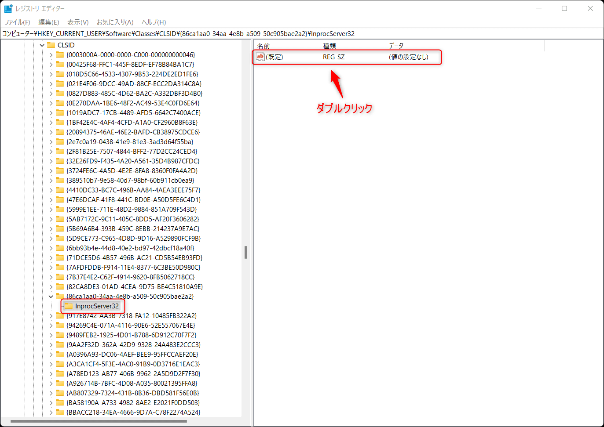
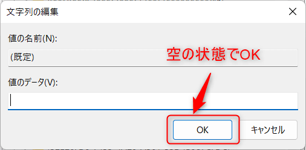
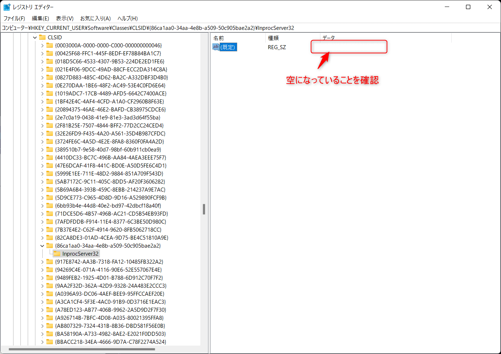
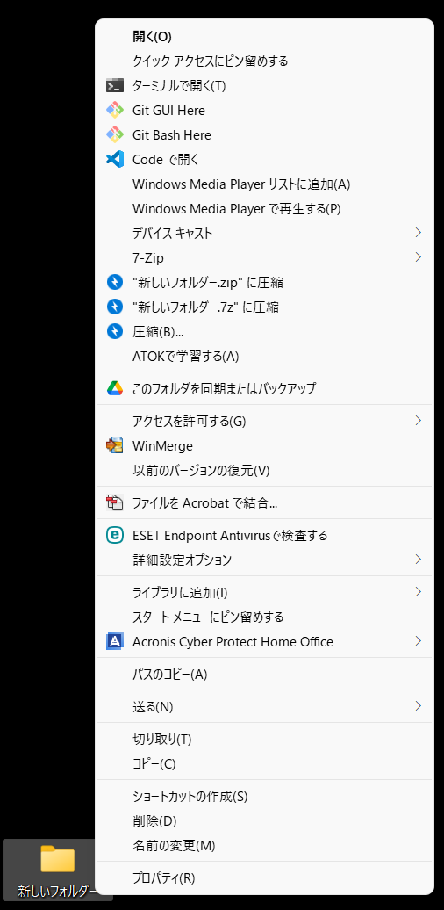

こんにちは。

Windows 11 が 2021 年 10 月 5 日にリリースされ、無償でアップグレードできることから徐々にWindows 11ユーザーも増えてきているのではないでしょうか。

改善されていることもあれば、改悪されていることもあると思いますが、
個人的にファイルやフォルダを右クリックした際のメニューが改悪だと感じています。

**その他のオプションを表示をクリックすることで旧形式になり** ますが、外部ソフトウェアで圧縮したいときなど1つ操作が増えるので不便です。

Windows 11 では、以下のようにメニューが省略された形式に変更されてます。

今回はこの Windows 11 でファイルやフォルダを右クリックした際に表示される内容を旧形式に戻す方法を紹介します。

## 変更方法

1. Windows マークを右クリック → ファイル名を指定して実行をクリックします
1. `regedit` と入力し、レジストリエディターを起動します
    
1. `コンピューター\HKEY_CURRENT_USER\Software\Classes\CLSID` を開きます
1. 作成した `CLSID` を右クリックし、新規 → キー をクリックします
    
1. `{86ca1aa0-34aa-4e8b-a509-50c905bae2a2}` という名前でキーを作成します
1. 作成した `{86ca1aa0-34aa-4e8b-a509-50c905bae2a2}` を右クリックし、新規 → キー をクリックします
    
1. `InprocServer32` という名前でキーを作成します
1. 作成した `InprocServer32` にある `(既定)` をダブルクリックします
    
1. 値のデータが空になっていることを確認して **OK** をクリックします。 **この操作をしないと値が設定されていない状態となって設定が変わりません。**
    
1. データが空になっていることを確認します
    

ここまで追加したらPCを再起動します。

フォルダを右クリックしてみると旧形式に戻っています。

## すぐに適用したい方へ
すぐに反映したい、という方のために変更後のレジストリが反映される reg ファイルを Gist にアップしました。内容は下記で確認できます。

[右クリックメニューを旧形式に戻すレジストリファイル ( リンク )](https://gist.github.com/norikazum/3b8fa2e2e321ebfef2c3ee0472b7f606/)

以下のリンクから ZIP ファイルをダウンロードし、解凍した reg ファイルをダブルクリックして実行すれば、追加されます。

[右クリックメニューを旧形式に戻すレジストリファイル ( ZIP 直接ダウンロード )](https://gist.github.com/norikazum/3b8fa2e2e321ebfef2c3ee0472b7f606/archive/511616864782177294c4e33ebb31189e00ca67f9.zip)

※自己責任でご利用ください。

それでは次回の記事でお会いしましょう。
