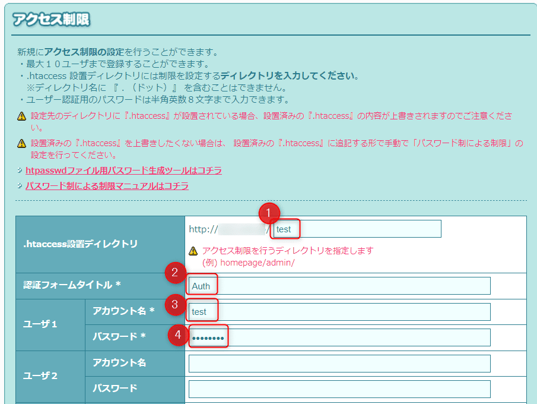
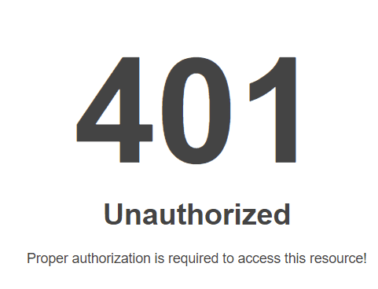

今回は、友人に頼まれて実施した、大手レンタルサーバーの[ロリポップ](https://lolipop.jp/)にDigest認証を設定したときのことを記事にしました。

> Digest認証（ダイジェストにんしょう）とは、HTTPの認証方法（HTTP認証）の一つ。ユーザ名とパスワードをMD5でハッシュ（ダイジェスト）化して送る。Basic認証では防げなかった盗聴や改竄を防ぐために考案された。
[Digest認証 - Wikipedia](https://ja.wikipedia.org/wiki/Digest%E8%AA%8D%E8%A8%BC)

検索すると、ロリポップではDigest認証は使えるが、サポートはしないと記載されていて具体的な手順は分かりません。
[Basic認証やDigest認証は利用できますか？ – ヘルプ - ロリポップ！マネージドクラウド](https://support.mc.lolipop.jp/hc/ja/articles/360053343374-Basic%E8%AA%8D%E8%A8%BC%E3%82%84Digest%E8%AA%8D%E8%A8%BC%E3%81%AF%E5%88%A9%E7%94%A8%E3%81%A7%E3%81%8D%E3%81%BE%E3%81%99%E3%81%8B-)

## 前提
- アカウントは作成済みで、管理者でログインしていることを前提とする
- 制御をかけるフォルダを `test` とする
- `htdigest` コマンドが実行できる端末準備する

## 手順

まずBASIC認証を作成して、その後Digest認証に変更するという流れで実施します。

1. [セキュリティ -> アクセス制限 -> 新規作成](https://user.lolipop.jp/?mode=htaccess&state=htacre) に進みます。 

1. 設置ディレクトリ(①)、認証フォームタイトル(②)、ユーザー名(③)、パスワード(④)を入力し、作成ボタンをクリックします。

認証フォームタイトルは任意ですが、のちほど実行するユーザー作成のコマンドで一致させる必要があります。ロリポップの制限上パスワードは8文字までしか入力できませんでした。

1. 成功するとポップアップがでます。


1. [ロリポップ！ＦＴＰ](https://lolipopftp.lolipop.jp/dir/list/) に接続し、制御フォルダに移動します。設定ファイルが作成されていて、BASIC認証がかかっています。


1. `.htaccess` を開き、`AuthType Basic` を `AuthType Digest` に変更して保存します。

1. `htdigest` コマンドが実行できる端末で、以下のコマンドを実行します。
```bash
htdigest -c .htpasswd "Auth" test
```

1. パスワードを入力し、作成されたファイルの内容を [ロリポップ！ＦＴＰ](https://lolipopftp.lolipop.jp/dir/list/) から `.htpasswd` を開き上書きします。


1. 接続テストをします。
認証が求められ、

ページを設定していませんのでエラーですが認証が通りました。

認証エラーになると、ポップアップがループで表示され、キャンセルをすると401エラーになります。


参考になれば幸いです。
それでは次回の記事でお会いしましょう。
