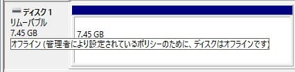
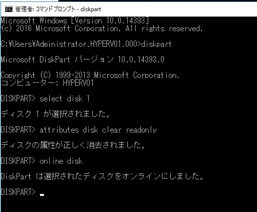
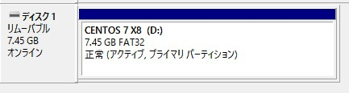

こんにちは。

今回は、評価用のWindows Server で USBメモリーを利用したところ、オンラインにならない現象が発生した際の解決記事です。

## 環境
- Windows Sever 2016 ※私はこの環境ですがおそらくOSに依存しないと思っています。
    

## 現象
サーバーにUSBを刺しても反応せず、ディスク管理から見るとオフラインになっていました。


i マークにカーソルを合わせると、 **オフライン (管理者により設定されているポリシーのために、ディスクはオフラインです)** と出ました。


ポリシーのために、と出ていますが **このサーバーはワークグループのサーバーで、特にローカルポリシーの設定もしていません** でした。

この環境では、発生したUSBメモリーと別のUSBメモリーでも同現象が発生しました。

## 解決方法

コマンドプロンプトを管理者権限で起動し、`diskpart` モードに入って以下を実行することで解決しました。

※ disk 1 の場合。

```
select disk 1
attributes disk clear readonly
online disk
```




これで無事オンラインになって利用できました。



根本的な原因を突きとめることができなかったのですが、それなりに解決までの時間がかかってしまったので同じ現象にお困りの方の役に立てれば幸いです。

それでは次回の記事でお会いしましょう。

## 参考にした情報
[「管理者により設定されているポリシーのために、ディスクはオフラインです」と表示される - Microsoft コミュニティ](https://answers.microsoft.com/ja-jp/windows/forum/all/%E7%AE%A1%E7%90%86%E8%80%85%E3%81%AB%E3%82%88/44306ac2-9f04-4f04-8bac-45d73964f978)

[Windows Diskpartを使ってディスクをオフライン・オンラインにする方法 - 元「なんでもエンジニ屋」のダメ日記](https://nasunoblog.blogspot.com/2016/01/how-to-change-disk-offline-or-online.html)
