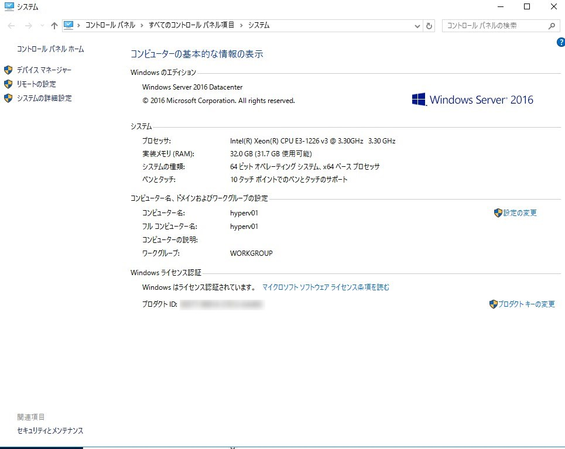
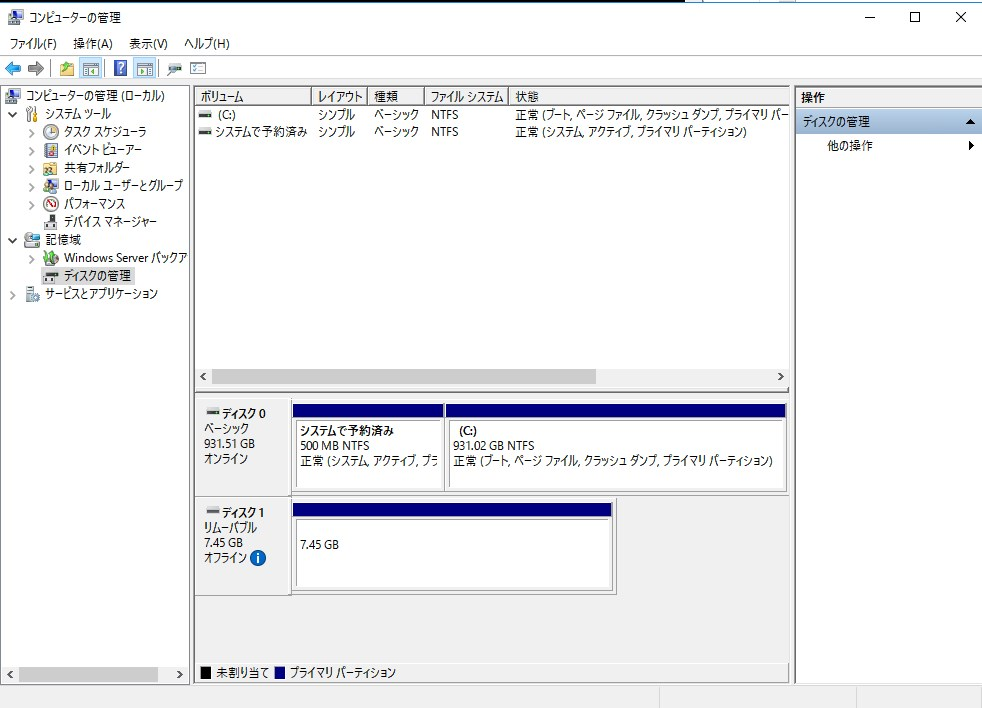

こんにちは。

<<<<<<< HEAD
今回は 評価用のWindows Server で USBメモリーを利用したところ、 **オフライン (管理者により設定されているポリシーのために、ディスクはオフラインです)** となる現象に遭遇し解決方法を記録したものです。

根本的な原因を突きとめることができなかったのですが、それなりに時間を使って解決したので1名でも時短できれば幸いです。

## 環境
- Windows Sever 2016 ※私はこの環境ですがおそらく発生するのはOSに依存しないと思っています。
=======
今回は 評価用のWindows Server で USBメモリを利用したところ、 **オフライン (管理者により設定されているポリシーのために、ディスクはオフラインです)** となる現象に遭遇し解決方法を記録したものです。

根本的な原因を突き止めることが出来ず謎ですが、それなりに時間を使って解決したので1名でも時短出来れば幸いです。

## 環境
- Windows Sever 2016 ※私はこの環境ですが恐らく発生するのはOSに依存しないと思っています。
>>>>>>> 06c808c2ac9afdf678f66d694321fd2722beb06d
    

## 現象
サーバーにUSBを刺しても反応せず、ディスク管理から見るとオフラインになっていました。


i マークにカーソルを合わせると、 **オフライン (管理者により設定されているポリシーのために、ディスクはオフラインです)** と出ました。


ポリシーのために、と出ていますが **このサーバーはワークグループのサーバーですし、特にローカルポリシーの設定もしていません** でした。

<<<<<<< HEAD
この環境では、発生したUSBメモリーと別のUSBメモリーでも同現象が発生しました。
=======
この環境では、発生したUSBメモリと別のUSBメモリでも同現象が発生しました。
>>>>>>> 06c808c2ac9afdf678f66d694321fd2722beb06d

## 解決方法

コマンドプロンプトを管理者権限で起動し、`diskpart` モードに入って以下を実行することで解決しました。

<<<<<<< HEAD
※ disk 1 の場合。
=======
※ disk 1 の場合
>>>>>>> 06c808c2ac9afdf678f66d694321fd2722beb06d

```
select disk 1
attributes disk clear readonly
online disk
```


<<<<<<< HEAD
これで無事オンライになって利用することができました。
=======
これで無事オンライになって利用することが出来ました。
>>>>>>> 06c808c2ac9afdf678f66d694321fd2722beb06d


## 参考にした情報
[「管理者により設定されているポリシーのために、ディスクはオフラインです」と表示される - Microsoft コミュニティ](https://answers.microsoft.com/ja-jp/windows/forum/all/%E7%AE%A1%E7%90%86%E8%80%85%E3%81%AB%E3%82%88/44306ac2-9f04-4f04-8bac-45d73964f978)

[Windows Diskpartを使ってディスクをオフライン・オンラインにする方法 - 元「なんでもエンジニ屋」のダメ日記](https://nasunoblog.blogspot.com/2016/01/how-to-change-disk-offline-or-online.html)
