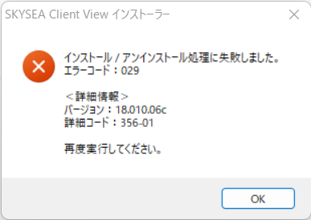
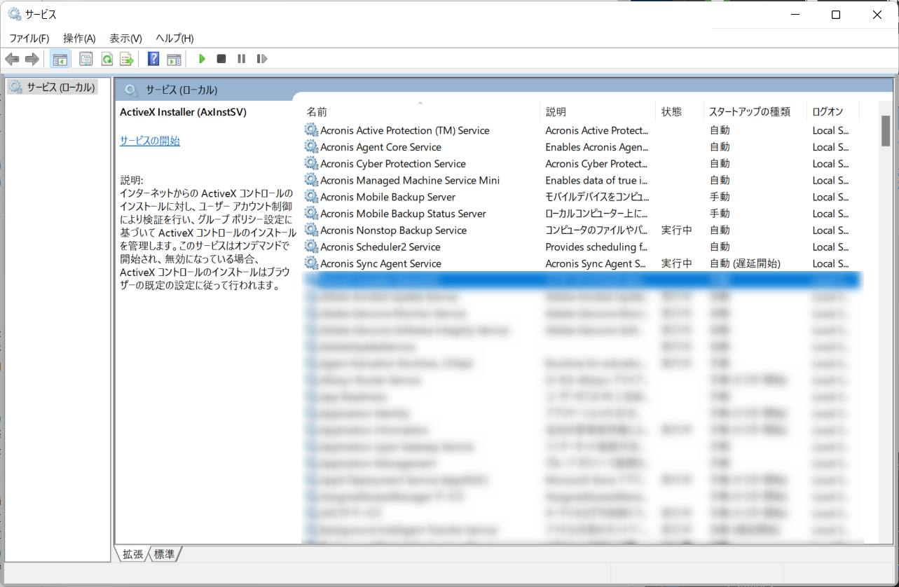

こんにちは。

今回は、社内で利用している SKYSEA Client View を 16系から18系にバージョンアップした際、**特定の端末がエラーコード029で失敗** ました。

これを解決した経緯を記事にします。

## 前提
SKYSEA Client View のマスタサーバーおよびデータサーバーはアップデート済みで、マスタサーバーからシステムアップデートを実施した際に起きたエラーです。

本記事ではサーバー側のアップデートや端末のアップデート手順は割愛します。

## 現象

アップデートを実行すると、以下のエラーで中断しました。

リトライしても同様にダメでした。

## 原因
SKYSEA保守契約窓口に問い合わせしたところ、このエラーは **インストーラーやアップデータでのレジストリへのアクセス、サービスの登録に失敗しているエラーである** とのことでした。

大きく分けて、以下の2点が問い合わせ時点で確認されているようでした。
1. ウィルス対策ソフト等により、レジストリへの書き込みがブロックされたり、サービスの登録が失敗して発生するケース
1. 偶発的な問題で発生していたケース

1のケースは **Acronis社製のバックアップソフトにて事例を確認している** とのことで今回はこのケースに当てはまっていました。

対象製品を利用している環境の場合、以下サービスを停止することで改善するケースを連絡されました。

- Acronis Managed Machine Service
- Acronis Scheduler2 Service
- Acronis Agent Core Service
- Acronis Active Protection Service
- Acronis Cyber Protection Service

## 対処
提案された停止サービスを端末で確認すると以下の5サービスが該当していました。 ※ファイル名から指定して実行から `services.msc` を実行して確認。

順次停止しようとしましたが、以下の2サービスは停止がグレーアウトされていて停止ができませんでした。
- `Acronis Active Protection (TM) Service` 
- `Acronis Cyber Protection Service` 

いろいろと試したところ、以下の手順でサービスを停止できました。

### サービスから停止

1. ファイル名から指定して実行から `services.msc` を実行
1. `Acronis Agent Core Service` を停止 ※このとき同時に `Acronis Managed Machine Service Mini` が停止される
1. `Acronis Scheduler2 Service` を停止

### タスクマネージャーから停止
1. ファイル名から指定して実行から `taskmgr` を実行  
1. `CyberProtectHomeOfficeMonitor.exe` のタスクを終了 
1. `anti_ransomware_service.exe` のタスクを終了
1. `cyber-protect-service.exe` のタスクを終了

これでサービスが停止しました。

この状態で再度SKYSEA Client Viewをインストールしたところ無事成功しました。
お困りの方のお役に立てれば幸いです。

それでは次回の記事でお会いしましょう。
