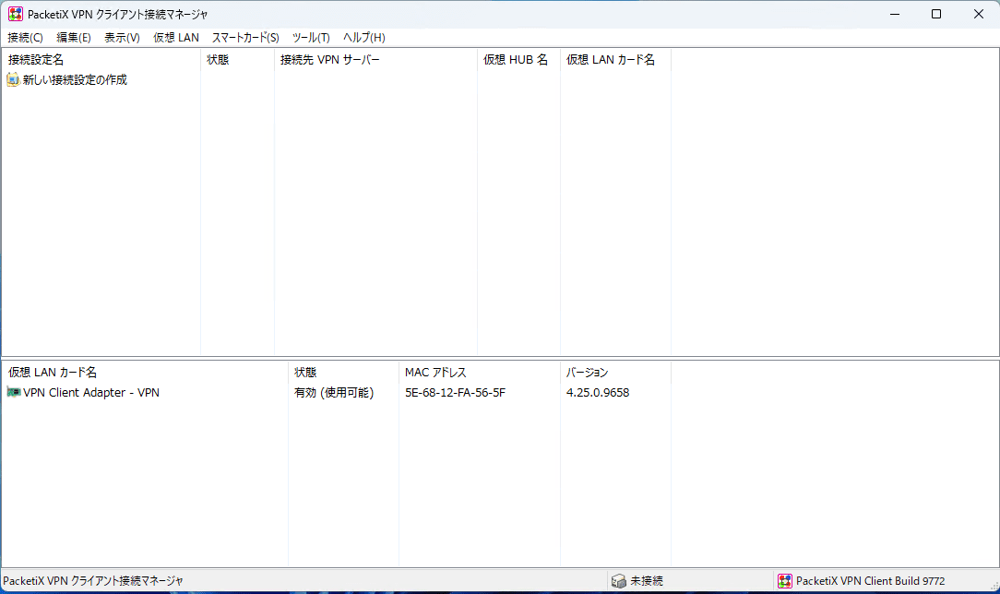

こんにちは。

評価でPacketix VPN Client 接続マネージャーを利用しようとした際、以下のエラーで起動しない現象に見舞われました。

> このコンピュータで動作しているVPN Client サービスに接続できませんでした。VPN Client サービスが起動し、正しく動作いているかどうか確認してください。


エラー内容にサービスが起動しているかどうかの確認がありましたが、 **サービスは問題なく起動していました** 。


今回はこの現象を解決した際の流れを記事にします。

## 環境
- 端末OS : Windows 11
- Packetix VPN Client: v4.39-9772-beta-2022.04.26
- Acronis Cyber Protect Home Office

## 原因の特定

特定のきっかけになったのは以下の記事でした。
[「VPNモバイル接続クライアント」起動時に「このコンピュータで動作しているVPNモバイル接続クライアント サービスに接続できませんでした。」](https://faq.r4support.epson.jp/app/answers/detail/a_id/2840/~/%E3%80%8Cvpn%E3%83%A2%E3%83%90%E3%82%A4%E3%83%AB%E6%8E%A5%E7%B6%9A%E3%82%AF%E3%83%A9%E3%82%A4%E3%82%A2%E3%83%B3%E3%83%88%E3%80%8D%E8%B5%B7%E5%8B%95%E6%99%82%E3%81%AB%E3%80%8C%E3%81%93%E3%81%AE%E3%82%B3%E3%83%B3%E3%83%94%E3%83%A5%E3%83%BC%E3%82%BF%E3%81%A7%E5%8B%95%E4%BD%9C%E3%81%97%E3%81%A6%E3%81%84%E3%82%8Bvpn%E3%83%A2%E3%83%90%E3%82%A4%E3%83%AB%E6%8E%A5%E7%B6%9A%E3%82%AF%E3%83%A9%E3%82%A4%E3%82%A2%E3%83%B3%E3%83%88-%E3%82%B5%E3%83%BC%E3%83%93%E3%82%B9%E3%81%AB%E6%8E%A5%E7%B6%9A%E3%81%A7%E3%81%8D%E3%81%BE%E3%81%9B%E3%82%93%E3%81%A7%E3%81%97%E3%81%9F%E3%80%82%E3%80%8D)

上記の記事から、Packetix VPN Client は 9999番ポートで待ち受けていることが分かりました。

コマンドプロンプトを開き、 `netstat -ano | find "9999"` を実行します。

コマンド結果の先頭を見ると、**2つのプロセスが待ち受けている ( LISTENING している ) ことが分かります**。
```
TCP         0.0.0.0:9999           0.0.0.0:0      LISTENING       5752
TCP         127.0.0.1:9999         0.0.0.0:0      LISTENING       4824
```


 `5752` と `4824` がプロセス番号 ( PID ) です。

タスクマネージャーから 2 つの PID を確認すると、`Acronis Agent Core` と `Packetix VPN` であることが分かりました。


切り分けで、 `Acronis Agent Core Service` を停止して確認します。


この状態でPacketix VPN Client 接続マネージャー を起動してみると正常に起動しました。


このことから、 **原因は Packetix VPN Client と Acronis Agent Core の 待ち受けポート番号がバッティングしている** と特定されました。

## 対処
Acronis Agent Core Service の待ち受けポートを変更することで対処します。

ポート番号は任意ですが 1つ 小さな `9998` にします。

コマンドプロンプトから `netstat -ano | find "9998"` を実行して `9998 ポート` が空いていることを確認します。

問題ありませんでした。


続けて、設定ファイルを変更します。

1. `C:\ProgramData\Acronis\Agent\etc\aakore.yaml` をテキストエディターーで開き、 `http: 127.0.0.1:9999` の部分を `http: 127.0.0.1:9998` に変更して保存します。
1. サービスから、 `Acronis Agent Core Service` を再起動します。


以下の記事を参考にしました。
[Acronis Cyber Protect Cloud: ポート 9999 を変更する方法 | Knowledge Base](https://kb.acronis.com/node/68127)

`netstat` の結果を確認し、バッティングが解消されていることを確認します。


無事起動しました。



それでは次回の記事でお会いしましょう。
