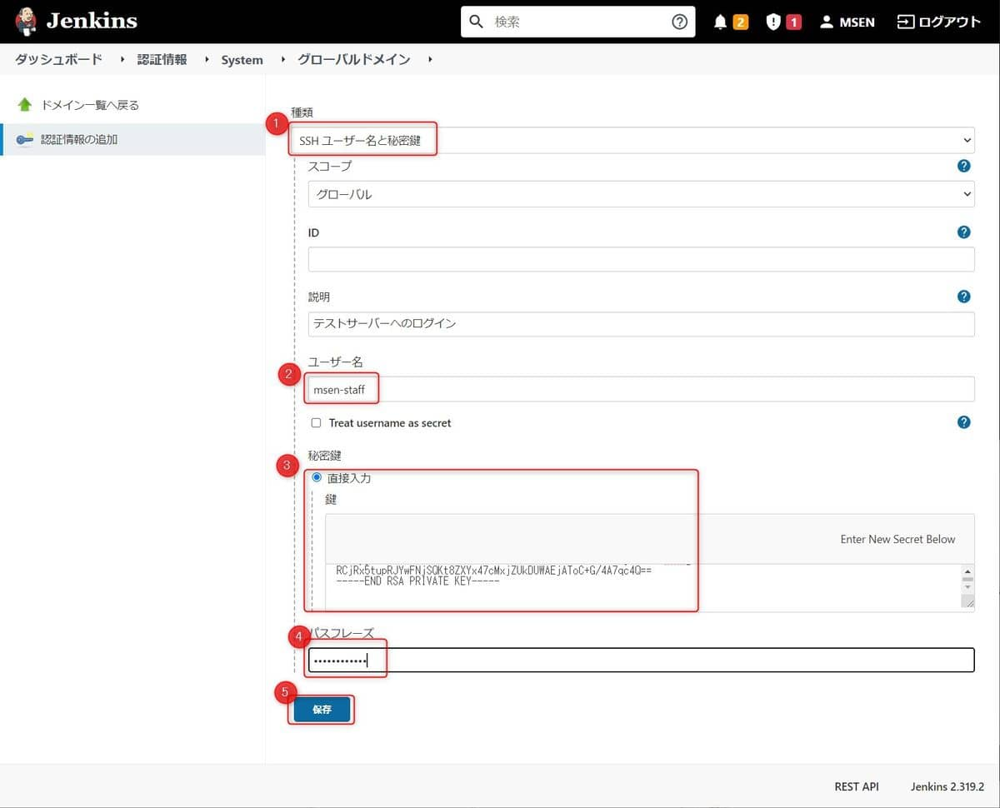
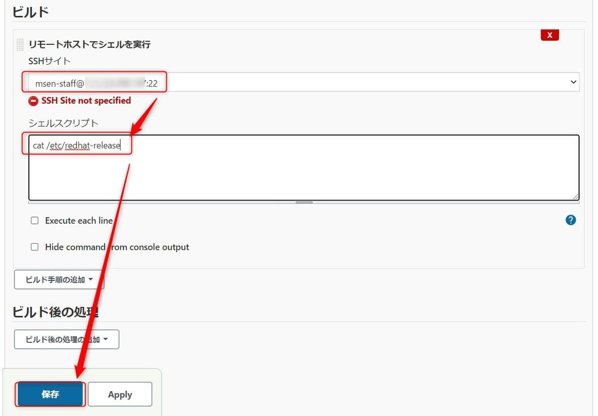
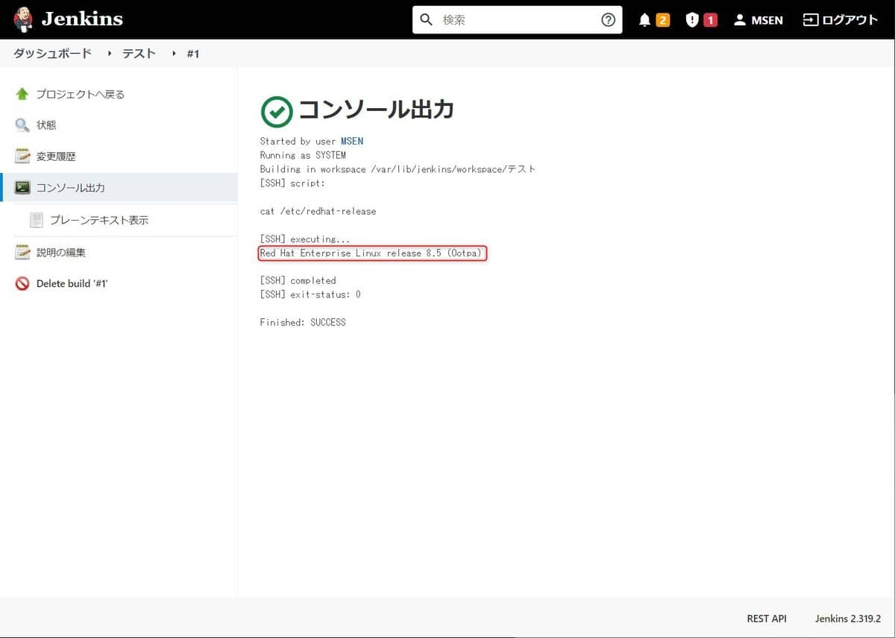
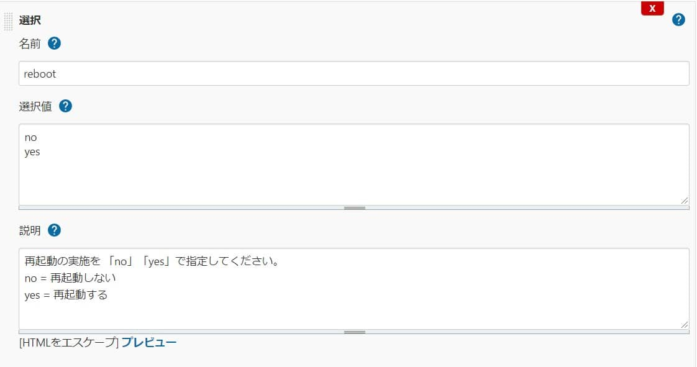
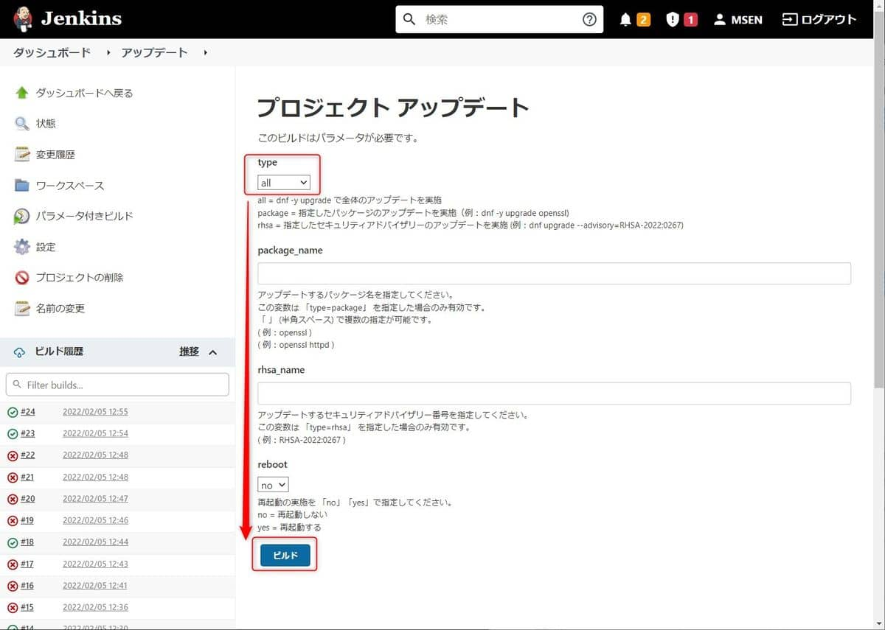
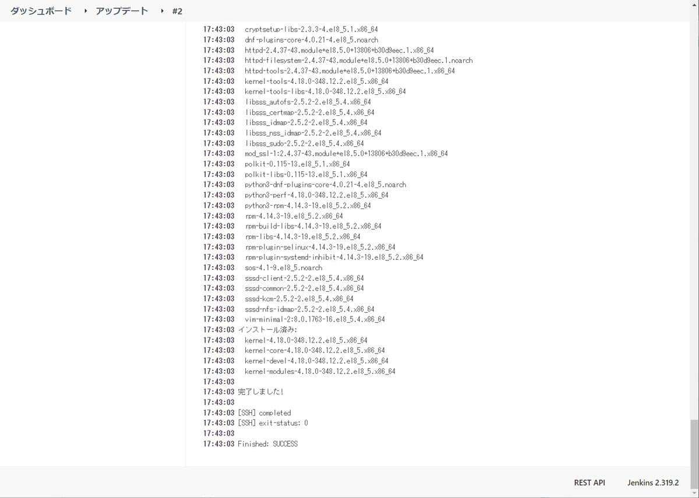
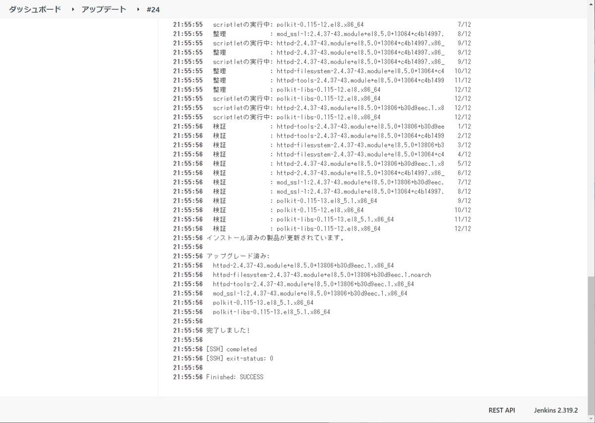
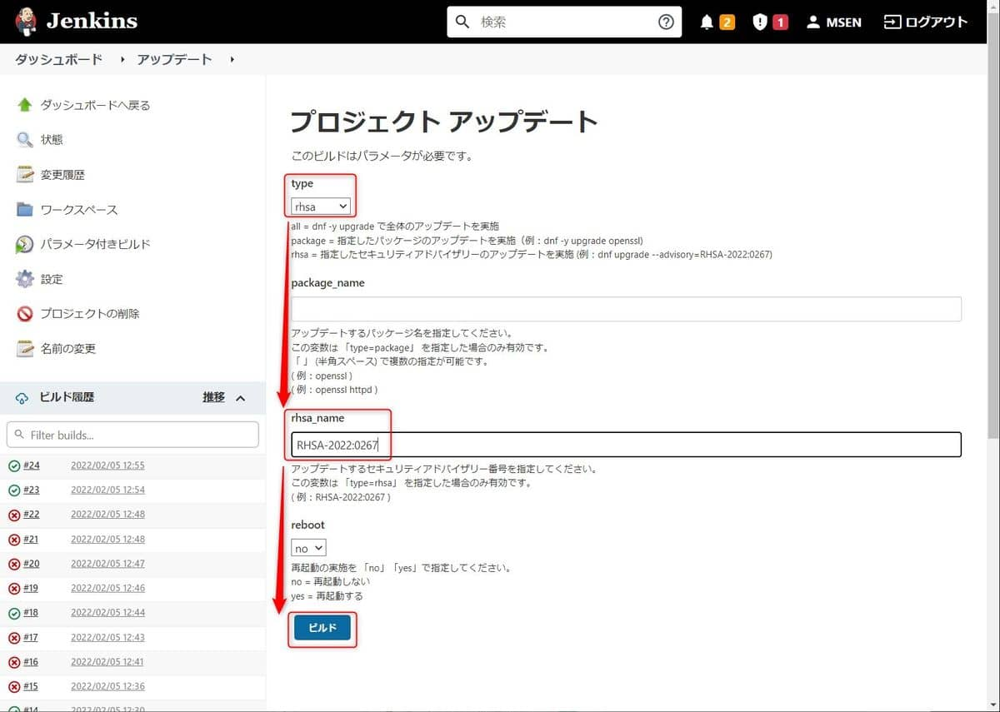
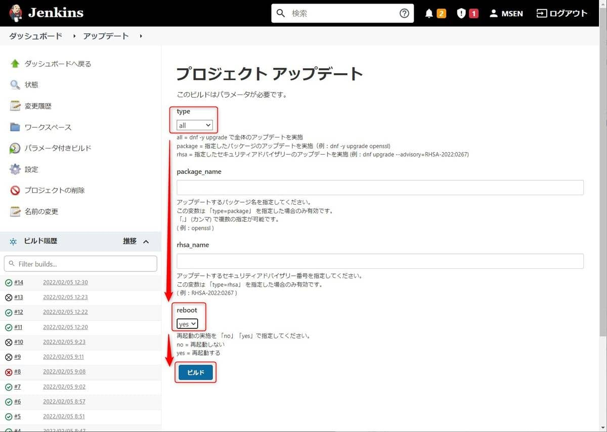

こんにちは。

今回の記事は、CI システムの **Jenkins を使って Linux サーバーのアップデート作業を簡単にする** 内容です。

**毎日のように脆弱性が通知** され、 **その都度 保守対象のサーバーをアップデートする** ことが多くなっています。

当然ながら、 **脆弱性対応は急ぎ** が多く、弊社でも漏れがないように **スプレッドシートなどで管理するのですがやはり煩雑かつ非効率** です。

**「またかー」という心の声** が聞こえます。

システムによりけりですが、自動でアップデートが難しいことも多いので、今回のアプローチは **Jenkins から 少ない操作でアップデートを実施することを目的** とします。

また、 **Jenkinsを利用すれば一度ジョブを設定すれば誰でも実行** できるメリットもあるのではと考えます。

Jenkins の構築は 過去記事を参考にしてください。

**(記事リリース後に更新)過去記事を入れる**

## 評価環境
- Jenkins 2.319.2
- Red Hat Enterprise Linux release 8.5 (アップデート対象)

## 概要
今回の評価では、以下 3パターンのアップデートができるように設定します。
1. 全体アップデート ( `dnf -y upgrade` )
1. 指定したパッケージのアップデート ( `dnf -y upgrade openssl` )
1. RHSA (Red Hat Security Advisory) 単位のアップデート ( `dnf upgrade --advisory=RHSA-2022:0267` )

**アップデート前後に全パッケージバージョンを取得** し、**再起動オプションも考慮** します。

## Red Hat Enterprise Linux 8.5 (アップデート対象) の設定変更
アップデートコマンドをパスワードなしで実行できるように `root` ユーザーで `visudo` を実行して **以下の1行を追加** します。

`msen-staff      ALL=(ALL)       NOPASSWD: /usr/bin/dnf, /usr/sbin/reboot`

## Jenkins で接続設定
**Jenkins に SSH プラグインをインストール** し、**アップデート先のサーバーに接続するための設定** をします。

- SSH プラグイン のインストール
    

**このリンクが少し見つけにくい** のですが認証情報の追加は **以下のURLのIP部分を自身のものに変更** して接続します。
http://IP:8080/credentials/store/system/domain/_/newCredentials

テストサーバーには、秘密鍵で接続するので種類は **SSHユーザー名と秘密鍵** になります。
※**鍵認証でなければ、ユーザー名とパスワードを選択** してください。

**IDは空欄** でOKです。
**秘密鍵の形式はOpenSSH形式** です。



続けて、**設定からSSHリモートホストを追加** します


**Check connection** をクリックし、**Successfull connection** が表示されればOKです。

念のため **Check connection** をクリックしたとき、サーバーの `/var/log/secure` にログが記録されていることを確認します。

```bash
Feb  5 02:22:58 test sshd[2265]: Accepted publickey for msen-staff from 192.168.10.254 port 43144 ssh2: RSA SHA256:d9cJIMZRXt5xUnnVyX1vZDLIN+hlyOId5411VB8Z3ss
Feb  5 02:22:58 test sshd[2265]: pam_unix(sshd:session): session opened for user msen-staff by (uid=0)
Feb  5 02:22:58 test sshd[2265]: pam_unix(sshd:session): session closed for user msen-staff
```

**保存ボタンをクリック** して設定を保存します。

## Jenkins でテストジョブ実行

**フリースタイルのジョブを作成** して、`/etc/redhat-release` を表示してみます。
- テストジョブの作成
    
    
    

- ジョブを実行
    

正常に実行できました。



では、いよいよ **次項で目的のジョブを作成** します。

## Jenkins でアップデート用のジョブを作成

同じく **フリースタイルのジョブを作成** して、アップデート用のジョブを作成します。

パラメーターは以下のとおりです。( **変更点のみ記載** )

- ジョブ名：アップデート (任意)
- ビルドのパラメーター化：チェック
    - 選択
        - 名前：type
        - 選択値：all, package, rhsa
        
    - 文字列
        - 名前：package_name
        - デフォルト値：空欄
        
    - 文字列
        - 名前：rhsa_name
        - デフォルト値：空欄
        
    - 選択
        - 名前：reboot
        - 選択値：no, yes
        
- ビルド環境
    - リモートホストでシェルを実行：チェック
        - SSHサイト：msen-staff@ooo.ooo.ooo.ooo:22
        - ビルド前スクリプト
            ```bash
            # アップデート前の時刻を記録
            TZ=JST-9 date
            echo -e "\n"

            # アップデート前のパッケージ一覧を記録
            rpm -qa
            ```
        - ビルド後スクリプト
            ```bash
            if [ "${reboot}" = "yes" ]; then
              # 再起動の実行
              sudo reboot &
            fi
            # アップデート後のパッケージ一覧を記録
            rpm -qa
            # アップデート後の時刻を記録
            echo -e "\n"
            TZ=JST-9 date
            ```
            ※ **& をつけてバックグラウンド実行にしないと、ジョブが失敗**します。
- ビルド
    - リモートホストでシェルを実行
        - SSHサイト：msen-staff@ooo.ooo.ooo.ooo:22
        - シェルスクリプト
            ```bash
            # アップデート実行
            if [ "${type}" = "all" ]; then
              sudo dnf -y upgrade
            elif [ "${type}" = "package" ]; then
              sudo dnf -y upgrade ${package_name}
            elif [ "${type}" = "rhsa" ]; then
              sudo dnf -y upgrade --advisory=${rhsa_name}
            fi
            ```
    
## ジョブのテスト
- **type=all** のテスト
    
    

- **type=package** のテスト
    
    

- **type=package(複数指定)** のテスト
    
    

- **type=RHSA** のテスト
    
    

- **reboot=yes** のテスト
    
    

**すべて正常に完了** できました。

## あとがき
この方法はあくまで **Jenkinsから直接接続できるサーバーが対象に** なりますので、起点になるサーバーからしかログインできないような環境にも対応できるように今後検討したいと思います。

それでは次回の記事でお会いしましょう。
