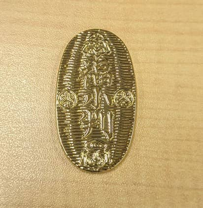

新年あけましておめでとうございます。
本年もよろしくお願いいたします。

毎年恒例、今宮戎参拝に行ってきました。
**2023 年は福笹の授与が行われている、1/10 (火) の午前中に参拝** してきました。

## 2023年の日程

[昨年は](https://mseeeen.msen.jp/2022-toka-ebisu/)、コロナ渦の制限が緩和され福笹の授与が再開されていました。

今年は特に制限なく **1月9日～11日** で福笹の授与が行われているようです。

日程は以下のようになっていました。

[今宮戎神社ホームページ抜粋](https://www.imamiya-ebisu.jp/%E4%BB%A4%E5%92%8C5%E5%B9%B4%E5%8D%81%E6%97%A5%E6%88%8E%E7%A5%9E%E4%BA%8B%E3%83%BB%E8%A1%8C%E4%BA%8B%E4%BA%88%E5%AE%9A%E8%A1%A8)

## 昨年の福笹

**昨年は 8 期目だったので 8 つの福飾り** でした。

## 参拝・福笹

これまでコロナ禍で静かでしたが、今年は賑わいが戻っていました。

昨年の福笹を無事返納しました。

## 今年の福笹

笹の受け取り。

今年も福飾りの授与がありましのたで **９期目 の ９点 の福飾りを選びました** ！

## あとがき

**今年も出店の出店がなく** ベビーカステラと、干支の飴は販売がなく購入できませんでした、残念。

個人的に毎年更新している小判は買えました！

コロナ渦がなかなか落ち着つかず、第8派を迎えている状態です。
今年もコロナとうまく付き合う1年になりそうですが、来年 ( 2024年 ) も 10 つの福飾りの紹介できるように頑張ります！

**2023 年もスタッフ一同頑張って参りますのでどうぞよろしくお願いいたします** 。

