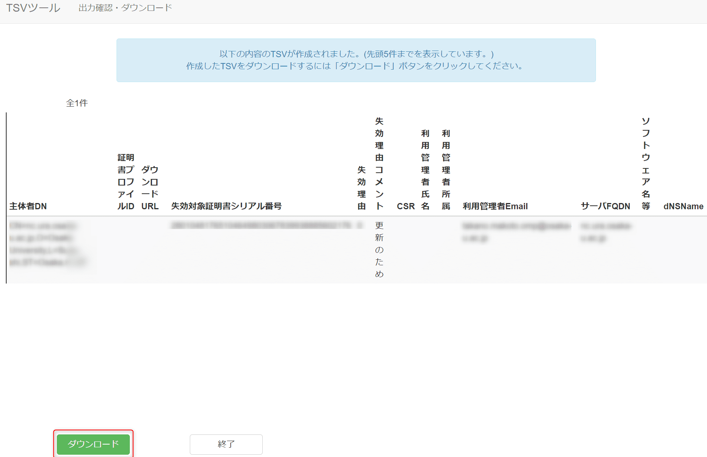

こんにちは。

UPKI向けの証明書に関連した記事は過去に2つほど書きましたが、今回は更新の方法を紹介したいと思います。
作成に関連したルールはたびたび変わることがあり、執筆時点で有効であることを確認した方法です。

[\[サーバー証明書\] UPKI向けCSRとTSVの作成方法](https://mseeeen.msen.jp/how-to-create-csr-and-tsv-for-upki/)
[\[サーバー証明書\] UPKI向け証明書失効手続きの流れ](https://mseeeen.msen.jp/flow-of-certificate-revocation-procedure-of-upki/)


## 下準備
1. 更新対象の証明書
    - テキストで作業PC上に保存する
1. `openssl` と `bash` スクリプトが使えるマシン
1. 上記マシンに以下のスクリプトを展開する ( ファイル名は任意です )
    - DNの情報には定められた情報を入力してください。
    - 現在のルールでは `OU` は空欄です。
    ```bash:mk_csr.sh
    #!/usr/bin/env bash
    
    ## DN 情報を入力
    CN="$1"
    C="JP"
    ST="Osaka"
    L="Osaka-shi"
    O="MSEN\ University"
    OU=""
    
    ## 変数に設定
    #Common Name (eg, your name or your server's hostname)
    CN="${CN}"
    # Country Name (2 letter code)
    C="${C}"
    # State or Province Name (full name)
    ST="${ST}"
    # Locality Name (eg, city)
    L="${L}"
    # Organization Name (eg, company)
    O="${O}"
    # Organizational Unit Name (eg, section)
    OU="${OU}"
    
    csrfile=$CN.csr
    pkeyfile=$CN.key
    subject="/C=$C/ST=$ST/L=$L/O=$O/OU=$OU/CN=$CN"
    
    ## エラー処理
    if [ -f $pkeyfile ] ; then
        echo "Error: Private Key already exists."
        exit
    fi
    
    ## 作成処理
    openssl req -new -sha256 -newkey rsa:2048 -nodes -out $csrfile -keyout $pkeyfile -subj "$subject"
    
    # CHECK modules
    openssl req -in $csrfile -text
    openssl rsa -in $pkeyfile -text
    ```

## 作業の流れ
以下の流れで作業します。
1. 失効用TSVの作成
1. 秘密鍵とCSR作成 ( 秘密鍵の再利用はできません )
1. 更新用TSVの作成
1. 学術機関の手続き
1. 証明書発行
今回は、上記 4. 5. は割愛します。

## 実際の作業
それではそれぞれの手順を解説します。

### 失効用TSVの作成
1. [TSVツール: 種別選択](https://certs.nii.ac.jp/tsv-tool/create/) に 接続します。
1. 失効用TSVの作成を開始します。
    
1. 下準備の 1. の **更新対象の証明書を読み込ませます** 。
    
1. 以下の画像を参考に手続きします。
    - ① この10進数をテキストエディター等に保存します
    - ② 学術機関から指定されたものを入力します
    - ③ その他 を選択します
    - ④ 任意です
    
1. TSVファイルが発行されますのでダウンロードします。
    

### 秘密鍵とCSRの作成
下準備の 3. で作成したスクリプトを利用して作成します。
1. `./mk_csr.sh CN名` を実行します。CN名が `mseeeen.msen.jp` であれば `./mk_csr.sh mseeeen.msen.jp` です。
1. スクリプトを実行することで秘密鍵とCSRが作成されますので、 **CSRをテキストで作業PC上に保存** します。
1. [TSVツール: 種別選択](https://certs.nii.ac.jp/tsv-tool/create/) に 接続します。
1. 更新用TSVの作成を開始します。
    
1. 前項で保存した **CSRファイルを読み込ませます** 。
    
1. 以下の画像を参考に手続きします。
    - ① **失効用TSVの作成のときに保存した10進数** を入力します
    - ②～④ 学術機関から指定されたものを入力します
    - ⑤ 利用しているWebサーバーを記載します
    
1. TSVファイルが発行されますのでダウンロードします。
    

以上でTSVの発行が完了します。

更新の場合になぜ失効用が必要になるのか？と思われるかもしれませんが、
現在は秘密鍵の再利用ができないため、更新用証明書をサーバーに設定したあと、
設定したことを機関に伝えると同時に作成した失効用TSVで旧証明書が失効される流れになります。

それでは次回の記事でお会いしましょう。
