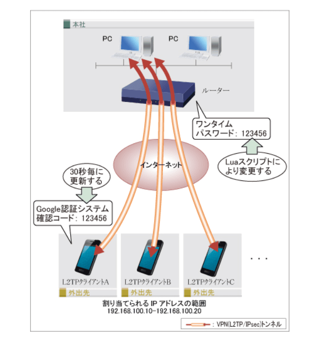
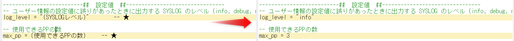
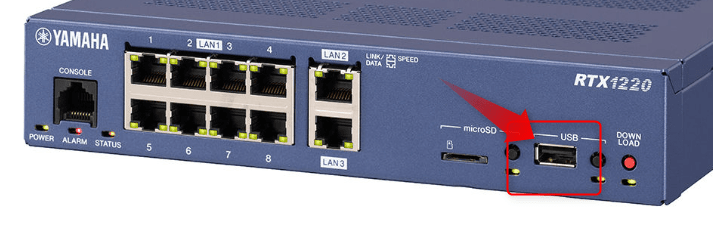
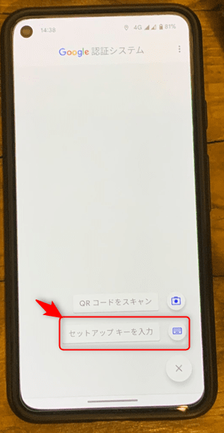
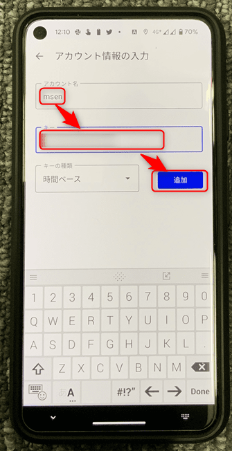
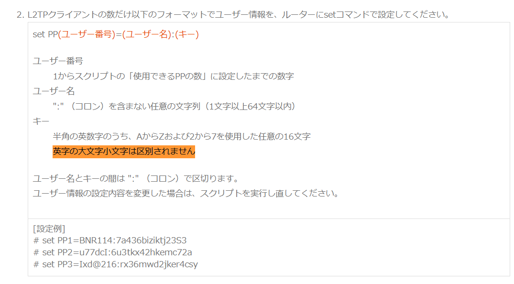

こんにちは。

今回の記事は、YAMAHA のルーターで L2TP / IPsec VPN を設定し、
**二要素認証にワンタイムパスワードを利用する** ものです。

主に以下の記事を参考にしています。

[Google 認証システムの確認コード生成方法に準じたワンタイムパスワードを設定する](https://network.yamaha.com/setting/router_firewall/monitor/lua_script/one_time_password2-rtx1200)

## 概要

L2TP/IPsec VPN 接続は、Pre-Shared Key ( 事前共有鍵 ) (以降 PSK ) と ユーザー名、パスワードを利用して認証します。

ルーターに **Lua スクリプトを配置し、定期的に実行させることでユーザー名に紐付くパスワード部分が定期的に変更される** しくみです。



L2TP/IPsec VPN の設定はYAMAHAの記事を参考にしてください。

[L2TP/IPsecを使用したリモートアクセス : ルーター コマンド設定](https://network.yamaha.com/setting/router_firewall/vpn/vpn_client/vpn-smartphone-setup_rtx1200)


## 対応機器

この機能が利用できる機器は以下のとおりです。

### Lua スクリプト機能の対応機種
- RTX5000
- RTX3500
- RTX1220
- RTX1210
- RTX1200(Rev.10.01.16以降)
- RTX830
- RTX810
- NVR700W
- NVR510
- NVR500
- FWX120

### VPN機能の対応機種
- RTX5000(Rev.14.00.12以降)
- RTX3500(Rev.14.00.12以降)
- RTX1220
- RTX1210
- RTX1200(Rev.10.01.59以降)
- RTX830、RTX810(Rev.11.01.21以降)
- NVR700W
- NVR510(Rev.15.01.03以降)
- FWX120(Rev.11.03.08以降)

確認に利用した機種は RTX1220 です。

## 設定の流れ
おおむね以下の流れで設定します。

1. ルーターの基本設定
    - LAN, WAN を適切に設定し、LANからWANにインターネット接続ができること
1. L2TP/IPsec の設定
    - インターネット側から PSK と ユーザー名・パスワードを利用してVPN接続ができること
1. L2TP/IPsec で設定したユーザーに対してセットアップキーの設定
1. Lua スクリプトの配置と関連設定
    - YAMAHA から提供されているLuaスクリプトをUSBメモリー経由でアップロードします

今回の記事では、 1, 2 は割愛します。
後述するサンプルコンフィグやYAMAHAの設定事例を確認してください。

## ユーザーに対してセットアップキーの設定
L2TP/IPsec で設定した `pp auth username` に対応したキーを設定します。

`pp auth username msen testpassword` で設定された1つめのユーザーが `PP1` になります。
`set PP1=msen:1a123biziktj12S9` はこの1つめのユーザーに対するセットアップキーの指定です。

この値が Google 認証システム ( Google Authenticator ) に入力するセットアップキーです。

## Lua スクリプトの配置と関連設定
各ファイルは以下よりダウンロードします。

[Google 認証システムの確認コード生成方法に準じたワンタイムパスワードを設定する](https://network.yamaha.com/setting/router_firewall/monitor/lua_script/one_time_password2-rtx1200)

**注意点**
以降の手順でリンク先から各 Lua スクリプトを取得します。このとき、文字コードの変更を防ぐために各ファイルは**「名前を付けてリンク先を保存」で保存** してください。

ダウンロードするファイルは以下の3つです。

1. lua-script-one_time_password2.lua ( Shift_JIS / 5430バイト)
1. onetimepass.lua ( Shift_JIS / 2827バイト )
1. sha1.lua ( UTF-8 / 110250バイト )

### Lua スクリプトの取得
1. lua-script-one_time_password2.lua の取得
    - Luaスクリプト下の **下記のLuaスクリプトを取り出すことができます。** からダウンロード します。
1. onetimepass.lua の取得
    - モジュール例1下の **下記のモジュールを取り出すことができます。** からダウンロード します。
1. sha1.luaの取得
    - モジュール例2下の **下記の修正がされたモジュールを取り出すことができます。** からダウンロード します。

### Lua スクリプトの修正
1. lua-script-one_time_password2.lua を修正
    - `log_level` と `max_pp` を修正します。
        - `log_level` は `info, debug, notice` から選択します。
        - `max_pp` は 設定している `tunnel` 数を記載します。

    修正箇所は以上です。
    
    
### Lua スクリプトを機器に転送
取得・修正した3つのLuaスクリプトをUSBメモリーに転送します。

USBメモリーを機器に接続します。


正常に認識すると **ピロ** という電子音がします。

電子音がしない場合、認識されていません。
いくつかのUSBメモリーを試しましたが、認識しないUSBメモリーのほうが多かったです。

**認識したUSBメモリーは、RUF3-K32GB でした** 。


USBメモリーを認識させたあと、以下のコマンドでUSBメモリーから機器のルートにコピーします。

```:title=USBから機器にファイル転送
copy usb1:/lua-script-one_time_password2.lua /
copy usb1:/onetimepass.lua /
copy usb1:/sha1.lua /
```

スクリプトファイルを差し替えする場合は、削除後に再度コピーします。

```:title=機器からファイルを削除
delete /lua-script-one_time_password2.lua
```

### Lua スクリプトのパスと自動実行設定

Lua スクリプトを自動的に起動するため、以下のようにパスとスケジュール設定します。
※ at 3 の数字部分は環境に応じて変化します。

```:title=パス指定
set LUA_PATH="./\?.lua;"
```

```:title=スケジュール設定
schedule at 3 startup * lua /lua-script-one_time_password2.lua
```

この設定で、起動時 ( startup ) に `lua-script-one_time_password2.lua` が実行されます。

即時手動で起動する場合は、 `lua lua-script-one_time_password2.lua` とします。

スケジュール設定は、以下の公式ページを参考にしてください。
[37.1 スケジュールの設定](http://www.rtpro.yamaha.co.jp/RT/manual/rt-common/schedule/schedule_at.html)

### 実行の確認
`show status lua` コマンドを利用し、スクリプトが正常に実行されたかを確認します。

正常に実行されていれば、以下のような出力になります。

```:title=正常
# show status lua
Luaライブラリバージョン:        Lua 5.1.5
Luaスクリプト機能バージョン:    1.08

[running]
LuaタスクID (状態):  1  (SLEEP)
走行トリガー:        スケジュールによる実行
コマンドライン:      lua /lua-script-one_time_password2.lua
スクリプトファイル:  /lua-script-one_time_password2.lua
開始日時:            2023/01/26 12:07:24
経過時間:            6秒

[history]
過去の走行履歴はありません
```

何らの理由で失敗した場合は、以下ような出力になります。

```:title=エラー
# show status lua
Luaライブラリバージョン:        Lua 5.1.5
Luaスクリプト機能バージョン:    1.08

[running]
走行中のLuaスクリプトはありません

[history]
(1)
走行トリガー:        'lua' コマンド
コマンドライン:      lua lua-script-one_time_password2.lua
スクリプトファイル:  /lua-script-one_time_password2.lua
走行回数:            1
エラー発生回数:      1
エラー履歴:
  2023/01/23 10:02:41: lua: error exit
初回の開始日時:      2023/01/23 10:02:41
前回の開始日時:      2023/01/23 10:02:41
前回の終了日時:      2023/01/23 10:02:41
前回の走行結果:      エラー終了
```

`lua-script-one_time_password2.lua` は、 `onetimepass.lua` と `sha1.lua` が連携して動作しているため、どちらかのファイルがない場合は分かるようなエラーがでますが、上記の `lua: error exit` は、エラーの特定が難しいです。 ※エラーを解消した経緯は後述します。

以上で設定は完了です。

## Google Authenticator の設定
Google Authenticator アプリをインストールし、以下の流れで設定します。

1. ＋ボタンからセットアップを開始


1. ユーザー名とセットアップキーを入力する

1. セットアップ完了


以上で設定が完了です。


ここまでの設定で、ユーザーに設定された **パスワードが周期的にGoogle 認証システムに準拠したもに変更** されます。
認証の際に、Google Authenticator アプリを開き、表示されるパスワードを入力します。

## サンプルコンフィグ
一部マスクしていますが、確認したコンフィグを参考に掲載します。

```:title=サンプルコンフィグ
# RTX1220 Rev.15.04.04 (Mon Jun 13 16:36:19 2022)
# MAC Address : ac:44:f2:b6:fe:c1, ac:44:f2:b6:fe:c2, ac:44:f2:b6:fe:c3
# Memory 256Mbytes, 3LAN
# main:  RTX1220 ver=00 serial=xxxxxx MAC-Address=ac:44:f2:xx:xx:xx MAC-Address=ac:44:f2:xx:xx:xx MAC-Address=ac:44:f2:b6:fe:c3
# Reporting Date: Jan 26 11:54:02 2023
administrator password encrypted *
console character ja.utf8
ip route default gateway 203.0.113.1
ip stealth lan3
ip lan1 address 192.168.11.1/24
ip lan1 proxyarp on
switch control use lan1 on
ip lan2 address 192.168.1.254/24
ip lan2 proxyarp on
ip lan2 secure filter in 110 3000
ip lan2 secure filter out 3000 dynamic 100 101 102 103 104 105 106 107
switch control use lan2 on
ip lan3 address 203.0.113.88/24
ip lan3 mtu 1454
ip lan3 proxyarp on
ip lan3 secure filter in 1 11 12 13 14 2000
ip lan3 secure filter out 1010 1011 1012 1013 3000 dynamic 100 101 102 103 104 105 106 107
ip lan3 nat descriptor 1000
switch control use lan3 on
pp select anonymous
 pp bind tunnel1-tunnel2
 pp auth request chap
 pp auth username msen testpassword
 pp auth username msen2 testpassword
 ppp ipcp ipaddress on
 ppp ipcp msext on
 ip pp remote address pool 192.168.11.201-192.168.11.210
 ip pp mtu 1258
 pp enable anonymous
tunnel select 1
 tunnel encapsulation l2tp
 ipsec tunnel 1
  ipsec sa policy 1 1 esp aes-cbc sha-hmac
  ipsec ike keepalive use 1 off
  ipsec ike local address 1 192.168.11.1
  ipsec ike nat-traversal 1 on
  ipsec ike pre-shared-key 1 text presharedkey
  ipsec ike remote address 1 any
 l2tp tunnel disconnect time off
 l2tp keepalive use on 10 3
 l2tp keepalive log on
 l2tp syslog on
 ip tunnel tcp mss limit auto
 tunnel enable 1
tunnel select 2
 tunnel encapsulation l2tp
 ipsec tunnel 2
  ipsec sa policy 2 2 esp aes-cbc sha-hmac
  ipsec ike keepalive use 2 off
  ipsec ike nat-traversal 2 on
  ipsec ike pre-shared-key 2 text presharedkey
  ipsec ike remote address 2 any
 l2tp tunnel disconnect time off
 ip tunnel tcp mss limit auto
 tunnel enable 2
ip filter 1 pass-log * * established * *
ip filter 2 pass-log * * icmp
ip filter 11 pass-log * * udp * 500
ip filter 12 pass-log * * esp
ip filter 13 pass-log * * udp * 4500
ip filter 14 pass-log * * udp * 1701
ip filter 110 reject * 192.168.11.0/24 * * *
ip filter 1010 reject * * udp,tcp 135 *
ip filter 1011 reject * * udp,tcp * 135
ip filter 1012 reject * * udp,tcp netbios_ns-netbios_ssn *
ip filter 1013 reject * * udp,tcp * netbios_ns-netbios_ssn
ip filter 2000 reject * *
ip filter 3000 pass-log * *
ip filter dynamic 100 * * ftp
ip filter dynamic 101 * * www
ip filter dynamic 102 * * domain
ip filter dynamic 103 * * smtp
ip filter dynamic 104 * * pop3
ip filter dynamic 105 * * submission
ip filter dynamic 106 * * tcp
ip filter dynamic 107 * * udp
nat descriptor type 1000 masquerade
nat descriptor address outer 1000 primary
nat descriptor masquerade incoming 1000 reject 
nat descriptor masquerade static 1000 4 192.168.11.1 udp 500
nat descriptor masquerade static 1000 5 192.168.11.1 esp
nat descriptor masquerade static 1000 6 192.168.11.1 udp 4500
nat descriptor masquerade static 1000 7 192.168.11.1 udp 1701
ipsec auto refresh on
ipsec transport 1 1 udp 1701
ipsec transport 2 2 udp 1701
syslog debug on
telnetd host lan1
dhcp service server
dhcp server rfc2131 compliant except remain-silent
dhcp scope 1 192.168.11.151-192.168.11.200/24 gateway 192.168.11.1 expire 24:00
dhcp scope option 1 dns=192.168.11.1
dns host lan
dns service recursive
dns server 8.8.8.8
dns private address spoof on
schedule at 1 */* 00:00:00 * ntpdate ntp.nict.jp syslog
schedule at 2 */* 12:00:00 * ntpdate ntp.nict.jp syslog
schedule at 3 startup * lua /lua-script-one_time_password2.lua
l2tp service on
httpd host lan1
statistics traffic on
statistics nat on
set LUA_PATH="./\?.lua;"
set PP1=msen:1a123biziktj12S9
set PP2=msen2:2b567baeljkt12S9
```

- LAN3 がグローバルIPアドレス

## エラーを解消した経緯

前述の実行確認で、Lua スクリプトのエラーですが、YAMAHAサポートの力もお借りし試行錯誤しましたが、原因不明の状態が続きました。

いろいろ設定を変更してみて最終的に `set PP` の部分のキーを修正することで解決しました。
※1ヵ月ほど時間がかかってしまいました。

```:title=error&nbsp;exitになったキー
set PP1=msen:E55X44RHV4EIBIVR
```

```:title=解決したキー
set PP1=msen:1a123biziktj12S9
```

YAMAHAのページには **英字の大文字小文字は区別されません** と記載されているので、べて大文字になっていることが原因ではないと考えています。



この部分は進展があれば記事を更新しようと思います。

`lua: error exit` でスクリプトが動かなくなったらキーの修正を試すとよいと思います。

2要素認証を利用することで、セキュリティは格段にアップしますので検討いただければ幸いです。

それでは、次回の記事でお会いしましょう。
