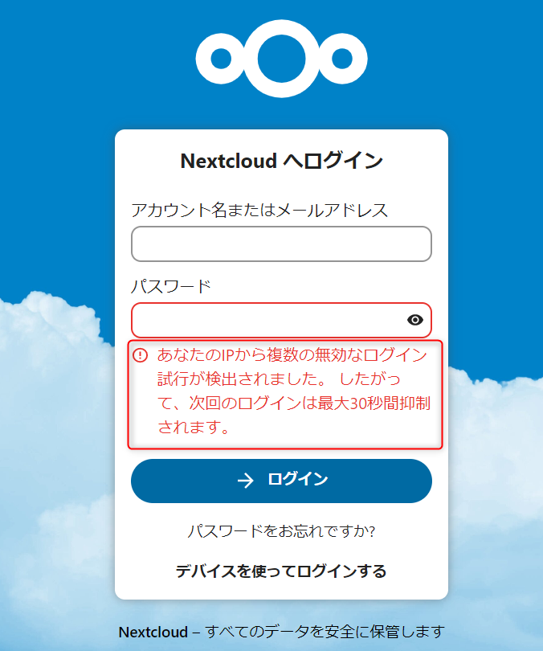

こんにちは。

今回は、Nextcloud でログイン失敗が連続して行われると動作が遅くなる現象について紹介します。

Nextcloud は一定の回数ログインに失敗すると以下のように `あなたのIPから複数の無効なログインが検出されました。 したがって、次回のログインは最大30秒間抑制されます。` という表示がでます。



この状況は時間経過で解決するのですが、現象発生後に共有リンクの表示が遅いという現象が発生しました。

解消した経緯を紹介します。

## 
ログインの失敗

oc_bruteforce_attempts;　というテーブルです。

```bash title=oc_bruteforce_attempts
+------+----------------+------------+-----------------+--------------------+---------------------------+
| id   | action         | occurred   | ip              | subnet             | metadata                  |
+------+----------------+------------+-----------------+--------------------+---------------------------+
| 1421 | login          | 1679024709 | a.a.a.a    | a.a.a.a/32    | {"user":"guest"} |
| 1422 | login          | 1679031941 | a.a.a.a    | a.a.a.a/32    | {"user":"guest"} |
| 1423 | login          | 1679031971 | a.a.a.a    | a.a.a.a/32    | {"user":"guest"} |
| 1424 | login          | 1679031984 | a.a.a.a    | a.a.a.a/32    | {"user":"guest"} |
| 1425 | login          | 1679032013 | a.a.a.a    | a.a.a.a/32    | {"user":"guest"} |
| 1426 | login          | 1679032035 | a.a.a.a    | a.a.a.a/32    | {"user":"guest"} |
| 1434 | login          | 1679035923 | b.b.b.b    | b.b.b.b/32    | {"user":"meeting"}   |
| 1435 | login          | 1679036163 | b.b.b.b    | b.b.b.b/32    | {"user":"meeting"}   |
| 1436 | login          | 1679036362 | b.b.b.b    | b.b.b.b/32    | {"user":"meeting"}   |
| 1437 | publicLinkAuth | 1679049568 | c.c.c.c     | c.c.c.c/32     | []                        |
| 1438 | publicLinkAuth | 1679049584 | c.c.c.c     | c.c.c.c/32     | []                        |
| 1439 | publicLinkAuth | 1679049591 | c.c.c.c     | c.c.c.c/32     | []                        |
| 1440 | publicLinkAuth | 1679049607 | c.c.c.c     | c.c.c.c/32     | []                        |
| 1441 | publicLinkAuth | 1679185958 | d.d.d.d | d.d.d.d/32 | []                        |
| 1442 | publicLinkAuth | 1679185978 | d.d.d.d | d.d.d.d/32 | []                        |
| 1443 | publicLinkAuth | 1679186005 | d.d.d.d | d.d.d.d/32 | []                        |
| 1444 | login          | 1679186041 | d.d.d.d | d.d.d.d/32 | {"user":"meeting"}   |
| 1445 | login          | 1679186201 | d.d.d.d | d.d.d.d/32 | {"user":"user.name"}    |
| 1446 | login          | 1679186206 | d.d.d.d | d.d.d.d/32 | {"user":"user.name"}    |
| 1447 | publicLinkAuth | 1679186437 | d.d.d.d | d.d.d.d/32 | []                        |
| 1448 | publicLinkAuth | 1679186460 | d.d.d.d | d.d.d.d/32 | []                        |
| 1449 | login          | 1679187035 | e.e.e.e    | e.e.e.e/32    | {"user":"meeting"}   |
| 1450 | publicLinkAuth | 1679187141 | e.e.e.e    | e.e.e.e/32    | []                        |
| 1451 | publicLinkAuth | 1679187237 | e.e.e.e    | e.e.e.e/32    | []                        |
| 1452 | publicLinkAuth | 1679187261 | e.e.e.e    | e.e.e.e/32    | []                        |
| 1453 | login          | 1679187316 | e.e.e.e    | e.e.e.e/32    | {"user":"user.name"}    |
| 1454 | publicLinkAuth | 1679187975 | e.e.e.e    | e.e.e.e/32    | []                        |
| 1455 | publicLinkAuth | 1679188053 | e.e.e.e    | e.e.e.e/32    | []                        |
| 1456 | publicLinkAuth | 1679188107 | e.e.e.e    | e.e.e.e/32    | []                        |
| 1457 | publicLinkAuth | 1679188168 | e.e.e.e    | e.e.e.e/32    | []                        |
| 1458 | publicLinkAuth | 1679189276 | e.e.e.e    | e.e.e.e/32    | []                        |
| 1459 | publicLinkAuth | 1679189305 | e.e.e.e    | e.e.e.e/32    | []                        |
| 1460 | publicLinkAuth | 1679189397 | e.e.e.e    | e.e.e.e/32    | []                        |
| 1461 | publicLinkAuth | 1679189420 | e.e.e.e    | e.e.e.e/32    | []                        |
+------+----------------+------------+-----------------+--------------------+---------------------------+
34 rows in set (0.000 sec)
```

失敗とカウントされるのは、ログインだけではなくパスワード付き共有リンクの失敗も含まれることが分かります。

記録されるのは、接続元のIPアドレスとなりますので、今回は 接続もとが `e.e.e.e` で発生しました。

