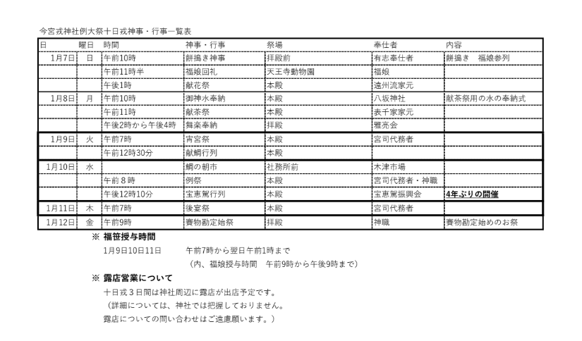

新年あけましておめでとうございます。
本年もよろしくお願いいたします。

毎年恒例、今宮戎参拝に行ってきました。
**2024 年は福笹の授与が行われている、1/11 (木) の午前中に参拝** してきました。

## 2024年の日程

今年は特に制限なく **1月9日～11日** で福笹の授与が行われていたようです。

日程は以下のようになっていました。

[今宮戎神社ホームページ抜粋](https://www.imamiya-ebisu.jp/%e4%bb%a4%e5%92%8c6%e5%b9%b4%e7%a5%9e%e4%ba%8b%e8%a1%8c%e4%ba%8b%e4%b8%80%e8%a6%a7%e5%8f%8a%e3%81%b3%e9%9c%b2%e5%ba%97%e5%96%b6%e6%a5%ad%e7%ad%89%e3%81%ab%e3%81%a4%e3%81%84%e3%81%a6)

## 昨年の福笹

**昨年は 9 期目だったので 9 つの福飾り** でした。

## 参拝・福笹

今年はすっかりコロナも明けた雰囲気で、出店がたくさん並んでいました。

おみくじは「吉」でした。

## 今年の福笹

いよいよ節目の10年目、**10期目 の 10点 の福飾りを選びました** ！

## あとがき

出店はたくさん出ていたのですが、9時に参拝したので開店前で今年もベビーカステラは購入できず。
個人的に毎年更新している福小判は例年通り更新しました！

この時期、今宮戎を参拝すると「今年も始まったな」と思える瞬間です。

**2024 年もスタッフ一同頑張って参りますのでどうぞよろしくお願いいたします** 。

