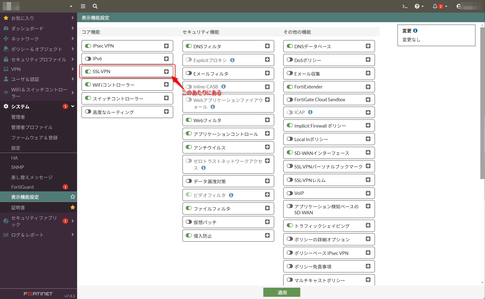
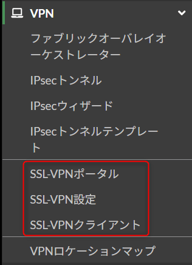
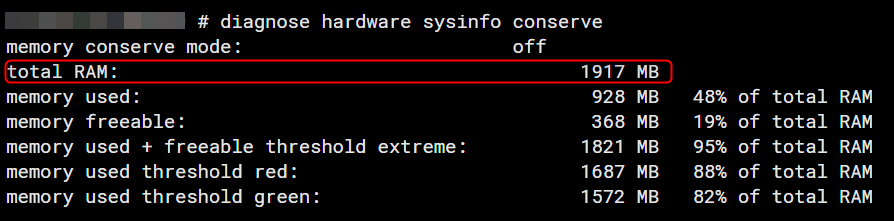

こんにちは。

FortiOS 7.4.1以降、SSL VPNのデフォルト動作とGUIの可視性に関する仕様変更が加えられました。

この変更により、SSL VPN設定が初期状態では非表示となり、設定方法や管理が変更されています。本記事ではその詳細と対処法について解説します。
※ 今回評価した環境は **バージョン 7.4.5 build2702** です。

## FortiOS 7.4.1 の主な変更点

1. **表示機能設定の非表示化**
   デフォルトでシステム-表示機能設定から非表示になります。   
   

1. **SSL VPN Webモードの非表示化**  
   デフォルトでSSL VPN Webモードの設定が無効化され、GUIおよびCLIから非表示になります。

2. **トンネルモードとメニューの非表示化**  
   トンネルモードの設定と`VPN > SSL-VPN`メニューもデフォルトでGUIから非表示となります。

3. **CLIでの設定分離**  
   VPN GUIの機能可視性設定がIPsecとSSL VPNで分離されました。
   - IPsec：`set gui-vpn` (デフォルトは有効)
   - SSL VPN：`set gui-sslvpn` (デフォルトは無効)

4. **警告メッセージの追加**  
   GUIのSSL VPN設定ページに、リモートアクセスの代替案を示す警告メッセージが追加されました。

5. **セキュリティレーティングの新しいチェック項目**  
   `Security Fabric > Security Rating`に新しいチェック「Disable SSL-VPN Settings」が追加され、SSL VPNが有効の場合にチェックが失敗します。

## 設定方法

### SSL VPNメニューの表示
GUIメニューを有効化するには、以下のCLIコマンドを使用します。

```cli
config system settings
set gui-sslvpn enable
end
```

これで、SSL-VPNのメニューが表示されます。


## デバイスのアップグレード後の挙動

FortiOS 7.4.1 より前のファームウェアでSSL VPN設定が有効化されていた場合、アップグレード後も設定とメニューは保持されます。一方、初期状態や設定が無効だった場合、GUIおよびCLIから非表示となります。

## 代替案：IPsec VPNとZTNA

Fortinetは、SSL VPNに代わるリモートアクセスソリューションとしてIPsec VPNやZTNAの利用を推奨しています。

## 詳細情報

さらに詳しい情報については、Fortinet公式ドキュメントをご覧ください。

[Fortinet公式ドキュメント: Update SSL VPN default behavior and visibility in the GUI 7.4.1](https://docs.fortinet.com/document/fortigate/7.4.0/new-features/233856/update-ssl-vpn-default-behavior-and-visibility-in-the-gui-7-4-1)

## FortiOS 7.6.0 における注意点について

なお、執筆時点で最新バージョンである 7.6.0 では、メモリー2G搭載モデルを対象として、SSL-VPN機能が無効化されたようです。
メモリーの確認は、`diagnose hardware sysinfo conserve` というコマンドで可能です。

SSL-VPNを利用している場合は、アップデートを避けるよう案内されていますので、注意してください。



参考ページ: [【FortiGate】FortiOS7.6.0における一部小型モデルの仕様変更について｜大塚商会](https://mypage.otsuka-shokai.co.jp/news/detail?linkBeforeScreenId=OMP20F0102S01P&oshiraseNo=MDAwMDAwNDc3Mg==&navi=1)

[SSL VPN removed from 2GB RAM models for tunnel and web mode | FortiGate / FortiOS 7.6.0 | Fortinet Document Library](https://docs.fortinet.com/document/fortigate/7.6.0/fortios-release-notes/877104/ssl-vpn-removed-from-2gb-ram-models-for-tunnel-and-web-mode)


## 2025年6月追記

~~以下のサイトに、モデル別のSSL-VPN利用可否が分かりやすく記載されています。~~
~~参考: [FortiGate 2GB RAMモデルにおける機能の制限について | NVC FAQ](https://support.nvc.co.jp/faq/show/677?site_domain=default)~~

~~FortiOS 7.6系にアップデートしても、SSL-VPNが利用可能な機種は以下のとおりです。~~

~~- FG-70F / 71F~~
~~- FG-80F / 81F~~
~~- FG-100 以上のモデル~~

以前の更新で上記のように記載しておりましたが、2025年4月末の情報で **FortiGateすべてのモデルを対象とて、SSL-VPN トンネルモードの無効化が発表されました**。

参考: [FortiOS 7.6.3以降でのSSL-VPNトンネルモード無効化のお知らせ（FortiGate全モデル対象）](https://www.fgshop.jp/info/ssl-vpn-tunnelmode-cancel/)

各バージョンのサポート終了日は以下のとおりです。  
参考: [Fortinet社製品ファームウェアサポート終了情報](https://www.networld.co.jp/product_file/file/fortinet_download_sup_20250114.pdf)

- FortiOS 7.0：2025年10月20日  
- FortiOS 7.2：2026年10月14日  
- FortiOS 7.4：2027年12月1日  

つまり、 FortiOS 7.4 までアップデートしておけば、**2027年12月1日までは SSL-VPN トンネルモード が利用できます**。

SSL-VPNの **WEBモードを利用している場合は、既存の設定はFortiOS 7.6.3以降へアップグレード後も保持され、「Agentless VPN」という名称に変更** となるようです。

それでは、次回の記事でお会いしましょう。
