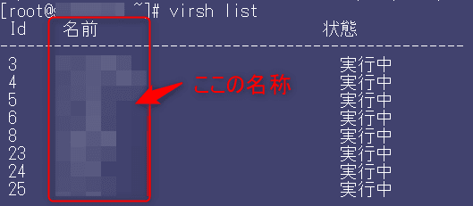

今回の記事は、`KVM（Kernel-based Vikortual Machine）` で動作する仮想マシンに対し、スナップショットの作成・復元・削除・リスト表示するためのbashスクリプトの紹介です。

このスクリプトを利用すれば、作業を簡素化し、VMのスナップショットを効率的に管理できます。

記事の作成で利用したKVMのバージョンは、`4.5.0` です。

### スクリプトの概要: `kvm-snap.sh`

`kvm-snap.sh`スクリプトは、以下の機能を提供します。

- **スナップショットの作成:** VMの現在の状態を保存します。
- **スナップショットの復元:** 保存された状態にVMを戻します。
- **スナップショットの削除:** 特定のスナップショットを削除します。
- **スナップショットのリスト表示:** VMに関連するすべてのスナップショットを表示します。

#### スクリプトの使用法

スクリプトを使用するには、以下の構文を使用します。

```bash:title=kvm.snap.sh&nbsp;usage
kvm-snap.sh {snap|restore|delete|list} <vm_name> [snapshot_name]
```

- `snap`: 新しいスナップショットを作成します。`vm_name`と`snapshot_name`が必要です。
- `restore`: 特定のスナップショット状態にVMを復元します。`vm_name`と`snapshot_name`が必要です。
- `delete`: 指定されたスナップショットを削除します。`vm_name`と`snapshot_name`が必要です。
- `list`: 指定されたVMのすべてのスナップショットを表示します。`vm_name`が必要です。

#### スクリプトのコード

以下が`kvm-snap.sh`スクリプトのコードです。

```bash:title=kvm.snap.sh&nbsp;code
#!/bin/bash

# 関数定義
function print_usage {
    echo "Usage: $0 {snap|restore|delete|list} <vm_name> [snapshot_name]"
    exit 1
}

# 引数のチェック
if [ $# -lt 2 ]; then
    if [ "$1" != "list" ]; then
        print_usage
    fi
fi

ACTION=$1
VM_NAME=$2
SNAPSHOT_NAME=$3

# アクションごとの処理
case $ACTION in
    snap)
        if [ -z "$SNAPSHOT_NAME" ]; then
            echo "Error: Snapshot name is required for snap action."
            print_usage
        fi
        DESCRIPTION=$(date +'%Y%m%d-%H%M%S')
        echo "Action: Create snapshot"
        echo "VM Name: $VM_NAME"
        echo "Snapshot Name: $SNAPSHOT_NAME"
        echo "Description: $DESCRIPTION"
        ;;
    restore)
        if [ -z "$SNAPSHOT_NAME" ]; then
            echo "Error: Snapshot name is required for restore action."
            print_usage
        fi
        echo "Action: Restore snapshot"
        echo "VM Name: $VM_NAME"
        echo "Snapshot Name: $SNAPSHOT_NAME"
        ;;
    delete)
        if [ -z "$SNAPSHOT_NAME" ]; then
            echo "Error: Snapshot name is required for delete action."
            print_usage
        fi
        echo "Action: Delete snapshot"
        echo "VM Name: $VM_NAME"
        echo "Snapshot Name: $SNAPSHOT_NAME"
        ;;
    list)
        echo "Action: List snapshots"
        echo "VM Name: $VM_NAME"
        ;;
    *)
        print_usage
        ;;
esac

# 実行確認
if [ "$ACTION" != "list" ]; then
    echo "Do you want to proceed? (Y/N)"
    read -r CONFIRM
    if [[ $CONFIRM != [Yy] ]]; then
        echo "Operation cancelled."
        exit 0
    fi
fi

# アクションの実行
case $ACTION in
    snap)
        sudo virsh snapshot-create-as --domain "$VM_NAME" "$SNAPSHOT_NAME" "$DESCRIPTION"
        ;;
    restore)
        sudo virsh snapshot-revert --domain "$VM_NAME" --snapshotname "$SNAPSHOT_NAME"
        ;;
    delete)
        sudo virsh snapshot-delete --domain "$VM_NAME" --snapshotname "$SNAPSHOT_NAME"
        ;;
    list)
        sudo virsh snapshot-list "$VM_NAME"
        ;;
esac

echo "Operation completed."
```

### 詳細なスクリプト機能

`<vm_name>` が分からない時は、標準コマンドの `virsh list` で取得し確認します。




#### 1. スナップショットの作成 (`snap`)

スナップショットを作成するには、以下のコマンドを使用します。

```bash:title=kvm.snap&nbsp;snap&nbsp;usage
kvm-snap.sh snap <vm_name> <snapshot_name>
```

この操作には、VM名とスナップショット名が必要です。現在の日付と時刻を使用して説明を自動生成します。

#### 2. スナップショットの復元 (`restore`)

スナップショットを復元するには、次のコマンドを実行します。

```bash:title=kvm.snap&nbsp;restore&nbsp;usage
kvm-snap.sh restore <vm_name> <snapshot_name>
```

このコマンドは、指定されたスナップショット状態にVMを戻します。

#### 3. スナップショットの削除 (`delete`)

スナップショットを削除するには、次のコマンドを実行します。

```bash:title=kvm.snap&nbsp;delete&nbsp;usage
kvm-snap.sh delete <vm_name> <snapshot_name>
```

これにより、指定されたスナップショットがVMから削除されます。

#### 4. スナップショットのリスト表示 (`list`)

すべてのスナップショットを表示するには、以下のコマンドを使用します。

```bash:title=kvm.snap&nbsp;list&nbsp;usage
kvm-snap.sh list <vm_name>
```

このコマンドは、指定されたVMに関連するすべてのスナップショットを表示します。

以下のような出力になります。


### アクションの確認

`snap`、`restore`、および`delete`のアクションについては、スクリプトが実行前に確認を求めます。

```bash:title=kvm.snap&nbsp;proceed
Do you want to proceed? (Y/N)
```

これにより、誤って操作することを防ぎます。

### まとめ

このスクリプトは、KVMスナップショット管理のためのスクリプトあり、一般的なスナップショット管理タスクのためのシンプルなインターフェースを提供します。

1人でも多くの方が、KVMの利用が効率化されることを願っています。

それでは次回の記事でお会いしましょう。
