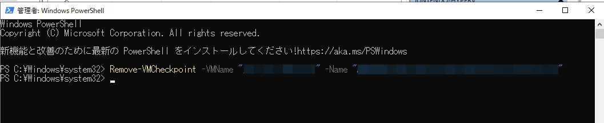

こんにちは。

今回は、`Hyper-V` のチェックポイントを `PowerShell` で削除する記事です。

発生したシーンとして、評価のため `Arcserve UDP` をサーバーにインストールし、
バックアップの取得を試行していたのですが、気付いたらチェックポイントが取得されていました。


`Arcserve UDP` は本運用には至らなかったのでアンインストールしました。

その後、Hyper-Vマネージャーからチェックポイントが作成されていることに気付き、
**削除しようと思いましたが、右クリックを押しても削除メニューが出てきません** でした。


調べたところ、以下のコマンドで削除できました。

```powershell
Remove-VMCheckpoint -VMName "仮想マシンの名前" -Name "チェックポイントの名前"
```


では、やってみましょう。

準備するのは、"仮想マシンの名前" と "チェックポイントの名前" ですが、
Hyper-Vマネージャーからコピーするのが視覚的で分かり易いでしょう。


パラメーターの準備ができたので、コマンドを組み立てます。
その後、PowerShellを管理者で起動し、実行します。

例として、`仮想マシンの名前=vm1`, `チェックポイントの名前をコピー=chekpoint1` とします。

```powershell
Remove-VMCheckpoint -VMName "vm1" -Name "chekpoint1"
```

実行結果は以下のようになります。


Hyper-Vマネージャー上は、統合が始まったあとにチェックポイントが無事消えました。


なぜ、Hyper-Vマネージャーで削除が出ないのかは追及できていませんが、
削除前に `Arcserve UDP` をアンインストールしてしまったのが怪しいと思っています。

それでは次回の記事でお会いしましょう。
