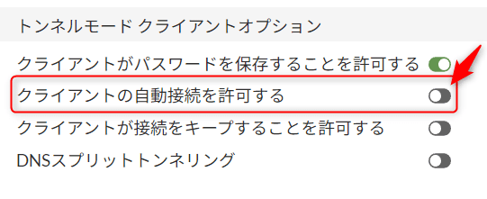

こんにちは。

今回は、FortiClient を利用して、SSL VPN接続する際のパスワードを保存する方法を紹介します。

標準では、以下のようにユーザー名は保存できますが、パスワードは毎回入力になります。


このパスワード入力を、毎回面倒だ！ と思っている方、多いのではないでしょうか？

そんな方に朗報です。
以下の手順でパスワードを保存できます。

1. FortiGate の設定変更
1. 接続元端末のレジストリ値変更
1. これまでと同じように接続する

上記の流れで、パスワードが保存され、次回以降の入力を省くことができます。

それでは、具体的な設定を紹介します。

## 設定方法

### 前提
- 設定名称を MSEN とします
- FortiOS は、`v7.2.7 build1577` とします
- 接続元ユーザーに設定されている SSL-VPN ポータルは tunnel-access とします
- FortiClient のバージョンは `7.0.1.0083` とします

### FortiGate の設定変更
1. FortiGateに管理者でログインします
1. VPN → SSL-VPNポータル → tunnel-access に進みます
1. トンネルモードオプションの **クライアントがパスワードを保存することを許可する** を ON にします
    - この変更で **接続済みのVPNセッションは切断されません**

### 接続元端末のレジストリ値変更 

1. レジストリエディタを開き、 `HKEY_CURRENT_USER\Software\Fortinet\FortiClient\Sslvpn\Tunnels` へ進みます。デフォルトは画像のようになっています。
    
1. 管理者でコマンドプロンプトを開き、以下のコマンドを実行します。MSEN の部分は設定名称です。
    ```
    reg add HKEY_CURRENT_USER\SOFTWARE\Fortinet\FortiClient\Sslvpn\Tunnels\MSEN /v show_remember_password /t REG_DWORD /d 1 /f
    ```
1. `show_remember_password` が、1 になったことが確認できます。
1. 接続設定を確認すると、**パスワードを保存** というチェックボックスが出ていることが確認できます。
    

以下の赤枠のレジストリ値は増えていることが確認できます。


### これまでと同じように接続する 
1. **パスワードを保存にチェックを入れた状態** でこれまでどおり接続します。
1. 切断しても、パスワードが保存された状態になります。
    

## 参考情報
### 自動接続
SSL-VPNポータルの設定を変更する際、気になった方もいるかもしれませんが、**クライアントの自動接続を許可する** という項目が合ったと思います。


この設定をONにし、管理者でコマンドプロンプトを開き、以下のコマンドを実行します。MSEN の部分は設定名称です。

```
reg add HKEY_CURRENT_USER\SOFTWARE\Fortinet\FortiClient\Sslvpn\Tunnels\MSEN /v show_autoconnect /t REG_DWORD /d 1 /f
```

`show_autoconnect` が、1 になったことが確認できます。


これで、**自動接続のチェックボックスが出現** しました。


しかし、チェックを入れると、以下のように表示され、**FortiClientの無料バージョンでは使用できない** ことが分かります。


### 保存したパスワードを削除
保存したパスワードを削除するためには、`SavePass` のレジストリ値を **1→0** に変更します。
")
")

設定を読み直すと、保存したパスワードが削除されています。


以上で、FortiClient を利用して、SSL VPN接続する際のパスワードを保存できます。

本設定は、**セキュリティに関わるものとなりますので、設定を採用する場合にはご自身の責任で実施いただきますよう** お願いいたします。

それでは次回の記事でお会いしましょう。
