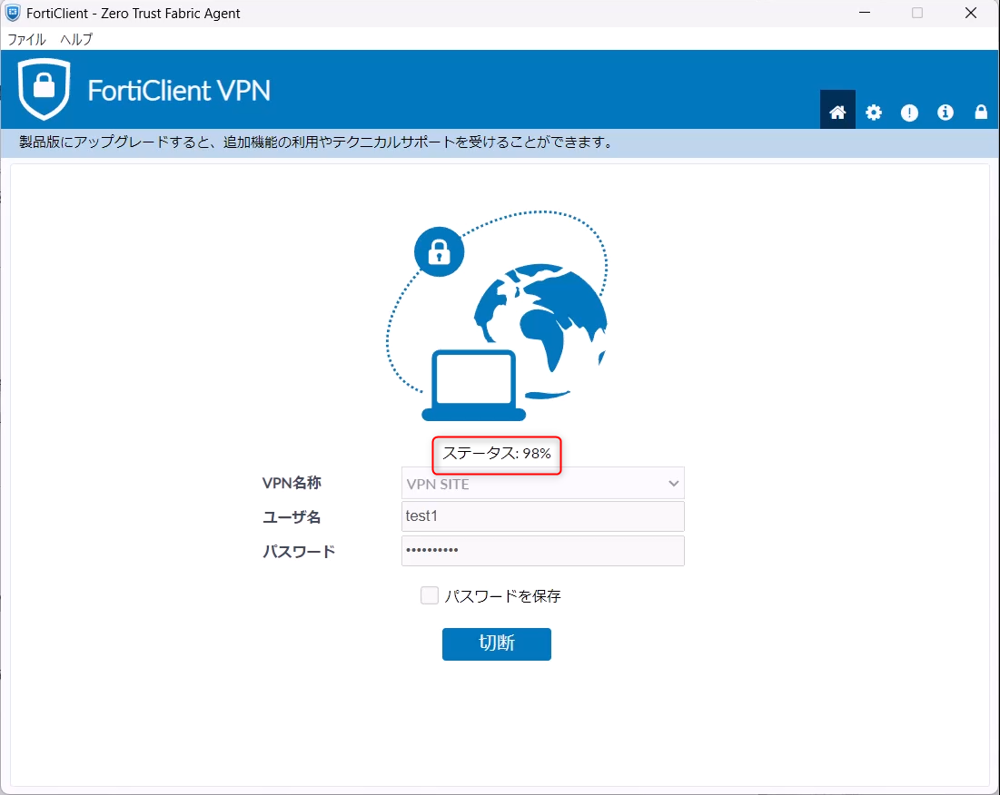
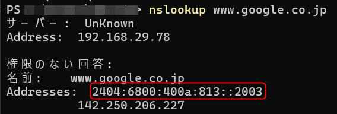
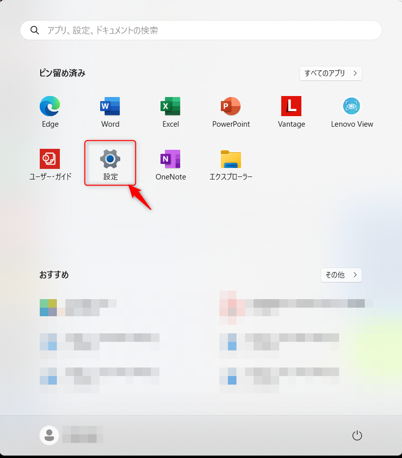
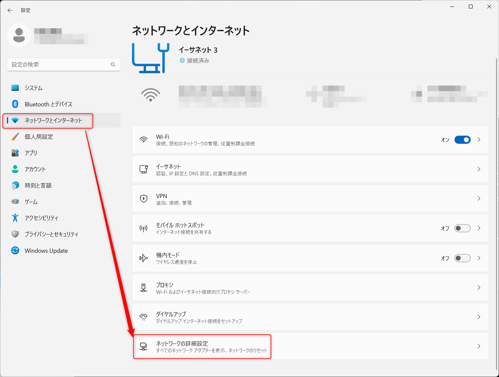
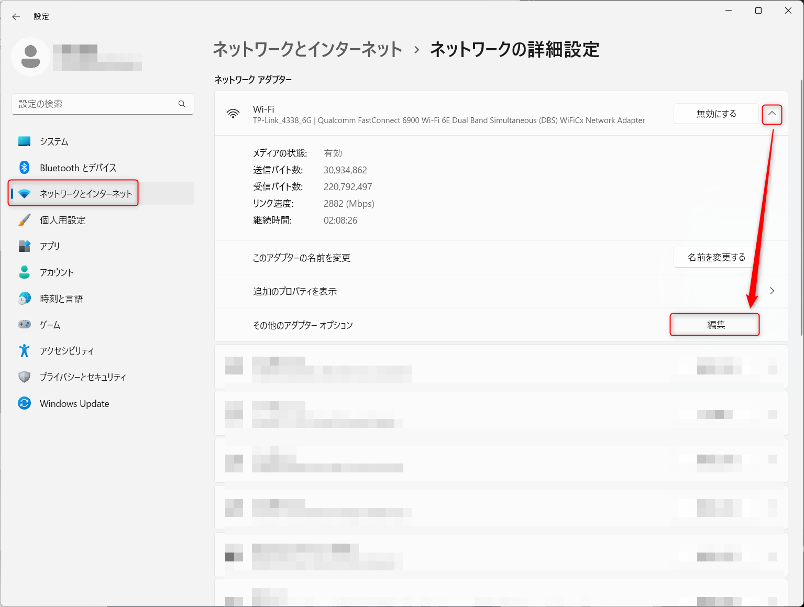
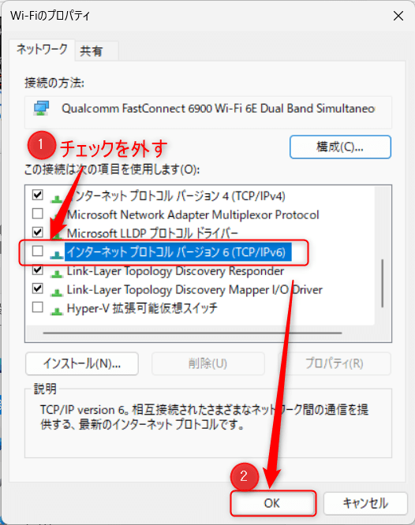
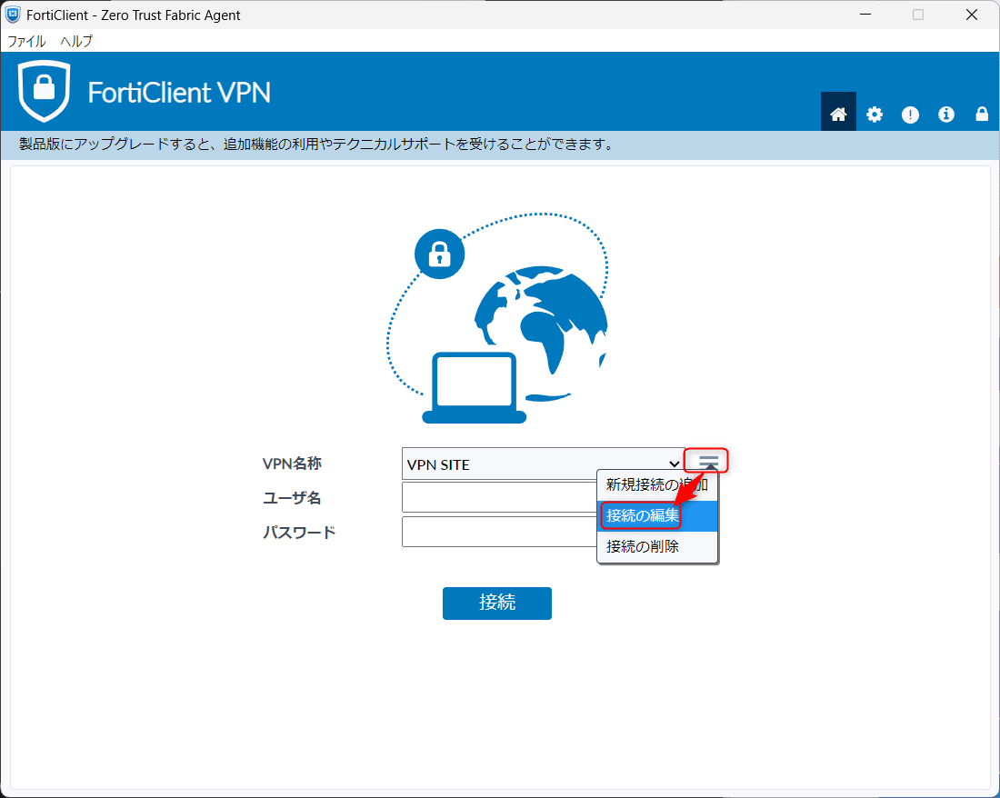
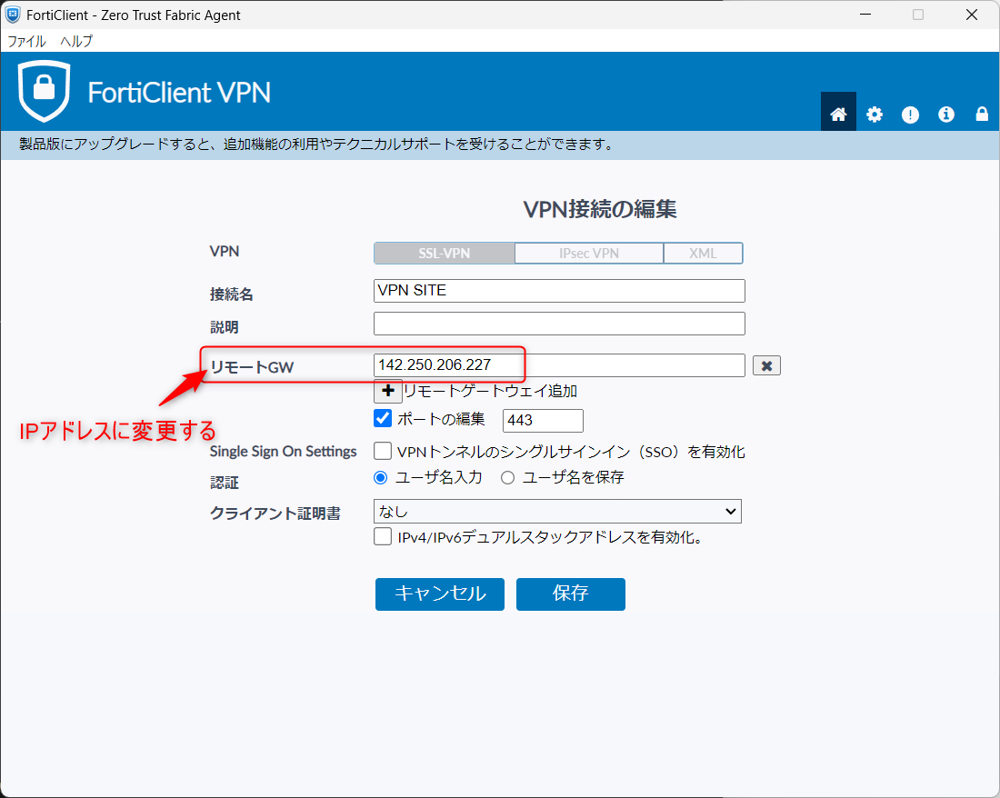
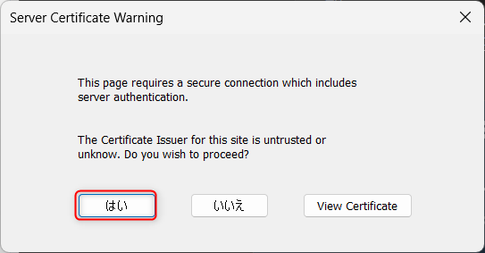

## VPN接続時に98％で停止し接続できない場合の対応手順
この記事は、VPN接続時にステータスが98％まで進んだ後、エラーは表示されないものの接続が完了しない現象の対応方法について記載しています。



### 原因
ドコモや一部のプロバイダー（特にモバイルネットワーク）は、IPv4アドレスの枯渇に対応するため、デュアルスタック方式を採用しています。

- デュアルスタック方式では、端末にIPv4とIPv6の両方が割り当てられます。
- 名前解決時にDNSからIPv4（Aレコード）とIPv6（AAAAレコード）の両方が返されます。

その結果、**FortiClientはIPv6アドレスを優先して接続を試みます**。

しかし、接続先（FortiGateのSSL VPN）がIPv6をサポートしていない場合、接続が失敗します。この際、**FortiClientはIPv4にフォールバック（切り替え）して再接続することがありません**。

この動作により、ステータスが98％で停止し、接続が完了しません。

### 現象の確認
以下の手順で、VPN接続先がIPv6を解決しているか確認します。

1. **コマンドプロンプト**を開きます。

2. 例として、以下のコマンドを実行します：
   ```cmd
   nslookup www.google.co.jp
   ```

    

3. 結果に**IPv6アドレス**が表示されている場合、VPN接続に失敗します。

### 対応策 1: ネットワークインターフェースでIPv6を無効化

ネットワークインターフェースでIPv6を無効化すると、IPv4のみが使用されるようになり、VPN接続が成功します。

#### 手順
1. **設定**を開きます。

   

2. **ネットワークとインターネット**から**ネットワークの詳細設定**を開きます。

   

3. **Wi-Fi(アダプター名)から、その他のアダプターオプション** を開きます。

   

4. 該当のネットワークアダプターの**IPv6**のチェックを外して無効化します。

   

### 対応策 2: 接続設定をDNS名からIPアドレスに変更

接続設定でDNS名ではなくIPv4アドレスを直接指定することで、IPv6アドレスを回避し、接続を成功させます。

#### 注意点
この方法では、証明書エラーが発生します。証明書の警告が表示された際は「はい」を選択して接続を続行してください。

#### 手順
1. **FortiClient**を開き、接続設定を編集します。

   

2. **リモートGW** を、例として以下のように変更します：
   - 変更前：`www.google.co.jp`
   - 変更後：`142.250.206.227`（IPv4アドレス）

   

3. **証明書警告**が表示された場合、「はい」を選択します。

   

### まとめ

- **原因**: デュアルスタック方式により、IPv6アドレスが優先され接続に失敗。
- **解決方法**: 
  1. IPv6を無効化する。
  2. リモートゲートウェイをIPv4アドレスに変更する。

上記のいずれかの方法で、VPN接続が正常に動作することを確認してください。
