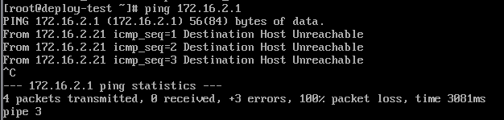
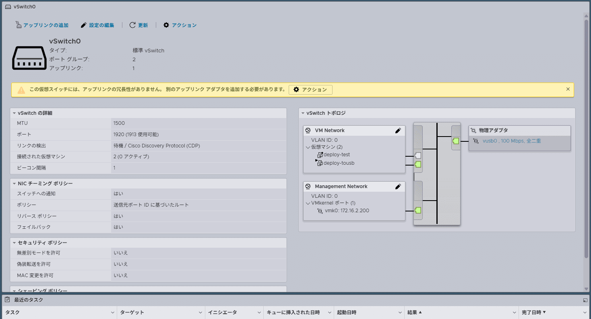
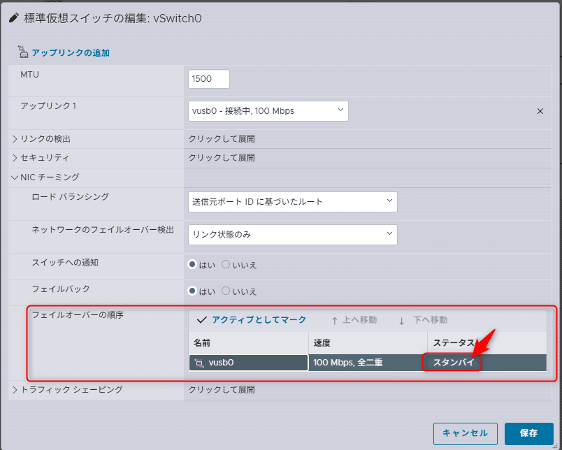
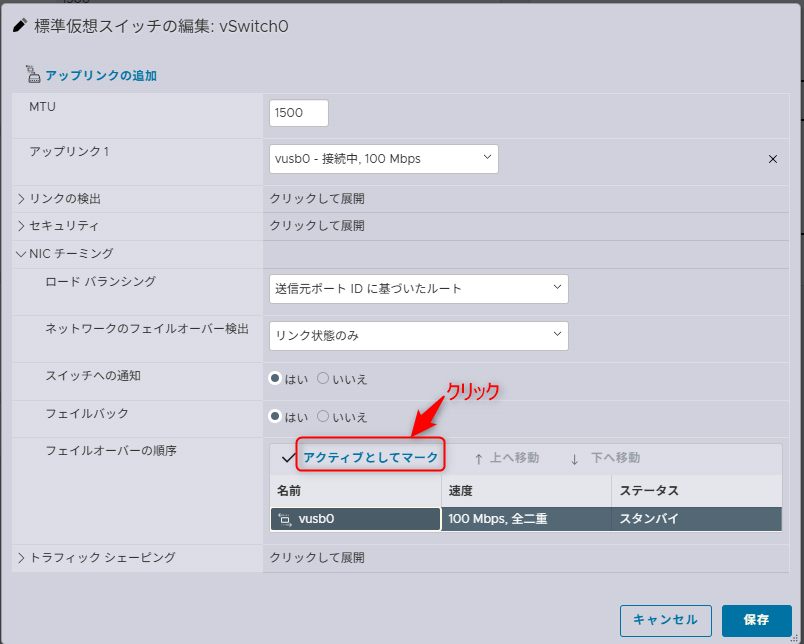
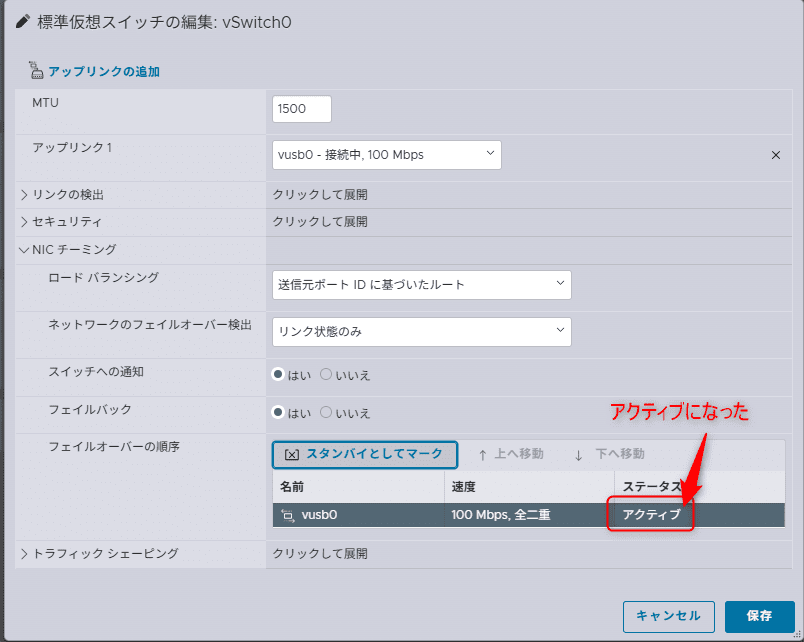

## はじめに

VMware ESXiをノートPCや小型PCなどで検証環境として構築する際、USB NICを利用してネットワークを構成するケースが増えています。

今回は、USB NICを2本使用した環境で「仮想マシンがネットワークに接続できない」という問題に遭遇しました。この記事では、発生した現象・仮説・実施した対処法を紹介します。ただし、**特定バージョンやUSB NICとの因果関係までは確定できていない**ため、その点も含めて参考情報としてご覧ください。

---

## 検証環境

* **ホスト**: Lenovo X1 ノートPC
* **ESXiバージョン**: 8.0.1 Build 21495797
* **NIC構成**: USB NIC × 2本（vusb0, vusb1）
* **USB NIC**: レノボ・ジャパン 4X90S91830 ThinkPad USB3.0 - イーサネットアダプター
* **仮想マシン**: deploy-tousb

## 問題の内容

* ESXiホストの管理画面（Host Client）には正常にアクセス可能
* 管理ネットワーク（VMkernelポート）は通信可能
* しかし、**仮想マシンから外部ネットワーク(ゲートウェイ)への通信ができなかった**
  * pingで「Destination Host Unreachable」または応答なし
    

## 仮説と状況

調査の結果、ESXiの仮想スイッチ（vSwitch0）には仮想マシン用の「VM Network」が正しく存在し、仮想マシンもそれに接続されていました。

しかし、`VM Network` に割り当てられた物理NIC（vusb0など）が、**スタンバイ状態（フェールオーバー構成の待機側）になっていた可能性が高い**と考えられました。

> この構成により、仮想マシンの通信が物理NICに流れず、外部ネットワークと接続できなかったと推測されます。

なお、USB NICの初期化タイミングや安定性、ESXiの自動構成挙動などが影響している可能性もありますが、**明確な原因の特定には至っていません**。

## 対処法（再現性あり）

以下の手順で解消しました：

1. ESXi Web UI（Host Client）にログイン
2. 「ネットワーク」 ＞ vSwitch0 ＞ `VM Network` を選択
3. 「NIC チーミングとフェールオーバー」設定を確認
4. `vusb0` を **スタンバイからアクティブに変更**
  
  
5. 設定を保存
6. 仮想マシンを再起動

変更後、仮想マシンからのpingが成功し、外部ネットワークと通信可能になりました。

## 考察：なぜこの問題が起きたのか？

以下は考えられる要因ですが、確定ではありません：

* USB NICの初期化タイミングが遅延して、ESXiがスタンバイ扱いに設定した可能性
* vSwitch自動構成時のNIC割り当てが意図しない形で適用された
* USB NICが非公式サポートのため、ドライバの影響を受けやすい

## まとめ

USB NICを使用したVMware ESXi構成では、**仮想マシン用ポートグループと物理NICの紐づけ状態に注意**が必要です。

特に今回のように、「管理ネットワークは問題ないが仮想マシンだけ通信できない」場合、**フェールオーバー設定の見直し**が有効です。

本記事の内容は一例であり、再現性はありますが、すべての環境に当てはまるとは限りません。環境依存の可能性もあるため、**設定確認の一助としてご活用ください。**

それでは次回の記事でお会いしましょう。