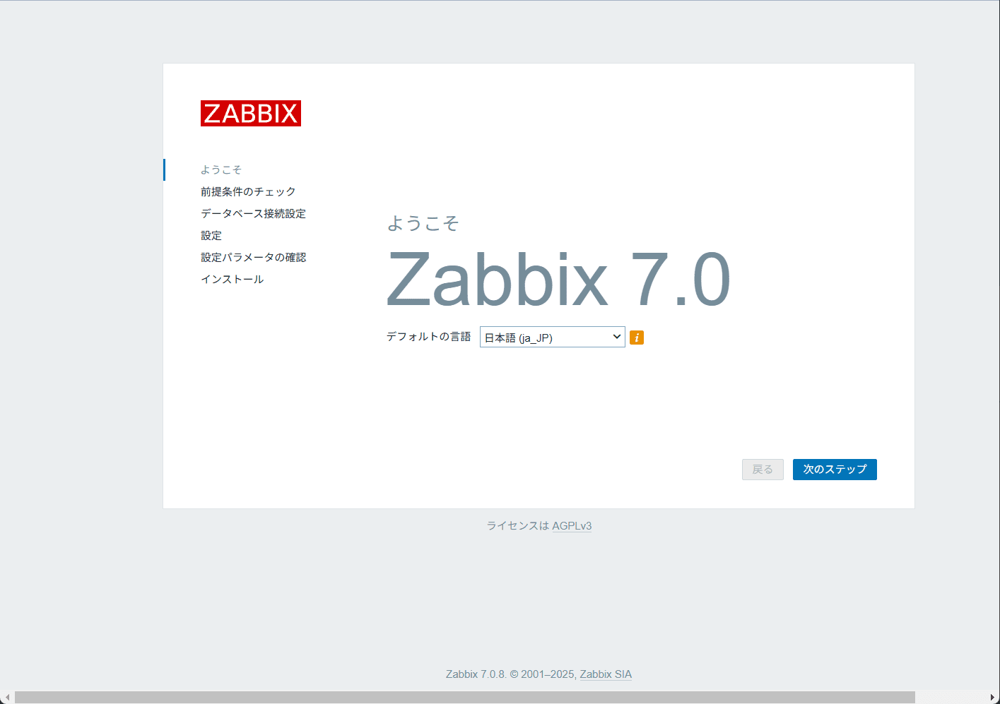
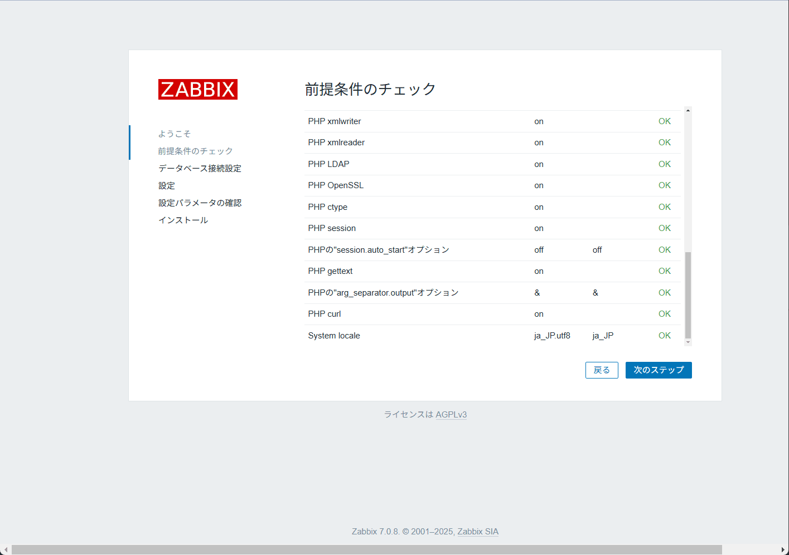
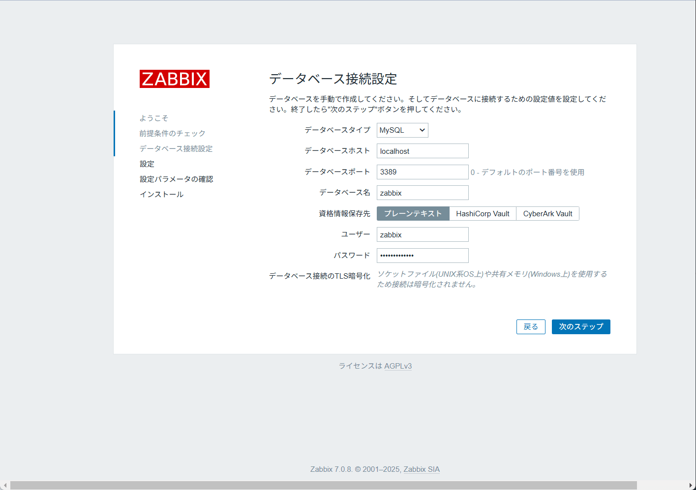
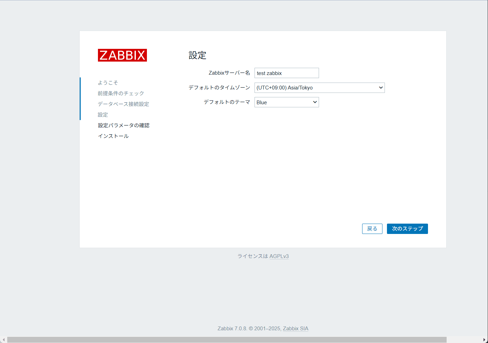
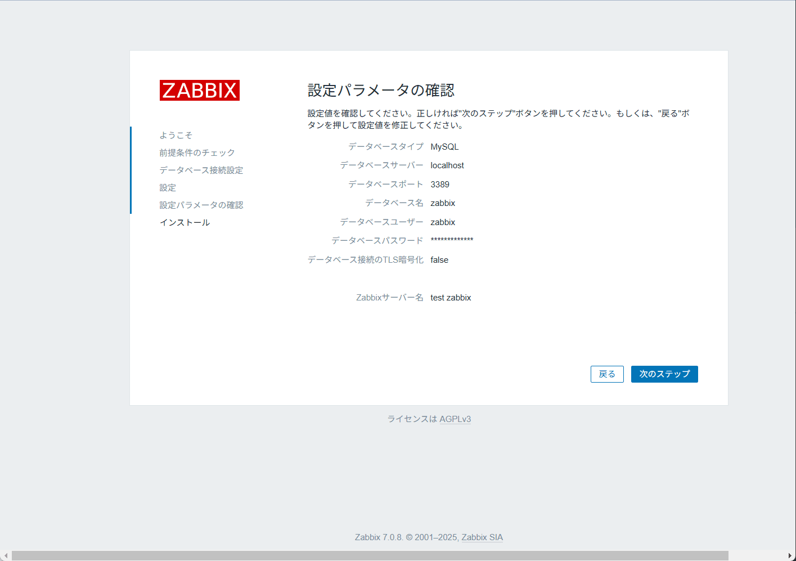
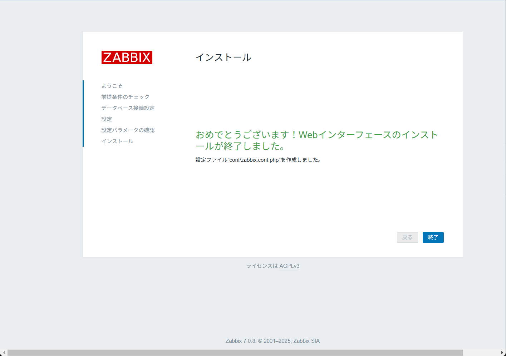
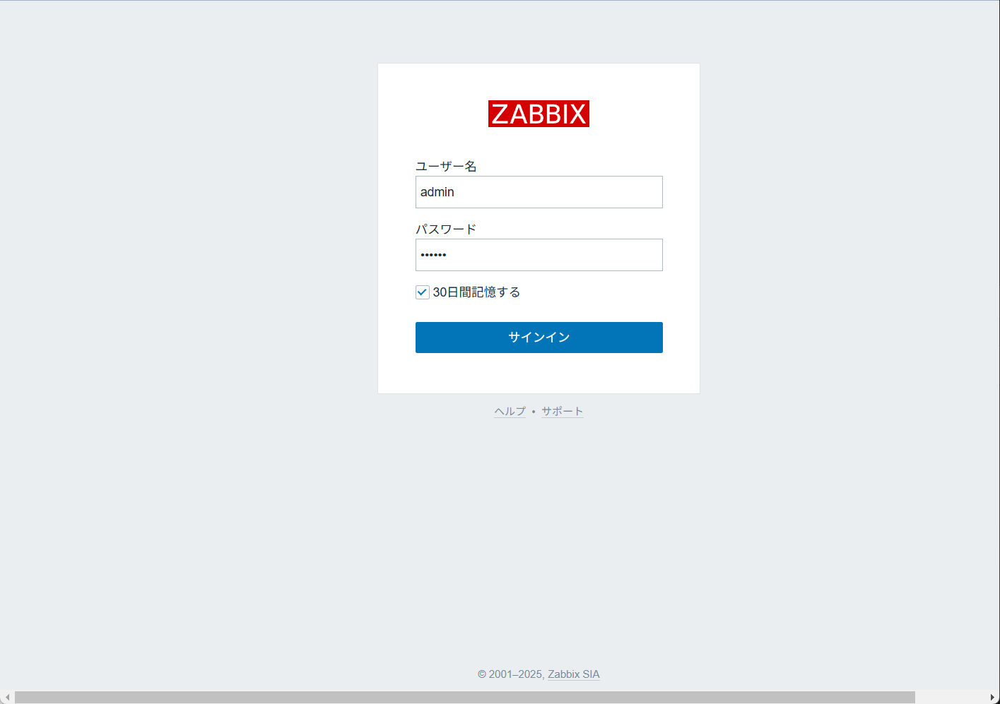

こんにちは。

Raspberry PiにZabbixをソースからのビルドからインストール流れについて解説します。

利用した Raspberry Pi OS ( 64bit )は以下のとおりです。

```
# cat /etc/os-release
PRETTY_NAME="Debian GNU/Linux 12 (bookworm)"
NAME="Debian GNU/Linux"
VERSION_ID="12"
VERSION="12 (bookworm)"
VERSION_CODENAME=bookworm
ID=debian
HOME_URL="https://www.debian.org/"
SUPPORT_URL="https://www.debian.org/support"
BUG_REPORT_URL="https://bugs.debian.org/"
```

なお、公式の手順からインストールするには以下を参考にしてください。
[Download and install Zabbix 7.0 LTS for Raspberry Pi OS 12 (Bookworm), MySQL, Nginx](https://www.zabbix.com/download?zabbix=7.0&os_distribution=raspberry_pi_os&os_version=12&components=server_frontend_agent&db=mysql&ws=nginx)

## 必要なソフトウェアのインストール
Zabbixを動作させるためには、Apache、PHP、MariaDBといった周辺ソフトウェアの準備が必要です。
それぞれを順にインストールし、設定を進めていきます。

### Apache のインストールと起動
```
apt install apache2
systemctl enable apache2
systemctl start apache2
```

### PHP のインストール
```
apt install php php-gd php-bcmath php-xml php-mbstring php-ldap php-mysql php-curl php-fpm
```

### mariadb のインストールと初期化
```
apt install mariadb-server
mysql_secure_installation

```

`mysql_secure_installation` は以下の流れで進めます。

```
# mysql_secure_installation

NOTE: RUNNING ALL PARTS OF THIS SCRIPT IS RECOMMENDED FOR ALL MariaDB
      SERVERS IN PRODUCTION USE!  PLEASE READ EACH STEP CAREFULLY!

In order to log into MariaDB to secure it, we'll need the current
password for the root user. If you've just installed MariaDB, and
haven't set the root password yet, you should just press enter here.

Enter current password for root (enter for none):
OK, successfully used password, moving on...

Setting the root password or using the unix_socket ensures that nobody
can log into the MariaDB root user without the proper authorisation.

You already have your root account protected, so you can safely answer 'n'.

Switch to unix_socket authentication [Y/n] Y
Enabled successfully!
Reloading privilege tables..
 ... Success!


You already have your root account protected, so you can safely answer 'n'.

Change the root password? [Y/n] Y
New password:
Re-enter new password:
Password updated successfully!
Reloading privilege tables..
 ... Success!


By default, a MariaDB installation has an anonymous user, allowing anyone
to log into MariaDB without having to have a user account created for
them.  This is intended only for testing, and to make the installation
go a bit smoother.  You should remove them before moving into a
production environment.

Remove anonymous users? [Y/n] Y
 ... Success!

Normally, root should only be allowed to connect from 'localhost'.  This
ensures that someone cannot guess at the root password from the network.

Disallow root login remotely? [Y/n] Y
 ... Success!

By default, MariaDB comes with a database named 'test' that anyone can
access.  This is also intended only for testing, and should be removed
before moving into a production environment.

Remove test database and access to it? [Y/n] Y
 - Dropping test database...
 ... Success!
 - Removing privileges on test database...
 ... Success!

Reloading the privilege tables will ensure that all changes made so far
will take effect immediately.

Reload privilege tables now? [Y/n] Y
 ... Success!

Cleaning up...

All done!  If you've completed all of the above steps, your MariaDB
installation should now be secure.

Thanks for using MariaDB!
```

設定したパスワードでログインできることを確認します。
```
# mysql -u root -p
Enter password:
Welcome to the MariaDB monitor.  Commands end with ; or \g.
Your MariaDB connection id is 41
Server version: 10.11.6-MariaDB-0+deb12u1 Debian 12

Copyright (c) 2000, 2018, Oracle, MariaDB Corporation Ab and others.

Type 'help;' or '\h' for help. Type '\c' to clear the current input statement.

MariaDB [(none)]>
```

## Zabbix の構築
Zabbix公式リポジトリがRaspberry Piのアーキテクチャをサポートしていないため、Zabbixのソースコードを取得してビルドを行う必要があります。このセクションでは、ソースのダウンロードからビルド、必要な設定までを解説します。
※今回、Zabbix Agent の設定説明は割愛します。

### ソースのダウンロードと配置

Zabbix のソースをダウンロードします。
今回のバージョンは、7.0LTS です。

```
curl -O https://cdn.zabbix.com/zabbix/sources/stable/7.0/zabbix-7.0.8.tar.gz
tar xvfz zabbix-7.0.8.tar.gz
mv zabbix-7.0.8 /usr/local/src/
```

### ユーザーの作成

```
addgroup --system --quiet zabbix
adduser --quiet --system --disabled-login --ingroup zabbix --home /var/lib/zabbix --no-create-home zabbix
```

### 必要なモジュールのインストール

```
apt install libpcre3-dev libevent-dev libmariadb-dev libcurl4-openssl-dev libssh2-1-dev libsnmp-dev libopenipmi-dev libxml2 libxml2-dev libldap2-dev golang gettext
```

### ビルドとインストール
今回は `--enable-server` `--enable-agent` `--enable-proxy` のすべてをインストールしていますが必要に応じて調整ください。※他のモジュールも同様。

```
cd /usr/local/src/zabbix-7.0.8/
./configure \
  --enable-server \
  --enable-agent \
  --enable-proxy \
  --with-mysql \
  --enable-ipv6 \
  --with-net-snmp \
  --with-libcurl \
  --with-libxml2 \
  --with-openipmi \
  --with-ssh2 \
  --with-ldap \
  --with-openssl
make
make install
```

### ログフォルダの作成
以下のコマンドでログ用のフォルダを作成し、権限を変更します。
```
mkdir /var/log/zabbix
chown zabbix:zabbix /var/log/zabbix
```

### プロセスフォルダの作成
以下のプロセスが作成されるフォルダを作成します。
```
mkdir /var/run/zabbix
chown zabbix:zabbix /var/run/zabbix
```

### DB の作成
以下の各情報で作成します。

DB名: zabbix
DBユーザー名: zabbix
パスワード: password

```
mysql -u root -p
create database zabbix character set utf8mb4 collate utf8mb4_bin;
create user 'zabbix'@'localhost' identified by 'password';
grant all privileges on zabbix.* to 'zabbix'@'localhost';
ALTER USER 'zabbix'@'localhost' IDENTIFIED BY 'password';
SET GLOBAL log_bin_trust_function_creators = 1;
FLUSH PRIVILEGES;
quit
```
※ zabbix_agent のみ利用する場合は、データベースは不要です。

### DB のエラーログ出力設定
以下のDiffのとおり設定します。

```diff
root@szabproxy:~# diff -u /etc/mysql/mariadb.conf.d/50-server.cnf.org /etc/mysql/mariadb.conf.d/50-server.cnf
--- /etc/mysql/mariadb.conf.d/50-server.cnf.org 2025-01-28 21:50:13.962559926 +0900
+++ /etc/mysql/mariadb.conf.d/50-server.cnf     2025-01-28 21:50:39.290593366 +0900
@@ -59,7 +59,7 @@
 # and when running legacy init error logging goes to syslog due to
 # /etc/mysql/conf.d/mariadb.conf.d/50-mysqld_safe.cnf
 # Enable this if you want to have error logging into a separate file
-#log_error = /var/log/mysql/error.log
+log_error = /var/log/mysql/error.log
 # Enable the slow query log to see queries with especially long duration
 #log_slow_query_file    = /var/log/mysql/mariadb-slow.log
 #log_slow_query_time    = 10
 ```

ログフォルダを作成します。
```
mkdir /var/log/mysql
chown -R mysql:mysql /var/log/mysql
```

### DB スキーマーのインポート
```
cd /usr/local/src/zabbix-7.0.8/database/mysql
cat schema.sql  | mysql -u zabbix -p -D zabbix
cat images.sql  | mysql -u zabbix -p -D zabbix
cat data.sql  | mysql -u zabbix -p -D zabbix
```
※ zabbix_proxy のみ利用する場合は、`schema.sql` のみのインポートでOKです。

### log_bin_trust_function_creators の無効化
```
mysql -u root -p
SET GLOBAL log_bin_trust_function_creators = 0;
FLUSH PRIVILEGES;
quit;
```

### php.ini の調整
以下のDiffのとおり `/etc/php/8.2/apache2/php.ini` を設定します。

```diff
--- /etc/php/8.2/apache2/php.ini.org    2025-01-27 13:13:25.575836891 +0900
+++ /etc/php/8.2/apache2/php.ini        2025-01-27 13:15:07.139999729 +0900
@@ -406,7 +406,7 @@
 ; Maximum execution time of each script, in seconds
 ; https://php.net/max-execution-time
 ; Note: This directive is hardcoded to 0 for the CLI SAPI
-max_execution_time = 30
+max_execution_time = 300

 ; Maximum amount of time each script may spend parsing request data. It's a good
 ; idea to limit this time on productions servers in order to eliminate unexpectedly
@@ -416,7 +416,7 @@
 ; Development Value: 60 (60 seconds)
 ; Production Value: 60 (60 seconds)
 ; https://php.net/max-input-time
-max_input_time = 60
+max_input_time = 300

 ; Maximum input variable nesting level
 ; https://php.net/max-input-nesting-level
@@ -700,7 +700,7 @@
 ; Its value may be 0 to disable the limit. It is ignored if POST data reading
 ; is disabled through enable_post_data_reading.
 ; https://php.net/post-max-size
-post_max_size = 8M
+post_max_size = 16M

 ; Automatically add files before PHP document.
 ; https://php.net/auto-prepend-file
@@ -852,7 +852,7 @@

 ; Maximum allowed size for uploaded files.
 ; https://php.net/upload-max-filesize
-upload_max_filesize = 2M
+upload_max_filesize 16M

 ; Maximum number of files that can be uploaded via a single request
 max_file_uploads = 20
 ```

### Zabbix Server の設定ファイル作成
設定ファイルは、`/usr/local/etc` に展開されます。

今回の記事では構築ができるところまでを対象としているため、デフォルト設定でも動作します。ただし、前述のログフォルダおよびプロセスフォルダを作成したことに合わせて、以下の箇所を修正します。

```diff
- # PidFile=/tmp/zabbix_server.pid
+ PidFile=/var/run/zabbix/zabbix_server.pid
- # LogFile=/tmp/zabbix_server.log
+ LogFile=/var/log/zabbix/zabbix_server.log
```

### Zabbix の起動

以下のコマンドで起動します。
```
# zabbix_server
#
```

### ui 整備
Zabbix UIはブラウザを通じて管理・操作するための重要な部分です。
以下の手順でUIの準備します。

```
mkdir /var/www/html/zabbix
cd /usr/local/src/zabbix-7.0.8/ui
cp -a . /var/www/html/zabbix
chown -R www-data:www-data /var/www/html/zabbix
systemctl restart php8.2-fpm
systemctl restart apache2
```

これで、以下のURLに接続すると初期設定が始まります。
※IPアドレスは適宜読み替えてください。

http://192.168.111.250/zabbix

## Zabbix の初期設定
以下の流れで実施します。













以上でセットアップが完了です。

ユーザー名: Admin
パスワード: zabbix でログインが可能です。



## zabbix serverとzabbix agent のサービス化
### Zabbix Server

以下のコマンドで設定ファイルを作成します。

```
vi /etc/systemd/system/zabbix-server.service
```

ファイルの内容は以下のとおりです。
```
[Unit]
Description=Zabbix Server
After=syslog.target
After=network.target

[Service]
Environment="DAEMON_ARGS= -c /usr/local/etc/zabbix_server.conf"
EnvironmentFile=-/etc/default/%p
Type=simple
KillMode=control-group
PIDFile=/var/run/zabbix/zabbix_server.pid
ExecStart=/usr/local/sbin/zabbix_server $DAEMON_ARGS
ExecStop=/bin/sh -c '[ -n "$1" ] && kill -s TERM "$1"' -- "$MAINPID"
RestartSec=10s
User=zabbix
Group=zabbix
Restart=on-abnormal

[Install]
WantedBy=multi-user.target
```

自動起動を有効に、起動します。
```
systemctl enable zabbix-server.service
systemctl start zabbix-server
```

### Zabbix Agent

以下のコマンドで設定ファイルを作成します。

```
vi /etc/systemd/system/zabbix-agent.service
```

ファイルの内容は以下のとおりです。
```
[Unit]
Description=Zabbix Agent
Documentation=man:zabbix_agentd
After=network.target

[Service]
Type=simple
User=zabbix
Group=zabbix
PIDFile=/var/run/zabbix/zabbix_agentd.pid
ExecStart=/usr/local/sbin/zabbix_agentd -c /usr/local/etc/zabbix_agentd.conf
Restart=on-failure
RestartSec=5s

[Install]
WantedBy=multi-user.target
```

自動起動を有効に、起動します。
```
systemctl enable zabbix-agent
systemctl start zabbix-agent
```

### Zabbix Proxy

以下のコマンドで設定ファイルを作成します。

```
vi /etc/systemd/system/zabbix-proxy.service
```

ファイルの内容は以下のとおりです。
```
[Unit]
Description=Zabbix Proxy
Documentation=man:zabbix_proxyd
After=network.target

[Service]
Type=simple
User=zabbix
Group=zabbix
PIDFile=/var/run/zabbix/zabbix_proxy.pid
ExecStart=/usr/local/sbin/zabbix_proxy -c /usr/local/etc/zabbix_proxy.conf
Restart=on-failure
RestartSec=5s

[Install]
WantedBy=multi-user.target
```

自動起動を有効に、起動します。
```
systemctl enable zabbix-proxy
systemctl start zabbix-proxy
```

以上で、Raspberry Pi上にZabbixをインストールするための設定は完了です。
この手順を進めることで、Raspberry Piを利用したZabbix環境を構築できます。

## メモ

Zabbix Server が 別で存在する場合に、Server側のOpenSSLのバージョン不一致で以下のエラーがクライアント側で出力されることがあります。

```
31765:20250128:221055.249 Unable to connect to [46.51.224.24]:10051 [TCP successful, cannot establish TLS to [[46.51.224.24]:10051]: SSL_connect() set result code to SSL_ERROR_SSL: file ../ssl/record/rec_layer_s3.c line 1605 func ssl3_read_bytes: error:0A000417:SSL routines::sslv3 alert illegal parameter: SSL alert number 47: TLS read fatal alert "illegal parameter"]
```

上記のケースでは、サーバー側とクライアント側でバージョンが不一致していることが確認できました。

- サーバー側: `OpenSSL 3.0.15 3 Sep 2024`
- クライアント側: `OpenSSL 1.1.1f  31 Mar 2020`

上記のとおり、サーバー側は古い OpenSSL 1.1.1f を使用しておる、これにより、TLS PSK のバインダー（ `tls_psk_do_binder` ）に互換性の問題が発生しています。

しかし、今回のケースではサーバーとの通信ができないということはありませんでした。

対策として、以下が考えられます。
※記事執筆時点で未確認のため、実施の際は十分に評価をお願いします。

1. Zabbix Server 側の OpenSSL をアップグレード
1. Proxy 側の OpenSSL をダウングレード
1. TLS 暗号スイートの互換性を明示的に設定 ( PSK に限定せずすべての暗号スイートを制御 )
   - サーバー側 ( `/etc/zabbix/zabbix_server.conf`)
        - TLSCipherAll=ECDHE-PSK-AES256-GCM-SHA384
        - TLSCipherAll13=TLS_AES_256_GCM_SHA384
   - クライアント側 ( `/etc/zabbix/zabbix_agent.conf` や `/etc/zabbix/zabbix_proxy.conf` )
        - TLSCipherAll=ECDHE-PSK-AES256-GCM-SHA384
        - TLSCipherAll13=TLS_AES_256_GCM_SHA384

それでは次回の記事でお会いしましょう。
