## はじめに

2025年5月20日（米国現地時間）、Red Hatは最新のエンタープライズ向けLinuxディストリビューション  
**Red Hat Enterprise Linux 10** を正式にリリースしました。

この記事では、 Red Hat Enterprise Linux 10のサポート期間、主な変更点、そして実際のインストール手順について解説します。

---

##  Red Hat Enterprise Linux 10のサポートライフサイクル

- **リリース日**：2025年5月20日  
- **フルサポート終了**：2030年5月31日  
- **メンテナンスサポート終了**：2035年5月31日  
- **延長ライフサイクルサポート（ELS）終了**：2038年5月31日  
（[出典](https://endoflife.date/rhel)）

## 主な変更点と新機能

### ✅ ハードウェア要件の更新

- 32ビットx86アーキテクチャのサポート終了  
- **x86-64-v3** 以降のCPU（Intel HaswellまたはAMD Excavator以降）必須  
（[情報元](https://www.theregister.com/2025/05/14/red_hat_enterprise_linux_10/)）

### ✅ セキュリティとコンプライアンスの強化

- ポスト量子暗号アルゴリズムの導入  
- OpenSSLのFIPS認証とCVEパッチ適用の分離  
（[詳細](https://www.redhat.com/en/blog/whats-new-rhel-10)）

### ✅ AI支援・開発者支援の強化

- **Red Hat Enterprise Linux Lightspeed**：生成AIによるCLI支援  
- 最新の開発ツール群：PHP 8.3、nginx 1.26、Git 2.47 など  
（[参照](https://www.redhat.com/en/resources/new-in-enterprise-linux-10-datasheet)）

### ✅ クラウド/コンテナー統合の強化

- AWS / GCP / Azureとの統合強化  
- Webコンソールの改善（Stratis FS管理、HAクラスター統合など）

## インストール手順とスクリーンショット

実際にインストールを行った手順を、スクリーンショット付きで解説します。
利用したメディアは、Red Hat Customer Portal からダウンロードした `rhel-10.0-x86_64-boot.iso` を利用しています。

- ブート画面は旧バージョンと特に変わっていません
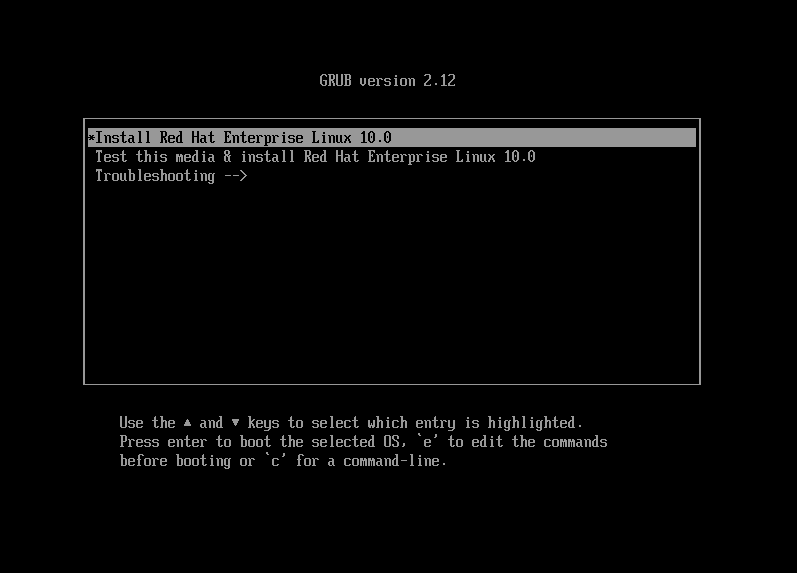

- 言語選択画面も変わりません
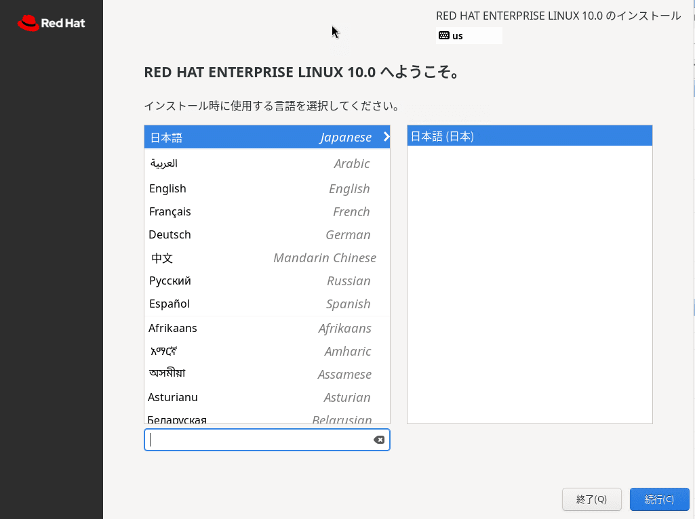

- インストール概要の画面です。2つほどこれまでと異なる点があります。
  - 1つめは、インストールソースがデフォルトで「Red Hat CDN」となっている点
  - 2つめは、デフォルトで「rootアカウントが無効になっています」となっている点
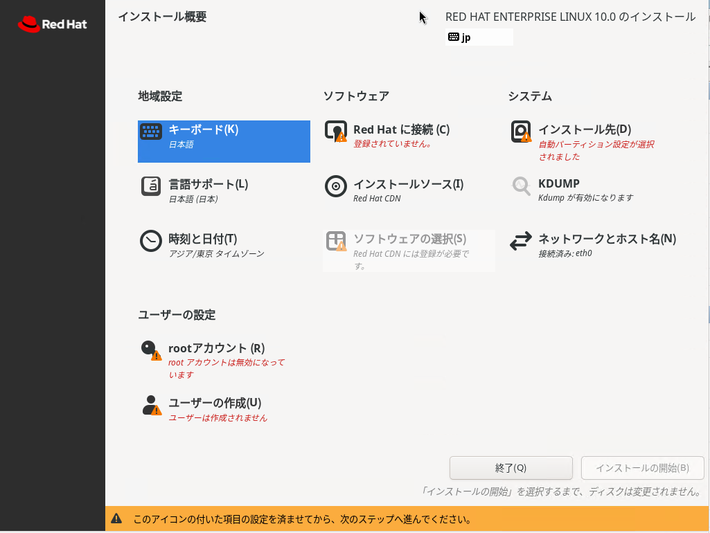

- インストールソースをブートディスクに変更しようと「自動検出したインストールメディア」を選択しますが、末尾に「失敗した」とでています。
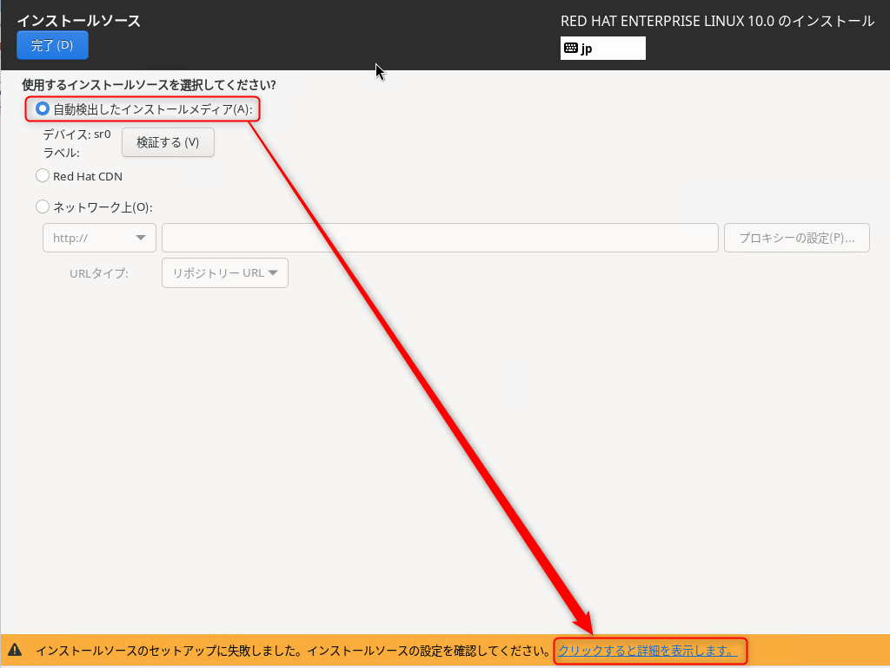

- 確認すると、インストールソース が正しく読み込めず、必要なメタデータ repomd.xml を取得できなかったというエラーでした。デフォルトがCDNになっているということはRed Hat 社の意図を感じましたのでこれ以上頑張らず、CDNでインストールを進めました
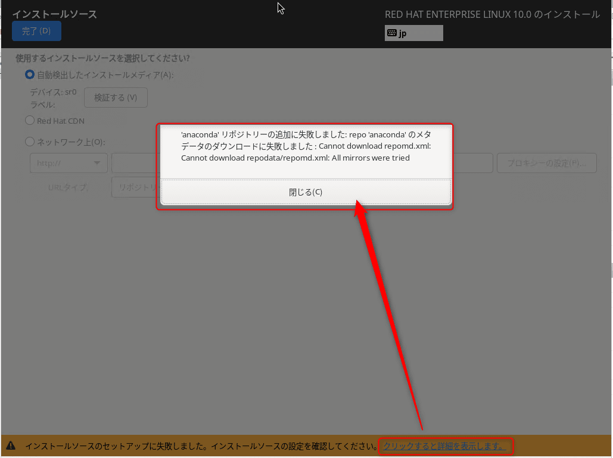

- インストール概要の「Red Hat に接続」からRed Hatにログインします。※ ライセンス契約があるアカウントの必要があります
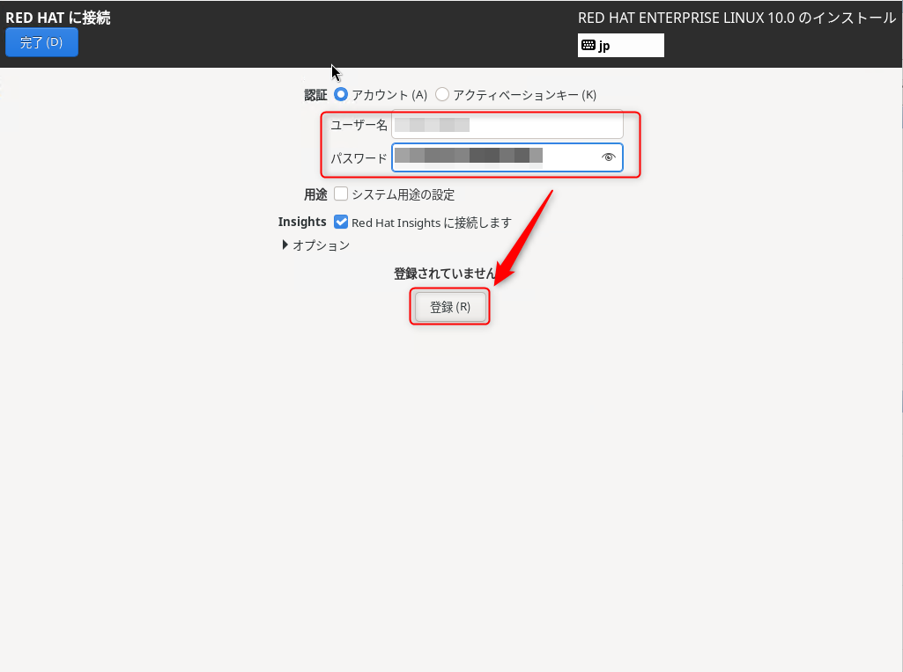

- ログインに成功したことが確認できました
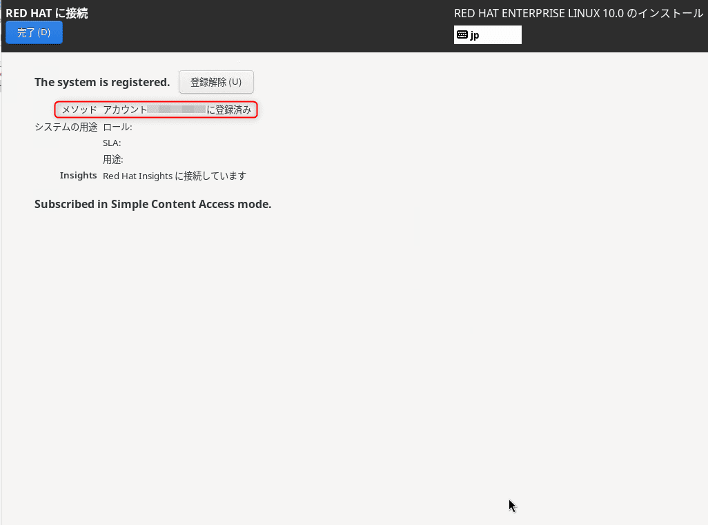

- ソフトウェアの選択が選べるようになりました。今回は「最小限のインストール」で進めます
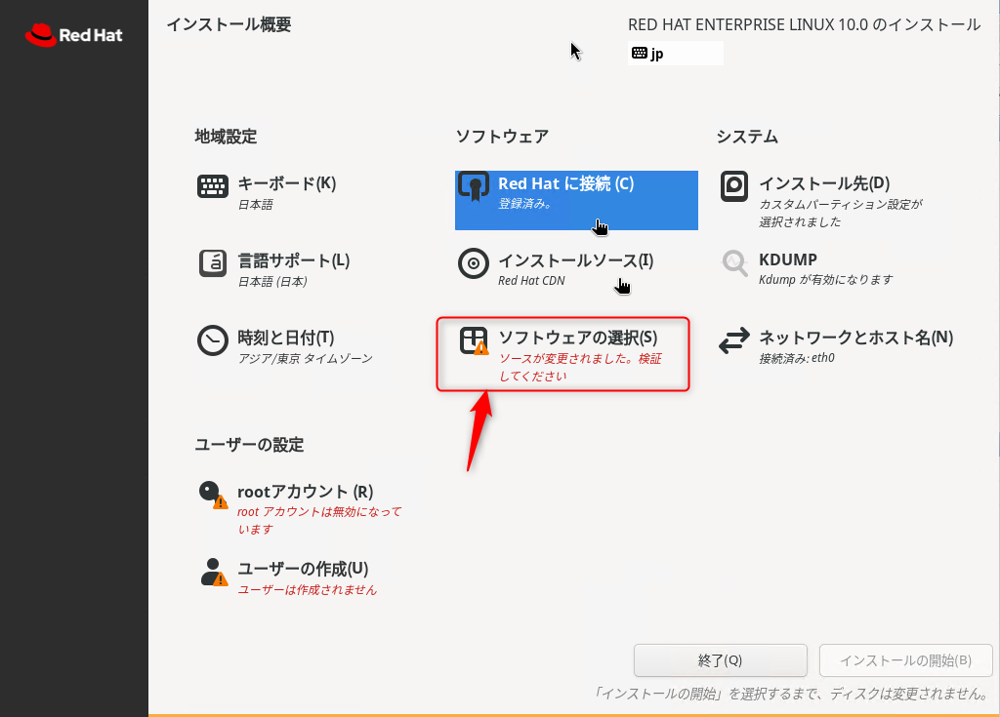
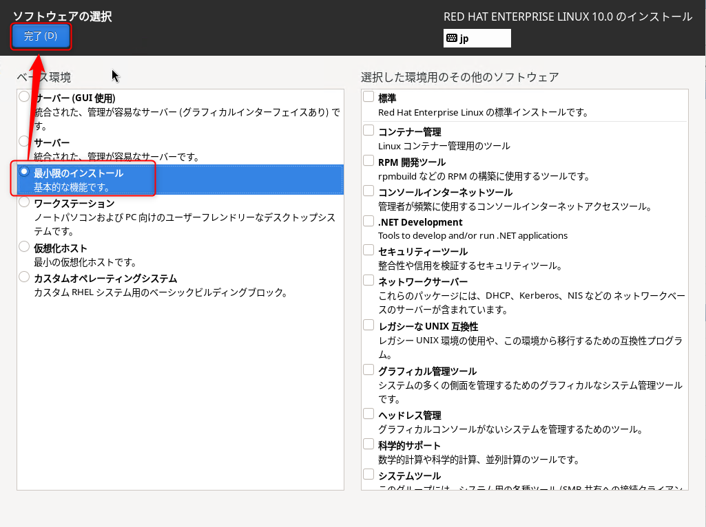

- root アカウントがデフォルトで無効化になっている内容を確認します
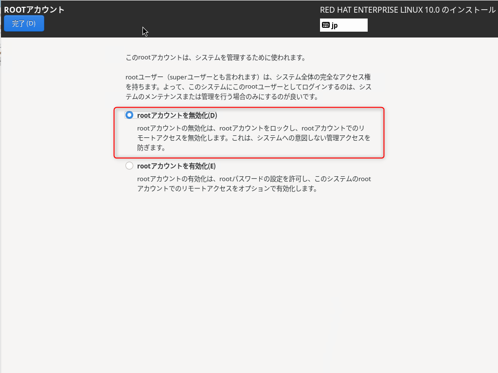

- インストールを開始します
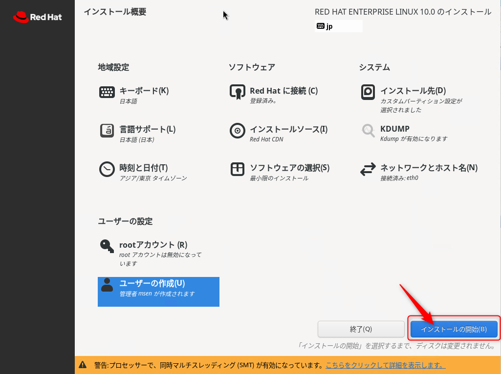
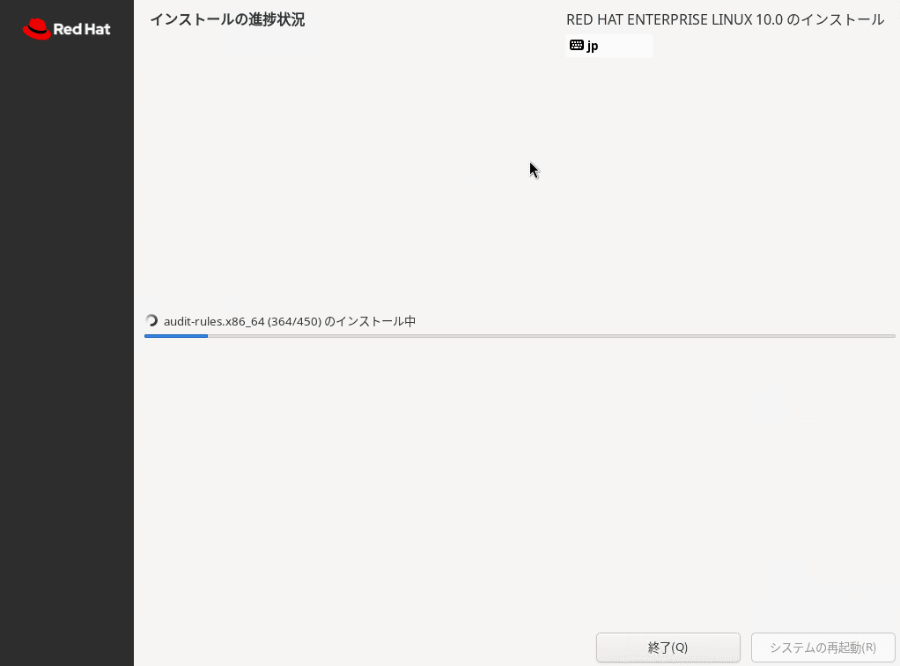

- インストールが完了しました。およそ10分程度要しました
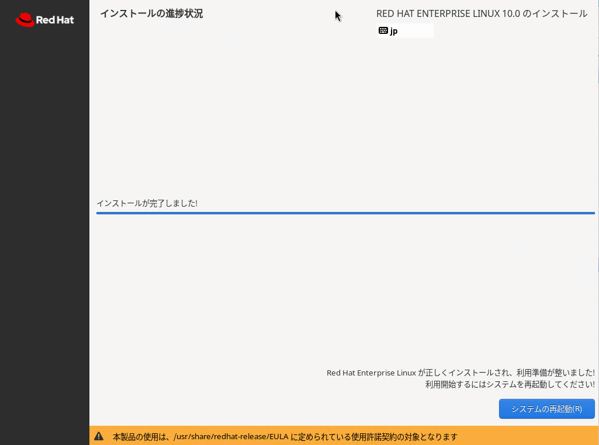
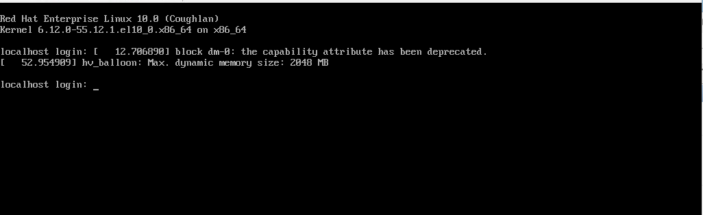

インストール直後のカーネルは `6.12-0-55.12.1.el10_0.x86_64`、OSバージョンは `Red Hat Enterprise Linux release 10.0 (Coughlan)` でした。
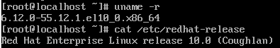

## あとがき

初めて業務で触ったバージョンが、3 だったと思うので約20年でバージョンアップが7回もあったと思うと、感慨深いですね。

それでは、次回の記事でお会いしましょう。
