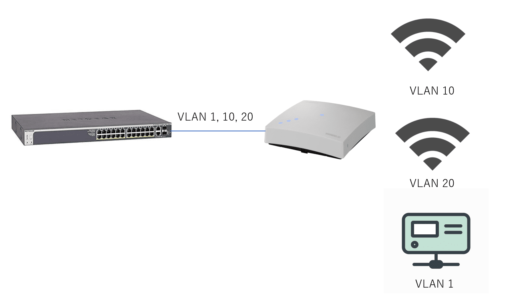
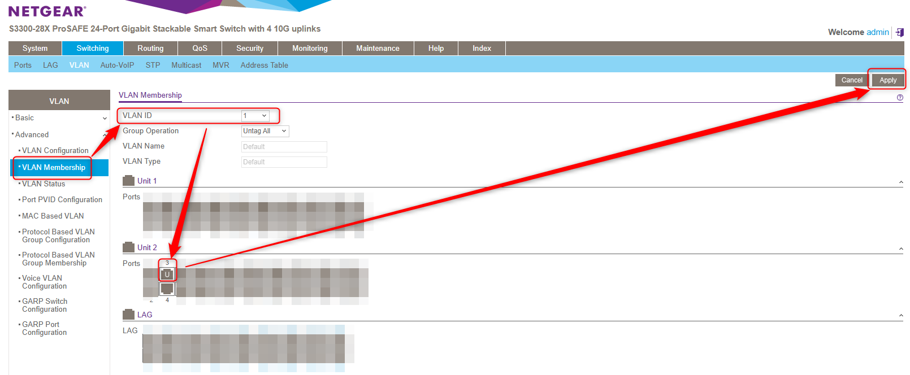
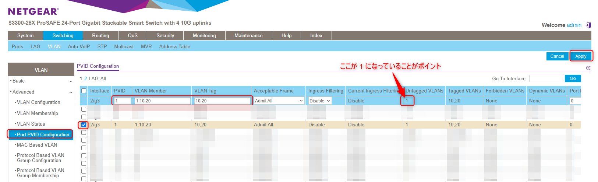
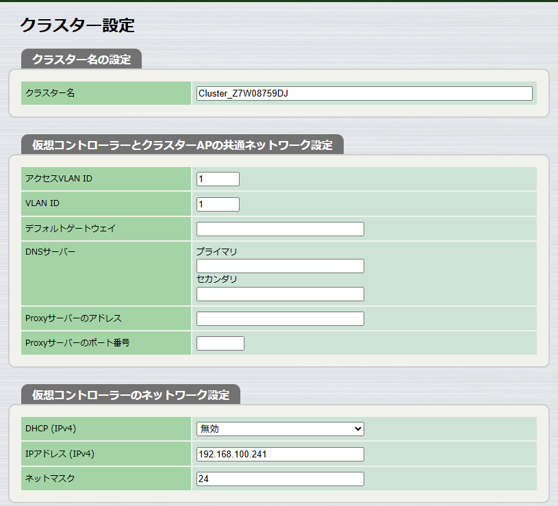
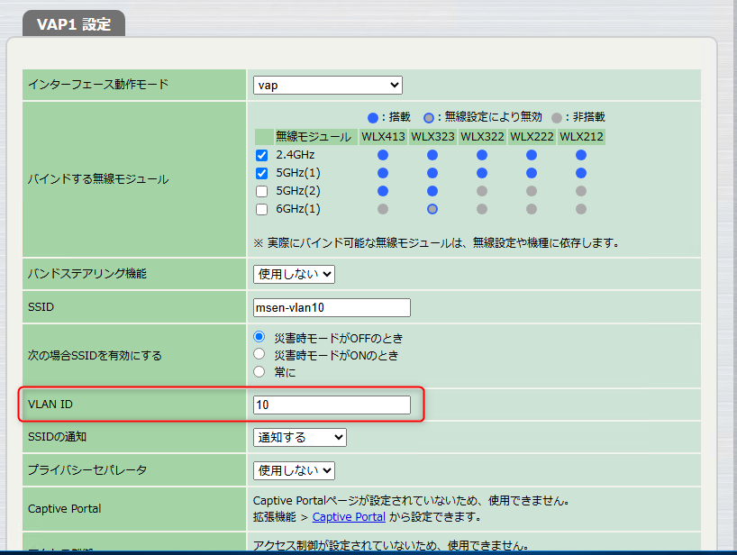
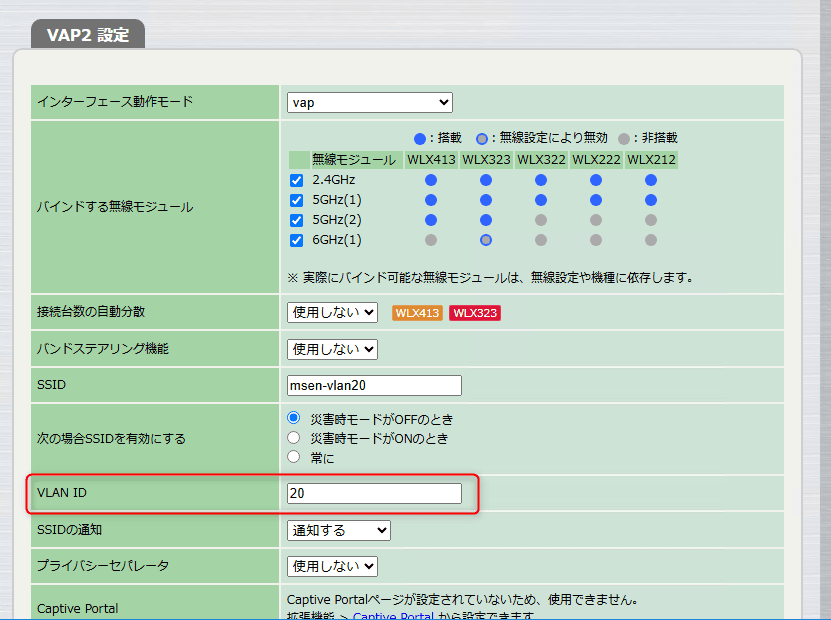
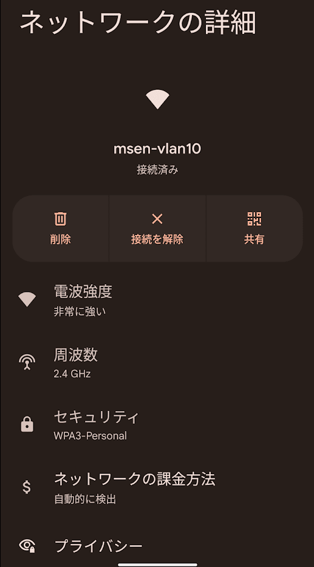
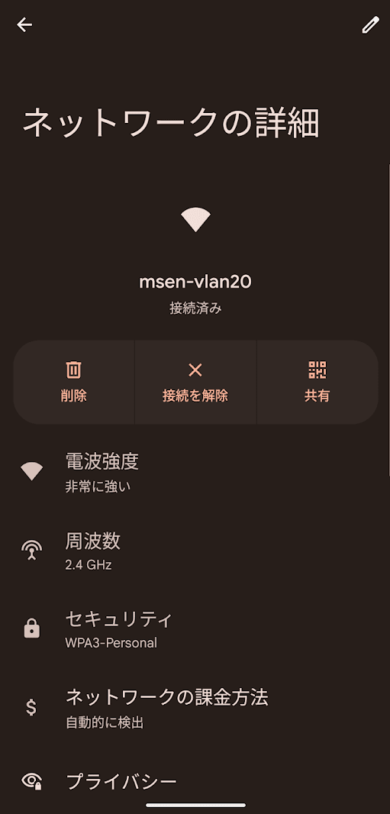

こんにちは。

今回は、NETGEARのスイッチと、YAMAHA WLX222 を利用してタグVLANを構成したWi-Fi環境を作成する内容です。

NETGEAR側の設定に少し癖があり、はまりましたので記録も兼ねて記事にします。

## 環境
- スイッチ: NETGEAR S3300-28X 
- 無線AP: YAMAHA WLX222

## 概要
以下のような環境を実現したい場合です。

- ネットワークスイッチから、VLAN 1, 10 ,20 を流す
- VLAN 10,20 は SSIDとして設定し、VLAN 1 は仮想コントローラー接続用に使用する。

## 設定

### NETGEAR S3300-28X 

管理画面にログインします。
今回は 2/g3 に設定します。

`Switching -> VLAN -> Advanced -> VLAN Membership` に進みます。

VLAN 1 の 設定で設定するポートをクリックして `U` にします。

この設定がポイント (**仮想コントローラー、Untag VLAN しか通らない**) です。
これが分からず、ずっと通信できなかったという結論です。

次に、`Switching -> VLAN -> Advanced -> Port PVID Configuration` に進みます。

設定するポートをチェックして、以下のように設定します。

各設定後に `Apply` ボタンをクリックして反映することを忘れないように注意します。

### YAMAHA WLX222
今回の評価では、仮想コントローラー設定はWLX222のデフォルトです。

以下のようになります。

- 仮想コントローラーの設定
  

SSID の設定は、以下のとおりです。
ポイントはVLAN IDの指定部分です。

- VLAN 10 を利用したSSID
  

- VLAN 20 を利用したSSID
  

これで、仮想コントローラーアクセスができ、かつVLAN10とVLAN20をSSIDに設定できます。

VLAN10 の SSID に接続できました。
  

VLAN20 の SSID に接続できました。
  

NETGEAR 側の設定で、tag VLAN と untag VLAN を分けて設定する方法が分からず、かなりの時間を費やしました。

参考になれば幸いです。
それでは次回の記事でお会いしましょう。
