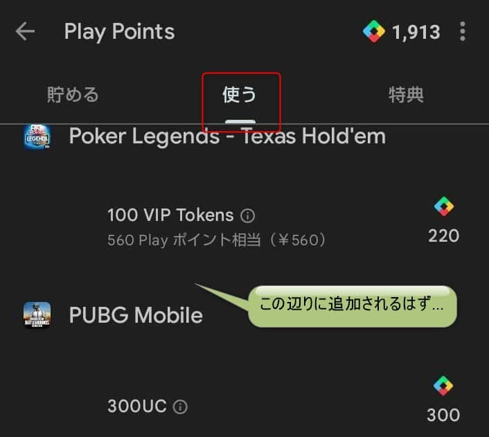

こんにちは、リーフです。

みなさまスマートフォン端末は何を使用されていますか？

私はメインとして iPhone12、 サブとして AQUOS wish2 (Android) の2台持ちをしています。

購入当初は2台とも *Y モバイル*で契約をしていましたが、少し前に使用頻度が低い Android のサブ端末のみ *povo 2.0* に変更しました。

povo 2.0といえば基本料金が無料で、トッピングを追加することで好みのプランを作成できるのが売りですよね。

また、特定のお店で一定金額を支払うとデータ容量を交換するコードが発行されるいわゆる"ギガ活"も話題になりました。

この度、そんな povo 2.0のデータ容量が [Google Play Points でも交換可能](https://povo.jp/googleplay_point/)になりました。

今回は詳細を Google Play ステータス**プラチナ**の私が紹介します。

※povo 2.0では、180日間トッピング未購入の場合、利用停止の対象となります。

今回追加された、プロモコードの交換ではトッピングを購入した扱いにはなりませんのでご注意ください。

### プロモコードについて

公式サイトを確認すると、データ容量の交換は
2023年3月30日から順次できるようになるとのことでした。

意気揚々と Google Play Points の画面を開きましたが、4/16時点で私の端末では表示されていませんでした。

サイトにも以下のように記載があったので表示されるようになるまでもう少しかかるかもしれません。

> ※Google Play Points での交換アイテムへの追加は順次拡大し、23年4月中旬ごろ（予定）にすべてのアカウントで利用できるようになります。  
> 交換アイテムへの掲載がない場合はしばらくお待ちください。

提供期間は
2023年3月30日～2023年6月30日
とのことでした。

交換が可能なトッピングは以下の通りです。

|交換アイテム(プロモコード)|Google Play Points|
|:-:|:-:|
|データ使い放題24時間|330|
|データ追加1GB(7日間)|390|
|データ追加3GB(30日間)|900|
|データ追加20GB(30日間)|2,450|

Google Play Points は*1ポイント = 1円換算*でアプリ内課金に使用ができるため、通常のトッピングと同レートで交換が可能です。

なかなか2,450ポイントを貯めるのはたいへんですが、ステータスが一番高いダイヤモンドの方であれば100円で2 point 獲得ができるのでお得かもしれません。

### Google Play Points について

Google Play 側のステータスも紹介します。

|ステータス|到達条件|獲得可能ポイント|
|:-:|:-:|:-:|
ブロンズ |初期ステータス|100円ごとに1ポイント
シルバー |1年間に250ポイント以上獲得 |100円ごとに1ポイント+25%のポイント
ゴールド |1年間に1,000ポイント以上獲得 |100円ごとに1ポイント+50%のポイント
プラチナ |1年間に4,000ポイント以上獲得 |100円ごとに1ポイント+75%のポイント
ダイヤモンド |1年間に15,000ポイント以上獲得 |100円ごとに2ポイント

私はプラチナステータスですので、100円ごとに、1.75ポイント獲得できます。

### 最後に
今回の追加は期間限定とのことですので、povo 2.0を利用されている方はギガ活をしてみてはいかがでしょうか。

私も端末に追加された際にはぜひ購入してみようと思います。

以上、リーフでした。🍃
